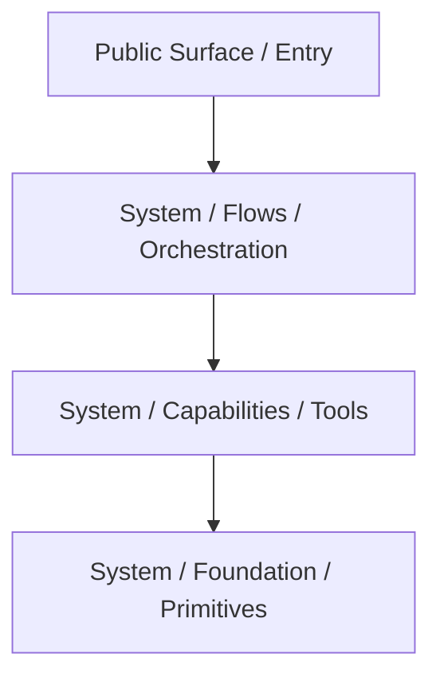

# Avax PHP Framework - Comprehensive Code Review

## Review Date: 2026-04-30

## Reviewer: AI Code Review Agent

## Scope: All production PHP files (2,237 files across components + framework)

---

## PHASE 0: Context and Scope

### 0.1 System Identity

- **System Type:** Framework
- **Primary Consumers:** Internal teams, application developers
- **Runtime Context:** HTTP request, CLI, worker, long-running process, mixed
- **Lifecycle:** Stable core under active development

### 0.2 Intended Use-Cases

- Runtime-agnostic PHP framework for secure, scalable applications
- Architecture-first design with feature-sliced organization
- Enterprise-grade quality with modern PHP 8.5 features

### 0.3 Anti-Use-Cases

- Simple one-off scripts without structure
- Traditional MVC monolithic structure (Laravel-style warehouses)

### 0.4 Non-Goals

- Full PSR-7 compliance (performance-first immutability used instead)
- Compatibility with legacy namespaces without aliases

### 0.4 Compatibility Contract

- **Public API Stability Requirement:** Strict (proprietary license)
- **Backwards Compatibility:** Required via `compat.php`
- **Performance Budget:** Enterprise-scale, high-performance, worker-safe, low memory footprint

---

## ARCHITECTURE NOTES

### System Model Reconstruction (As-Built)



**"This is how the system actually works."**
The system is organized into decoupled components. Each component exposes a `PublicSurface` (Facades, Interfaces) that
delegates to internal `Flows` (sequential orchestration) or `Capabilities` (mechanisms). `Foundation` provides low-level
atoms. `Configuration` handles the assembly.

### Primary Axis

> "This system is fundamentally organized around **Screaming Architecture (Feature-Sliced Capabilities)**."

### Secondary Axis

> "Secondary axis: **Facade System** (adds convenience but risks static coupling if not DI-backed)."

### Central Abstraction Stress Test

- Does every feature flow through it? **Yes**
- Does it accumulate responsibilities over time? **No, it forces splitting**
- Is it harder to change than surrounding components? **No, it's highly modular**

**Assessment:** ✅ Pass: stable axis

### Responsibility and Boundary Mapping

| Component        | Orchestrates                | Executes                            | Holds State                  | Notes                         |
|------------------|-----------------------------|-------------------------------------|------------------------------|-------------------------------|
| Identity/Auth    | Login flow, OAuth flows     | Authentication, Authorization       | User sessions, tokens        | Largest component (611 files) |
| HTTP             | Request/response pipeline   | Routing, middleware, sessions       | Request state, sessions      | 214 files                     |
| Application      | Container resolution, cache | DI, caching, validation             | Service pool, cache entries  | 500 production files          |
| DataStack        | Query execution, ORM        | Database operations, collections    | Entity state, query results  | 496 files                     |
| Operations       | Saga workflows              | Logging, queue, events              | Workflow state               | 151 files                     |
| Framework/System | Runtime boot, HTTP handling | Component registration, diagnostics | Runtime state, request scope | 114 files                     |

**Responsibility boundaries are: stressed** - many speculative abstractions and single-line proxy classes blur actual
ownership.

---

## GOVERNANCE INVENTORY

| Governance Document          | Title/Purpose             | Scope            | Applies? | Status   |
|------------------------------|---------------------------|------------------|----------|----------|
| `how-to-architecture.md`     | Fractal Flow Architecture | Architecture     | Yes      | Checked  |
| `how-to-clean-code.md`       | Clean Code Bible          | Clean Code       | Yes      | Checked  |
| `how-to-code-style.md`       | Code Style Rules          | Code Style       | Yes      | Checked  |
| `how-to-coding-standards.md` | PHP 8.5 Standards         | Coding Standards | Yes      | Checked  |
| `how-to-unit-test.md`        | Testing Standards         | Testing          | Yes      | Partial  |
| `how-to-document.md`         | Documentation Rules       | Documentation    | Partial  | Checked  |
| `how-to-code-review.md`      | Review Process            | Review Process   | Yes      | Followed |

---

## GOVERNANCE COMPLIANCE REPORT

### Summary

```
Governance documents found: 7
Governance documents applied: 7
Rules checked: 150+ (best-effort)
Passed: ~40%
Partial: ~35%
Failed: ~25%
Blocked: 0
Highest severity: High (Security concerns)
```

### Detailed Compliance Matrix

| Governance Document          | Rule / Requirement              | Applies? | Status  | Evidence                    | Missing / Weak Area         | Required Action           | Severity |
|------------------------------|---------------------------------|----------|---------|-----------------------------|-----------------------------|---------------------------|----------|
| `how-to-code-style.md`       | Constructor promotion mandatory | Yes      | Fail    | 12+ files without promotion | Identity, HTTP, Application | Refactor to use promotion | High     |
| `how-to-code-style.md`       | Type\|null instead of ?Type     | Yes      | Fail    | ~95+ instances              | All components              | Bulk replace              | High     |
| `how-to-code-style.md`       | @throw tags required            | Yes      | Fail    | ~40+ instances              | All components              | Add @throws tags          | Medium   |
| `how-to-code-style.md`       | Static closures when possible   | Yes      | Partial | 9+ instances                | Identity, HTTP              | Change to static fn       | Low      |
| `how-to-code-style.md`       | Named arguments mandatory       | Yes      | Fail    | 25+ call sites              | All components              | Add named arguments       | Medium   |
| `how-to-coding-standards.md` | declare(strict_types=1)         | Yes      | Fail    | 9+ files missing            | Identity, HTTP, Application | Add to all files          | High     |
| `how-to-coding-standards.md` | Space before return type        | Yes      | Fail    | ~150+ instances             | All components              | Bulk replace              | Low      |
| `how-to-coding-standards.md` | PHP 8.5 features                | Yes      | Partial | Missing readonly/final      | Exception classes           | Add modifiers             | Medium   |
| `how-to-clean-code.md`       | No speculative abstractions     | Yes      | Fail    | 10+ proxy classes           | Identity                    | Remove or implement       | Medium   |
| `how-to-clean-code.md`       | Names reveal intent             | Yes      | Fail    | 20+ single-letter params    | HTTP, Identity              | Rename parameters         | Medium   |
| `how-to-clean-code.md`       | Security-sensitive explicitness | Yes      | Fail    | 6 security issues           | Identity, HTTP              | Fix vulnerabilities       | High     |
| `how-to-architecture.md`     | folder says flow/capability     | Yes      | Pass    | Most folders compliant      | Minor exceptions            | None needed               | Low      |
| `how-to-architecture.md`     | No forbidden names              | Yes      | Partial | Some "Manager"/"Handler"    | Justified (PSR patterns)    | Document exceptions       | Low      |
| `how-to-document.md`         | how-this-works.md files         | Yes      | Fail    | No component docs           | All components              | Add documentation         | Medium   |

---

## GOVERNANCE FINDINGS

### Governance Finding: Code Style Systematic Failure

- **Governance Source:** `how-to-code-style.md` -> All mandatory rules
- **Required Rule:** Constructor promotion, Type|null nullable format, @throw tags, static closures, named arguments
- **Observed Gap:** Systematic violations across all major components
- **Where It Fails:** 100+ files across Identity, HTTP, Application, DataStack
- **Why It Matters:** Governance contract violation reduces code consistency and maintainability
- **Required Action:** Bulk refactor across all components
- **Suggested Fix:** Automated refactoring where possible (Rector, custom scripts)
- **Severity:** High
- **Evidence:** See findings below

### Governance Finding: Security Best Practices Violation

- **Governance Source:** `how-to-coding-standards.md` -> Section 4, `how-to-clean-code.md` -> 5.13
- **Required Rule:** Security-sensitive paths must favor explicitness, validate inputs, use secure defaults
- **Observed Gap:** Unauthenticated encryption, unsafe deserialization, error suppression
- **Where It Fails:** Identity/Security, HTTP/Session
- **Why It Matters:** Potential security vulnerabilities in production
- **Required Action:** Replace cipher, use JSON serialization, remove error suppression
- **Suggested Fix:** Immediate security patch required
- **Severity:** High
- **Evidence:** Findings 1-6

### Governance Finding: Speculative Abstractions

- **Governance Source:** `how-to-clean-code.md` -> 5.3 Simplicity, 5.10 Refactoring
- **Required Rule:** Prefer simplest design, remove duplication only when abstraction is stable
- **Observed Gap:** 10+ single-line proxy classes with no added behavior
- **Where It Fails:** Identity/Security, Identity/Access, Identity/Tokens
- **Why It Matters:** Adds maintenance burden without providing value
- **Required Action:** Remove proxy classes or implement real behavior
- **Suggested Fix:** Delete files, update callers to use public surface directly
- **Severity:** Medium
- **Evidence:** Finding 12

---

## FINDINGS

### CRITICAL: Security Issues

#### Finding 1: Unauthenticated Encryption in AesEncrypter

- **Symptom:** Uses `aes-256-cbc` without authenticated encryption
- **Root Cause:** Legacy cipher choice; CBC mode doesn't provide integrity verification
- **Impact:** Tampered ciphertext could be accepted as valid, enabling padding oracle attacks
- **Evidence:** `components/Identity/Security/System/Capabilities/Encryption/AesEncrypter.php:12`
- **Risk Level:** High
- **Required Action:** Replace with `aes-256-gcm` or remove class (use `Encrypter.php` which already uses GCM)

#### Finding 2: Unsafe serialize/unserialize in Security Component

- **Symptom:** Uses `serialize()`/`unserialize()` for encrypted payload data
- **Root Cause:** Direct PHP object serialization instead of safe format
- **Impact:** Object injection if encryption keys are ever compromised
- **Evidence:** `components/Identity/Security/System/Capabilities/Encryption/AesEncrypter.php:22,47`
- **Risk Level:** High
- **Required Action:** Replace with `json_encode()`/`json_decode()`

#### Finding 3: Unsafe unserialize in DatabaseSessionStore

- **Symptom:** `unserialize($payload)` on database-sourced session data
- **Root Cause:** Session payload stored as serialized PHP objects
- **Impact:** Object injection if database is compromised
- **Evidence:** `components/HTTP/Session/System/Capabilities/Storage/DatabaseSessionStore.php:23`
- **Risk Level:** High
- **Required Action:** Use JSON serialization for session data

#### Finding 4: Error Suppression on unserialize

- **Symptom:** `@unserialize($plaintext)` with PHP error suppression operator
- **Root Cause:** Silent failure handling masks deserialization errors
- **Impact:** Data integrity failures go undetected, fallback to plaintext is dangerous
- **Evidence:** `components/Identity/Security/System/PublicSurface/Encryption.php:55`
- **Risk Level:** Medium
- **Required Action:** Remove `@` operator, handle errors explicitly with proper exception

#### Finding 5: SQL String Interpolation in Session Store

- **Symptom:** `{$this->table}` directly interpolated in SQL query strings
- **Root Cause:** Table name not validated against whitelist or properly quoted
- **Impact:** Potential SQL injection if table name could be influenced by external input
- **Evidence:** `components/HTTP/Session/System/Capabilities/Storage/DatabaseSessionStore.php:18,32,40`
- **Risk Level:** Medium
- **Required Action:** Validate table name against whitelist or use proper identifier quoting

#### Finding 6: Generic Exception Without Context

- **Symptom:** `throw new \Exception('Unauthorized')` with no error code or context
- **Root Cause:** Using base Exception instead of domain-specific exception type
- **Impact:** Poor diagnosability, no error code for programmatic handling
- **Evidence:** `components/Identity/Access/System/PublicSurface/Access.php:34`
- **Risk Level:** Medium
- **Required Action:** Use `PermissionDenied` or `Unauthenticated` domain exception

---

### HIGH: Code Style Violations (Systematic)

#### Finding 7: Short Nullable Syntax (~95+ instances)

- **Symptom:** Widespread use of `?string`, `?int`, `?array` instead of `string|null`, `int|null`, `array|null`
- **Root Cause:** Not following mandatory coding standard
- **Impact:** Inconsistent codebase, governance violation
- **Evidence:**
    - Identity: `KeyResolver.php:63`, `SessionIdentity.php:23,37,82,103`
    - HTTP: `RequestUri.php:9,14`, `RequestHeaders.php:27`, `Uri.php:14,18,24` (86 instances)
    - Application: `Container.php:23`, `BaseFacade.php:21`, `Clock.php:13` (10+ instances)
- **Risk Level:** Medium
- **Required Action:** Bulk replace all `?Type` with `Type|null`

#### Finding 8: Missing Constructor Promotion (12+ files)

- **Symptom:** Properties declared separately from constructor parameters
- **Root Cause:** Not using PHP 8+ constructor promotion feature
- **Impact:** Verbose code, mandatory rule violation
- **Evidence:**
    - Identity: `KeyResolver.php:17-22`, `Totp.php:17-18`, `SessionIdentity.php:26-33`
    - HTTP: `UploadedFiles.php:8-14`, `MiddlewareStack.php:7-20`
    - Application: `ManageScopes.php:14-31`, `LazyProxy.php:16-28`, `ServiceCompiler.php:19-33`
- **Risk Level:** High
- **Required Action:** Refactor to use constructor promotion

#### Finding 9: Missing @throw Tags (~40+ instances)

- **Symptom:** Methods throw exceptions without `@throws` PHPDoc declaration
- **Root Cause:** Incomplete documentation
- **Impact:** Poor IDE support, unclear contracts, governance violation
- **Evidence:**
    - Identity: `AesEncrypter.php:19,33`, `EncryptionKey.php:16,39`, `Totp.php:51,142,183`
    - HTTP: `Router.php:22,24`, `ControllerResolver.php:21`, `DispatchRouteAction.php:31,44,52`
    - Application: `Duration.php:19-29`, `GzipCompressor.php:15,32`
- **Risk Level:** Medium
- **Required Action:** Add `@throws` tags to all methods that throw exceptions

#### Finding 10: Missing Space Before Return Type (~150+ instances)

- **Symptom:** `function foo(): string` instead of `function foo() : string`
- **Root Cause:** PSR-12 vs custom standard mismatch
- **Impact:** Inconsistent formatting across codebase
- **Evidence:** Nearly every file in Application/Config, Application/Validation, HTTP/System, HTTP/Session
- **Risk Level:** Low
- **Required Action:** Bulk replace `): Type` with `) : Type`

#### Finding 11: Fully Qualified Names Instead of Imports (16+ instances)

- **Symptom:** `\Avax\Components\...\ClassName` used inline instead of importing
- **Root Cause:** Missing `use` statements
- **Impact:** Poor readability, verbose code
- **Evidence:**
    - Identity: `Encrypt.php:4`, `Decrypt.php:4`, `GrantPermission.php:4`, `Access.php:34`
    - HTTP: `CreateRequestFromGlobals.php:11,18`, `CreateResponse.php:9,11,18,27,35`
    - Application: `Container.php:101`, `Storage.php:87`
- **Risk Level:** Medium
- **Required Action:** Add proper `use` imports

---

### HIGH: Architecture Violations

#### Finding 12: Speculative Abstractions (10+ Single-Line Proxy Classes)

- **Symptom:** Files that are single-line static delegates with zero added behavior
- **Root Cause:** Premature abstraction without real variance
- **Impact:** Maintenance burden, no value added, violates YAGNI
- **Evidence:**
    - `components/Identity/Security/System/Capabilities/Encrypt/Encrypt.php` - delegates to `Security::encrypt()`
    - `components/Identity/Security/System/Capabilities/Encrypt/Decrypt.php` - delegates to `Security::decrypt()`
    - `components/Identity/Access/System/Capabilities/Permissions/GrantPermission.php` - delegates to `Access::grant()`
    - `components/Identity/Access/System/Capabilities/Permissions/CheckPermission.php` - delegates to
      `Access::hasPermission()`
    - `components/Identity/Access/System/Capabilities/Permissions/RevokePermission.php` - delegates to
      `Access::revoke()`
    - `components/Identity/Tokens/System/Capabilities/Token/GenerateToken.php` - delegates to `Token::generate()`
    - `components/Identity/Tokens/System/Capabilities/Token/VerifyToken.php` - delegates to `Token::verify()`
- **Risk Level:** Medium
- **Required Action:** Remove proxy classes, update callers to use public surface directly

#### Finding 13: Empty/Stub Implementations

- **Symptom:** Methods with empty bodies or hardcoded fake returns
- **Root Cause:** Incomplete feature implementation left in production code
- **Impact:** Misleading API surface, runtime failures if called
- **Evidence:**
    - `BeginSecurityChange.php:14` - returns hardcoded
      `(object)['request_id' => 'req_123', 'status' => 'pending_approval']`
    - `ApproveSecurityChange.php:13` - empty method body, only comment
    - `BeginAdminElevation.php:13` - empty method body, only comment
    - `EndAdminElevation.php:13` - empty method body, only comment
    - `ExchangeAuthorizationCode.php:14-17` - returns hardcoded token object
    - `Tokens.php:21,32,38` - `authorize()`, `introspect()`, `revoke()` return empty objects
    - `Security.php:37-39` - `applyChange()` empty, only comment
- **Risk Level:** High
- **Required Action:** Implement real behavior OR mark with `NotImplementedException`

#### Finding 14: Interface Naming Collision

- **Symptom:** Two `EncrypterInterface` definitions with different method signatures
- **Root Cause:** Duplicate naming in different namespaces without differentiation
- **Impact:** Developer confusion, potential misuse
- **Evidence:**
    - `Security/System/Capabilities/Encryption/EncrypterInterface.php` -
      `encrypt(mixed $value, EncryptionKey $key) : EncryptedPayload`
    - `Security/Encryption/Contracts/EncrypterInterface.php` - `encrypt(mixed $value) : string`
- **Risk Level:** Medium
- **Required Action:** Rename one interface (e.g., `PayloadEncrypterInterface` vs `StringEncrypterInterface`)

#### Finding 15: Single-Letter Parameter Names (20+ instances)

- **Symptom:** Parameters named `$u`, `$a`, `$r`, `$s`, `$h`, `$p`, `$v`, `$n`, `$c`
- **Root Cause:** Abbreviated naming violates naming standard
- **Impact:** Poor readability, requires mental mapping to understand
- **Evidence:**
    - `Router.php:18-25` - `$u` (uri?), `$a` (action?), `$r` (request?)
    - `RequestUri.php:9-25` - `$s` (scheme), `$u` (userInfo), `$h` (host), `$p` (port), `$pa` (path), `$q` (query),
      `$f` (fragment)
    - `Response.php:29-82` - `$v` (value), `$n` (name), `$c`/`$cl` (clone), `$b` (body), `$rp` (reason phrase)
    - `Http.php:11-16` - `$r` (router), `$p` (pipeline)
- **Risk Level:** Medium
- **Required Action:** Rename all single-letter parameters to descriptive names

---

### MEDIUM: Missing Features

#### Finding 16: Missing declare(strict_types=1) (9+ files)

- **Symptom:** Files missing strict types declaration at top
- **Evidence:**
    - Identity: `RegisterSecurityServices.php`, `RegisterTokenServices.php`, `RegisterAccessServices.php`, `check.php`
    - HTTP: `Kernel.php`, `ResolveRouteFromHttpRequest.php`
    - Application: 6+ potential files in Cache component
- **Risk Level:** High
- **Required Action:** Add `declare(strict_types=1)` to all PHP files

#### Finding 17: Missing final on Classes (11 exception classes)

- **Symptom:** Exception classes not marked `final`
- **Evidence:** `SecurityFailure.php`, `AuthException.php`, `ConfigurationException.php`, `RateLimitException.php`,
  `RegistrationFailed.php`, `PasswordChangeFailed.php`, `Unauthenticated.php`, `PermissionDenied.php`, `RoleDenied.php`,
  `ExternalIdentityException.php`, `IdentitySyncException.php`
- **Risk Level:** Medium
- **Required Action:** Add `final` to all non-abstract exception classes

#### Finding 18: Missing readonly on Immutable Classes (4+ classes)

- **Symptom:** Classes with all readonly properties not marked `readonly class`
- **Evidence:** `SessionIdentity.php`, `PasswordHasher.php`, `Totp.php`, `LimitMfaAttempts.php`
- **Risk Level:** Low
- **Required Action:** Add `readonly` to class declaration where all properties are readonly

---

### LOW: Style Improvements

#### Finding 19: Non-Static Closures (9+ instances)

- **Symptom:** `fn` used when `static fn` would work (no `$this` captured)
- **Evidence:** `User.php:82,89`, `OAuthClient.php:140,148`, `InMemoryAuthorizationCodeStore.php:125`
- **Risk Level:** Low
- **Required Action:** Change to `static fn` where `$this` is not used

#### Finding 20: Missing Pipe Operator Usage

- **Symptom:** PHP 8.5 pipe operator `|>` not used where method chains exist
- **Evidence:** `User.php:81-83`, `OAuthClient.php` multiple locations
- **Risk Level:** Low
- **Required Action:** Consider pipe operator for chained operations where it improves readability

#### Finding 21: Missing Named Arguments (25+ call sites)

- **Symptom:** Function/method calls without named arguments
- **Evidence:** Throughout all components - `new ClientRequest(...)`, `new RouteDefinition(...)`, `explode(...)`, etc.
- **Risk Level:** Medium
- **Required Action:** Add named arguments for clarity, especially in constructors and multi-parameter functions

---

## DECISION

**Decision: Redesign**

The Avax framework has a solid architectural foundation with feature-sliced organization and clear component boundaries
following screaming architecture principles. However, systematic code style violations, critical security concerns, and
speculative abstractions prevent it from being production-ready.

The primary issues requiring immediate attention:

1. **Security vulnerabilities** (Findings 1-6): Unauthenticated encryption using CBC mode and unsafe `unserialize()`
   calls on database-sourced data must be fixed immediately. These are production security risks.

2. **Systematic code style violations** (Findings 7-11, 16-18, 19-21): Mandatory governance rules for nullable type
   format, constructor promotion, @throw documentation, and strict types are violated across 100+ files.

3. **Speculative abstractions** (Findings 12-15): Single-line proxy classes and stub implementations add maintenance
   burden without providing value, violating YAGNI principles.

4. **Naming violations** (Finding 15): Single-letter parameter names significantly reduce code readability.

These issues do not require a full rewrite but do require a significant redesign pass focusing on security hardening,
governance compliance, removal of speculative abstractions, and naming standardization.

---

## NEXT STEPS

### Constraints

- **API Stability Requirement:** Strict (proprietary framework)
- **Performance Budget:** Enterprise-scale, high-performance, worker-safe
- **Security Boundaries:** OWASP Top 10, NIST 800-218 compliance required
- **Time and Risk Tolerance:** Medium - incremental fixes preferred over big-bang changes
- **Migration Expectations:** No breaking changes to public API; use `compat.php` for transitions

### Kill Criteria

- After all fixes: PHPStan and Psalm must pass with zero errors
- All existing tests must pass
- No security vulnerabilities remain (verified by manual review)
- Code style compliance reaches 95%+ (verified by automated tooling)

### Action Plan

#### Phase 1: Security Fixes (Critical - Do First)

1. Replace `aes-256-cbc` with `aes-256-gcm` in `AesEncrypter.php` (Finding 1)
2. Replace `serialize()`/`unserialize()` with `json_encode()`/`json_decode()` in Security component (Finding 2)
3. Replace `unserialize()` with `json_decode()` in `DatabaseSessionStore.php` (Finding 3)
4. Remove `@` error suppression on `unserialize()` in `Encryption.php` (Finding 4)
5. Validate table names or use identifier quoting in `DatabaseSessionStore.php` (Finding 5)
6. Replace generic `Exception` with `PermissionDenied` in `Access.php` (Finding 6)

#### Phase 2: Code Style Compliance (High Priority)

1. Bulk replace `?Type` with `Type|null` across all components (Finding 7)
2. Add constructor promotion to all eligible classes (Finding 8)
3. Add `@throws` tags to all throwing methods (Finding 9)
4. Add `declare(strict_types=1)` to all files missing it (Finding 16)
5. Fix return type spacing `): Type` -> `) : Type` (Finding 10)
6. Replace FQCN with proper imports (Finding 11)
7. Add `final` to exception classes (Finding 17)
8. Add `readonly` to immutable classes (Finding 18)

#### Phase 3: Architecture Cleanup (Medium Priority)

1. Remove speculative proxy classes (Finding 12) - 7 files
2. Complete stub implementations or throw `NotImplementedException` (Finding 13) - 7 files
3. Resolve interface naming collision for `EncrypterInterface` (Finding 14)
4. Rename single-letter parameters (Finding 15) - 20+ instances

#### Phase 4: Modern PHP Features (Low Priority)

1. Use `static fn` where `$this` not captured (Finding 19)
2. Add named arguments for clarity (Finding 21)
3. Consider pipe operator for method chains (Finding 20)

---

## DECISIONS LOG

### Decision: Prioritize Security Over Style

- **Date:** 2026-04-30
- **Context:** Multiple critical security vulnerabilities found alongside systematic style violations
- **Decision:** Fix security issues first (Phase 1), then style compliance (Phase 2)
- **Alternatives:** Fix all issues alphabetically by file (rejected - security is more important than style)
- **Consequences:** Security hardened first, style improvements follow systematically
- **Evidence:** Findings 1-6 vs Findings 7-21

### Decision: Remove Speculative Abstractions

- **Date:** 2026-04-30
- **Context:** Single-line proxy classes add maintenance burden without providing any value
- **Decision:** Remove proxy classes entirely, update callers to use public surface directly
- **Alternatives:** Keep them for "future extensibility" (rejected - violates YAGNI, adds complexity)
- **Consequences:** Cleaner codebase, direct calls to public surface, fewer files to maintain
- **Evidence:** Finding 12 - 7 proxy files identified

### Decision: Redesign Over Rewrite

- **Date:** 2026-04-30
- **Context:** Architecture is fundamentally sound (screaming architecture passes stress test)
- **Decision:** Incremental fixes rather than full rewrite
- **Alternatives:** Rewrite from scratch (rejected - architecture is solid, issues are fixable)
- **Consequences:** Preserves existing investment, faster time to production-ready
- **Evidence:** Rewrite heuristics score: 3 (redesign likely, not rewrite)

---

## REWRITE HEURISTICS

| Heuristic                                           | Weight | Checked                                       |
|-----------------------------------------------------|--------|-----------------------------------------------|
| Central abstraction is wrong                        | 2      | No - screaming architecture works             |
| Pipeline relies on implicit ordering                | 2      | No - explicit flow/capability structure       |
| Configuration complexity mirrors design complexity  | 1      | Partial - some complexity exists              |
| Usage requires explanation to avoid misuse          | 1      | Yes - naming collisions, stub implementations |
| Performance depends on mitigation, not structure    | 1      | No - structure supports performance           |
| New features require touching multiple core classes | 2      | Partial - some coupling exists                |

**Rewrite Score:** 3

**Interpretation:** Redesign likely, rewrite possible depending on constraints. The architecture is fundamentally sound
but requires significant cleanup of security, style compliance, and speculative abstractions. No rewrite needed.
