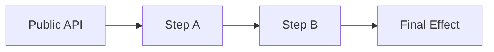

# Enterprise-Grade System Code Review

## Architecture, Design, and Foundational Assessment

> **Purpose**
>
> This document defines a **result-oriented, enterprise-grade code review** process for **core systems**
> (frameworks, platforms, infrastructure components, SDKs, shared libraries).
>
> This is **not** a PR review.
> The output of this review must enable a **clear technical decision** about the system’s future.

---

## Review Contract

### What This Review IS

- System-level analysis
- Architecture and design validation
- Foundational assumption challenge
- Performance-by-design evaluation
- Failure-mode and diagnostic surface sanity check (minimal, not a tooling deep dive)

### What This Review IS NOT

- Style or formatting review
- Line-by-line refactor suggestions
- Feature-level feedback
- Full observability or tooling audit (dashboards, vendors, agents, pipelines)

---

## Expected Final Outcomes (Non-Negotiable)

At the end of this review, we must be able to answer **unambiguously**:

1. **Is the system fundamentally sound?**
2. **Is evolution safe, or does complexity compound?**
3. **What is the correct next action?**

The review must conclude with **exactly one** of the following outcomes:

- ✅ **Keep and Improve**: system is sound, proceed with incremental evolution
- ⚠️ **Redesign**: core assumptions are stressed, targeted redesign required
- 🚨 **Rewrite Candidate**: foundational design is flawed, rewrite is rational

If the review cannot support one of these decisions, **it is incomplete**.

---

## Hard Gates (Stop Conditions)

Stop the review immediately if any of the following cannot be produced:

- A correct **as-built execution flow**
- A **primary axis** statement (central abstraction)
- A completed **responsibility and boundary map**
- A set of **system invariants** (at least 5)

---

## Review Rules (Mandatory)

1. Do **not** propose fixes in Phase 1.
2. Do **not** start from individual files.
3. Do **not** optimize before reconstructing the architecture.
4. Every finding must include:
    - **Symptom**: what is observed
    - **Root Cause**: why it exists
    - **Impact**: why it matters
    - **Evidence**: concrete pointers (files, classes, call paths, scenarios)
    - **Risk Level**: Low / Medium / High / Rewrite Risk

---

## Cross-Governance Compliance Gate (Mandatory)

This review MUST verify that the reviewed code, tests, architecture, and documentation comply with **every applicable
rule from every `how-to-*.md` governance document** in the repository.

This is not optional.
This is not a reminder.
This is a hard review gate.

A code review that does not explicitly check the `how-to-*.md` governance set is incomplete, even if the architecture
analysis is strong.

### Governance Inventory Rule

Before writing findings, the reviewer MUST discover and list all governance documents matching:

```text
**/how-to-*.md
```

The inventory MUST include at least:

- file path
- document title or main purpose
- applicable scope: architecture / clean code / code style / coding standards / testing / documentation / review
  process / other
- whether the document applies to this reviewed system
- if not applicable, the exact reason why it does not apply

The reviewer MUST NOT silently ignore a `how-to-*.md` document.

If a governance document exists but cannot be read, parsed, or reconciled with the review scope, the review MUST mark
this as a **Governance Blocker**.

### Rule Extraction Rule

For every applicable `how-to-*.md` document, the reviewer MUST extract and enforce:

- every `MUST` rule
- every `MUST NOT` rule
- every `HARD RULE`
- every `Mandatory` section
- every `Non-Negotiable` section
- every explicit checklist item
- every required output or deliverable
- every forbidden anti-pattern
- every naming, ownership, testing, documentation, style, or architecture law

`SHOULD` rules must also be reviewed, but they may be treated as improvement opportunities when the trade-off is
justified.

The reviewer MUST NOT cherry-pick only the obvious rules.
The reviewer MUST treat the governance set as a complete contract.

### Compliance Matrix Rule

The review output MUST include a `GOVERNANCE COMPLIANCE REPORT` section with a matrix like this:

| Governance Document      | Rule / Requirement                                                                   | Applies? | Status                | Evidence                           | Missing / Weak Area | Required Action                                | Severity                      |
|--------------------------|--------------------------------------------------------------------------------------|----------|-----------------------|------------------------------------|---------------------|------------------------------------------------|-------------------------------|
| `how-to-architecture.md` | folder says flow or capability, unit says responsibility, function says exact action | Yes      | Pass / Partial / Fail | file/folder/class/function pointer | exact gap           | keep / rename / move / split / merge / rewrite | Low / Medium / High / Blocker |

Status values:

- **Pass**: rule is clearly satisfied
- **Partial**: rule is attempted but incomplete, vague, weak, inconsistent, or under-documented
- **Fail**: rule is violated
- **Not Applicable**: rule honestly does not apply, with a concrete reason
- **Blocked**: rule cannot be evaluated because evidence is missing or the governance source cannot be read

The matrix MUST be concrete.
Do not write vague entries like "mostly follows clean code" or "tests are okay".

### Exact Gap Reporting Rule

For every `Partial`, `Fail`, or `Blocked` item, the review MUST state exactly:

- **what is missing**
- **where it is missing**: file, class, method, folder, test, doc, public API, or flow
- **why it matters**
- **which governance document and rule it violates**
- **what should be done next**
- whether the required action is:
    - add
    - remove
    - rename
    - move
    - split
    - merge
    - simplify
    - document
    - test
    - harden
    - rewrite
    - deprecate

The report MUST include concrete suggestions, rewrites, or replacement shapes when they improve clarity.

If the reviewer believes a rule should not be followed in this specific case, they MUST write an explicit exception
with:

- reason
- trade-off
- risk
- owner of the exception
- expiration or revisit condition

Silent exceptions are forbidden.

### Governance Coverage Summary

The review MUST include a short summary:

```text
Governance documents found: <number>
Governance documents applied: <number>
Rules checked: <number or best-effort count>
Passed: <number>
Partial: <number>
Failed: <number>
Blocked: <number>
Highest severity: Low / Medium / High / Blocker
```

If the reviewer cannot count every rule exactly, they MUST provide a best-effort count and explain why exact counting
was not possible.

### Governance Failure Impact Rule

Governance failures MUST influence the final decision.

Use this interpretation:

- **Low**: local improvement, does not change the final decision by itself
- **Medium**: affects maintainability, documentation, tests, naming, or local ownership
- **High**: affects architecture, correctness, safety, public API stability, test trust, or evolution safety
- **Blocker**: review cannot approve the system until the gap is resolved or explicitly accepted

A system may not receive **✅ Keep and Improve** if there is an unresolved governance blocker.

A system may not receive a clean approval if any `MUST`, `MUST NOT`, `HARD RULE`, or `Non-Negotiable` item fails without
an explicit exception.

### Mandatory Governance Finding Template

Use this template for governance-specific findings:

```md
### Governance Finding: <short title>

- **Governance Source:** `<how-to-file.md>` -> `<section/rule>`
- **Required Rule:** ...
- **Observed Gap:** ...
- **Where It Fails:** file/folder/class/method/test/doc path
- **Why It Matters:** ...
- **Required Action:** add / remove / rename / move / split / merge / simplify / document / test / harden / rewrite / deprecate
- **Suggested Fix:** concrete proposed change, rewrite, or replacement shape
- **Severity:** Low / Medium / High / Blocker
- **Evidence:** concrete pointers
```

### Cross-Document Conflict Rule

If two `how-to-*.md` documents appear to conflict, the reviewer MUST NOT guess.

Resolve conflicts using this priority order:

1. correctness and safety
2. explicit project governance
3. architecture and ownership clarity
4. public API stability
5. testability
6. documentation truthfulness
7. coding standards and style
8. local taste

The review MUST record the conflict and the chosen interpretation in `DECISIONS-LOG`.

### Minimum Required Governance Checks

When these files exist, the review MUST check them explicitly:

- `how-to-architecture.md`: ownership, screaming architecture, flow/capability slicing, hierarchy, boundaries, locality,
  public surface, security, refactoring, and change governance
- `how-to-clean-code.md`: correctness, readability, simplicity, naming, function design, module design, error handling,
  testing, refactoring discipline, anti-pattern rejection
- `how-to-code-style.md`: project-specific formatting, typing, imports, constructor promotion, nullable type style,
  named arguments, static closures, pipe usage when applicable
- `how-to-coding-standards.md`: PHP version expectations, security, DevSecOps gates, modern language features, output
  expectations, privacy/legal notes where relevant
- `how-to-unit-test.md`: behavior-first tests, happy/failure/edge/regression/security scenarios, naming,
  Arrange/Act/Assert, one-act rule, assertion precision, test data clarity
- `how-to-document.md`: docs location, filesystem-first documentation, `how-this-works.md`, mermaid diagrams, real
  triggers, debug-first guidance, documentation completeness
- `how-to-code-review.md`: this review process itself, including hard gates, findings, decision, next steps, and
  governance compliance

If any listed file is missing, the reviewer MUST state whether it is expected to exist for this repository.

### Deliverable

The final `review.md` MUST include:

- `GOVERNANCE INVENTORY`
- `GOVERNANCE COMPLIANCE REPORT`
- `GOVERNANCE FINDINGS`
- `GOVERNANCE EXCEPTIONS` if any
- `GOVERNANCE COVERAGE SUMMARY`
- `DECISIONS-LOG` entries for conflicts, exceptions, or waived rules

If these sections are missing, the review fails the review process itself.

---

## Risk Level Definitions (Mandatory)

| Risk Level   | Definition                                                                                                                           |
|--------------|--------------------------------------------------------------------------------------------------------------------------------------|
| Low          | Localized issue, does not spread across boundaries, low coupling, easy to test and fix without ripple effects.                       |
| Medium       | Crosses module boundaries or affects extension points, requires coordination, increases maintenance cost.                            |
| High         | Impacts correctness, safety, or evolution, forces touching multiple core classes, increases systemic fragility.                      |
| Rewrite Risk | Indicates the system’s axis is wrong or the complexity-to-capability ratio is compounding. Requires structural change, not patching. |

---

## Standard Finding Template (Use This Format)

### Finding: <short title>

- **Symptom:** …
- **Root Cause:** …
- **Impact:** …
- **Evidence:** …
- **Risk Level:** Low / Medium / High / Rewrite Risk
- **Notes (optional):** constraints, trade-offs, why it might be acceptable

---

## Required Artifacts (Deliverables)

The review must produce these file review.md as output
in the folder Code-Review-And-ToDo with sections:

- `ARCHITECTURE NOTES` (or this doc filled in)
- `GOVERNANCE INVENTORY` (all discovered `how-to-*.md` documents)
- `GOVERNANCE COMPLIANCE REPORT` (rule-by-rule compliance matrix)
- `GOVERNANCE FINDINGS` (all governance gaps using the mandatory governance finding template)
- `GOVERNANCE EXCEPTIONS` (only when a rule is intentionally waived with justification)
- `FINDINGS` (all findings using the standard template)
- `DECISION` (final decision, max 10 sentences)
- `DECISIONS-LOG` (decision log entries, see template below)
- `NEXT STEPS` (action-oriented plan based on the decision)

NOTE: overwrite existing reviews
---

# PHASE 0: Context and Scope Gate (Mandatory)

**Goal:** Prevent wrong assumptions and opinion-based review.

### 0.1 System Identity

Fill in:

- **System Type:** library / framework / platform / infra component / SDK / shared module
- **Primary Consumers:** internal teams / public users / app layer / infra layer
- **Runtime Context:** HTTP request / CLI / worker / long-running process / mixed
- **Lifecycle:** prototype / stable core / legacy / replacement-in-progress

### 0.2 Intended Use-Cases and Anti-Use-Cases

- **Intended Use-Cases :**
    - …
- **Anti-Use-Cases (things the system explicitly should NOT do):**
    - …

### 0.3 Non-Goals

- List explicit non-goals, to prevent scope creep in review:
    - …

### 0.4 Compatibility Contract

- **Public API Stability Requirement:** strict / moderate / none
- **Backwards Compatibility:** required / optional / not required
- **Performance Budget:** expected scale and constraints (rough numbers are fine)

**Deliverable:** A filled Phase 0 section. If Phase 0 is missing, Phase 1 findings are invalid.

---

# PHASE 1: System and Architecture Review

**Goal:** Build a correct mental model of the system as it exists today.

---

## 1. System Model Reconstruction (Mandatory)

### 1.1 Actual Execution Flow (As-Built)

Reconstruct the real execution flow, ignoring documentation and intentions:

`Public API -> ? -> ? -> ? -> Final Effect`

Identify explicitly:

- Where state is **created**
- Where state is **mutated**
- Where decisions are **made**
- Where execution is **pure / mechanical**

**Deliverable:**

- One diagram (ASCII / Mermaid / external)
- A 5 to 10 line explanation titled:
  **"This is how the system actually works."**

Example Mermaid skeleton (optional):



If this cannot be produced, the review stops here.

---

## 2. Central Abstraction Identification

### 2.1 Primary Axis Rule (Mandatory)

Answer with one sentence only:

> "This system is fundamentally organized around **<PRIMARY_AXIS>**."

Examples:

- Kernel

- Pipeline

- Context

- Configuration

- Engine

- Other (explicitly name it)

### 2.2 Secondary Axis (Optional, but Controlled)

If a second axis exists, name it explicitly:

> "Secondary axis: **<SECONDARY_AXIS>** (adds complexity and must be justified)."

**Rule:** If a secondary axis exists, mark **Design Risk: Dual-axis complexity** and justify why it is necessary.

**Deliverable:**

- Primary axis sentence

- Optional secondary axis sentence + justification

---

## 3. Central Abstraction Stress Test

For the primary axis, answer Yes / No:

- Does every feature flow through it?

- Does it accumulate responsibilities over time?

- Is it harder to change than surrounding components?

**Assessment:**

- ✅ Pass: stable axis

- ⚠️ Weak: growing pressure

- 🚨 Fail: wrong axis

**Deliverable:**

- Classification (Pass / Weak / Fail)

- write clear justification(s) with evidence pointers

---

## 4. Responsibility and Boundary Mapping

Map responsibilities explicitly:

| Component | Orchestrates | Executes | Holds State | Notes |
|-----------|--------------|----------|-------------|-------|
|           |              |          |             |       |

**Red Flags:**

- One component does all three (orchestrates, executes, holds state)

- Responsibilities are inferred, not explicit

- State ownership is unclear

- Boundaries leak through "helper" backdoors

**Deliverable:**

- Completed table

- A 3 line summary:  
  **"Responsibility boundaries are: clear / stressed / violated."**

---

## 5. Pipeline and Control Flow Analysis (If Applicable)

### 5.1 Pipeline Inventory

List steps in actual execution order:

| Step | Mandatory | Conditional | Mutates State | Terminal |
|------|-----------|-------------|---------------|----------|
|      |           |             |               |          |

### 5.2 Determinism Check

Is this pipeline a formal state machine?

**Criteria for "Yes":**

- Explicit states exist

- Explicit transitions exist

- Explicit terminal and error states exist

**Deliverable:**

- Table

- Explicit answer: **Yes / No**

- If "No": mark as **Foundational Risk: Implicit ordering**

---

## 6. Mutability Audit (Mandatory)

List all mutable objects:

| Object | Scope | Lifetime | Why Mutable? | Classification                         |
|--------|-------|----------|--------------|----------------------------------------|
|        |       |          |              | Necessary / Convenience / Design Smell |

**Deliverable:**

- Table

- Summary sentence:  
  **"Mutability is: justified / excessive / misplaced."**

---

## 7. System Invariants (Mandatory)

Define invariants the system must preserve. Examples:

- Deterministic resolution under same inputs

- No hidden mutation outside the central context

- No global state access without explicit boundary

- Circular dependency handling is explicit and policy-driven

- Errors carry context and are classifiable

- Extensions cannot bypass safety rules

**Deliverable:**

- as much as possible invariants

- For each invariant, list where it is enforced (or not enforced)

Template:

| Invariant | Enforced Where | Evidence | Status                              |
|-----------|----------------|----------|-------------------------------------|
|           |                |          | Enforced / Partially / Not enforced |

---

# PHASE 2: Foundational and Critical Design Review

**Goal:** Decide whether the system’s initial assumptions were correct.

---

## 8. Routine Enterprise Design Failures

### 8.1 Framework-in-a-Framework Syndrome

Check if present:

- Excessive builders, registries, facades

- Abstractions mirroring popular frameworks without real need

- Complexity without proportional capability

**Deliverable:**

- Present / Not Present

- celar explanation(s) with evidence pointers

---

### 8.2 Abstractions Without Real Variance

Identify:

- Interfaces with a single implementation

- Extension points never exercised

- Configuration flags that mimic polymorphism

Classify each:

- Acceptable

- Premature abstraction

- Design debt

**Deliverable:**

- List + classification + evidence

---

### 8.3 "Too Clever" Design Test

Answer explicitly:

- Is the design optimized for **reading** or **writing**?

- Does usage require internal knowledge?

**Deliverable:**

- Clear / Risky / Over-engineered

- Short justification with one usage scenario

---

## 9. Configuration as Architectural Signal

Answer Yes / No:

- Has configuration become a proxy for architecture?

- Are behavioral modes encoded via flags?

- Are invalid combinations possible?

**Assessment:**

- Healthy

- Risky

- Fundamentally flawed

**Deliverable:**

- Classification + reasoning + evidence

---

## 10. Performance-by-Design Sanity Check

Answer Yes / No:

- Is caching required for acceptable performance?

- Are many objects created per request or resolve?

- Could parts be plain functions instead of objects?

- Is reflection on the hot path without mitigation?

If 2 or more are Yes, mark:  
**Design-Level Performance Risk**

**Deliverable:**

- Yes/No matrix

- Conclusion and evidence pointers

---

## 11. Failure Modes and Diagnostic Surface (Minimal, Mandatory)

This is not a tooling audit. This is a design sanity check.

Answer Yes / No:

- Are errors categorized (programmer error vs runtime error vs domain error)?

- Do exceptions include context (what, where, why)?

- Can the system explain "why a decision was made" in a minimal way (debug hooks, traces, or structured error details)?

- Are failure states explicit in the pipeline or axis?

**Deliverable:**

- Yes/No matrix

- write clear conclusion

---

## 12. Rewrite Heuristics (Mandatory, Weighted)

Check items and sum weights.

| Heuristic                                           | Weight | Checked |
|-----------------------------------------------------|--------|---------|
| Central abstraction is wrong                        | 2      | ☐       |
| Pipeline relies on implicit ordering                | 2      | ☐       |
| Configuration complexity mirrors design complexity  | 1      | ☐       |
| Usage requires explanation to avoid misuse          | 1      | ☐       |
| Performance depends on mitigation, not structure    | 1      | ☐       |
| New features require touching multiple core classes | 2      | ☐       |

**Rewrite Score:** sum of checked weights = `__`

**Interpretation:**

- Score 0 to 2: rewrite not justified by heuristics

- Score 3 to 4: redesign likely, rewrite possible depending on constraints

- Score 5+: rewrite is rational unless constraints prohibit it

**Deliverable:**

- Checked list

- Final score

- One paragraph justification referencing findings

---

## 13. Documentation Gates (Mandatory, Required for how-this-works.md)

This section is **non-negotiable** for any code review that touches documentation files.
All rules are defined in `how-to-document.md` - these are explicit enforcement checks.

### Pre-Review: Document Validation

Before reviewing any documentation, verify the documentation files meet quality gates:

#### For all `how-this-works.md` files:

- [ ] File contains **valid frontmatter** (title, owner, last_reviewed, classification)
- [ ] Contains **mermaid diagram block** (```mermaid``` fence)
- [ ] Mermaid uses **`sequenceDiagram`** or **`flowchart`** type
- [ ] Uses `autonumber` where flow order matters
- [ ] All participant names are **real** (file/function names, NOT "Upstream", "Main Handler", etc.)

#### Ship Check (from how-to-document.md):

- [ ] Reader can retell **one exact path** from command to result WITHOUT opening code
- [ ] Uses **real** participant names (not generic placeholders)
- [ ] Uses **real command or trigger** at the start
- [ ] Explains **what gets written to disk** or left as evidence
- [ ] Explains **what user sees** on screen
- [ ] Contains **where to debug first** section

### Quality Anti-Patterns (Explicitly Forbidden)

DO NOT APPROVE if documentation contains:

- [ ] Generic placeholders like "Upstream Flow", "Main Handler", "Data Handler"
- [ ] "handles", "works with", "supports" without concrete behavior
- [ ] No mermaid diagram when flow is sequential
- [ ] No flowchart when topology is more important than sequence
- [ ] Missing "what gets written" explanation
- [ ] Missing failure/shutdown path

### Deliverable for Documentation Review:

- [ ] All checked items from Document Validation
- [ ] Any anti-patterns found with specific file:line references
- [ ] Clear pass/fail decision for documentation quality

**If documentation fails any gate, the review FAILS.**

---

# FINAL DECISION (Required)

Select exactly one:

- ✅ **Keep and Improve**

- ⚠️ **Redesign**

- 🚨 **Rewrite Candidate**

## Justification (Strict)

- Write clear human-grade sentences (how, why, where..)

- Must reference findings above (by IDs or titles)

- Must explain why this is the correct next step under the constraints

---

# NEXT STEPS (Action-Oriented)

## Constraints (Mandatory)

Define the non-negotiables for the chosen direction:

- API stability requirement: …

- Performance budget: …

- Security boundaries: …

- Time and risk tolerance: …

- Migration expectations: …

## Kill Criteria (Mandatory)

Define signals that the decision is failing:

- Example: "After 2 iterations, adding one feature still requires touching 4+ core classes"

- Example: "We cannot explain resolution decisions without deep internal knowledge"

- Example: "Caching becomes mandatory to hide design issues"

---

## If Keep and Improve

- What must not change:

    - …

- What can be incrementally evolved:

    - …

- First 3 concrete actions:

    1. …

    2. …

    3. …

## If Redesign

- Which abstraction is being redesigned:

    - …

- What remains intact:

    - …

- First 3 concrete actions:

    1. …

    2. …

    3. …

## If Rewrite Candidate

- What core idea failed:

    - …

- What the new primary axis should be:

    - …

- Migration strategy (minimum viable):

    - parallel run / adapter layer / incremental replacement

- First 3 concrete actions:

    1. …

    2. …

    3. …

---

# DECISIONS LOG (Template)

Use one entry per significant decision.

## Decision:

- **Date:** YYYY-MM-DD

- **Context:** what triggered this decision

- **Decision:** what we chose

- **Alternatives:** what we rejected and why

- **Consequences:** expected outcomes and risks

- **Evidence:** findings and references

---

> **Final Rule**
>
> A review that does not clearly determine what to do next and why  
> is not an enterprise-grade review.
