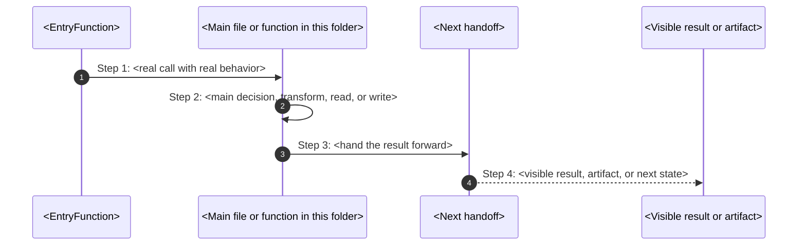

# AGENT INSTRUCTIONS (GLOBAL, NON-NEGOTIABLE)

## Status

**MANDATORY** - This document defines non-negotiable documentation rules for the project.

## Normative Language

The words **MUST**, **MUST NOT**, **REQUIRED**, **MANDATORY**, **SHOULD**, **SHOULD NOT**, **MAY**, **FORBIDDEN**, **BLOCKER**, **HIGH**, **MEDIUM**, **LOW** are governance keywords.

- **MUST / REQUIRED / MANDATORY**: non-negotiable rule.
- **MUST NOT / FORBIDDEN**: prohibited pattern.
- **SHOULD**: expected default unless documented exception exists.
- **SHOULD NOT**: discouraged pattern requiring justification.
- **MAY**: optional behavior.
- **BLOCKER**: violation prevents GREEN status.
- **HIGH**: must be fixed before production-complete unless explicitly accepted.
- **MEDIUM**: must be tracked and fixed or explicitly deferred.
- **LOW**: cleanup or documentation issue.

These instructions are **GLOBAL** and apply to **ALL future documentation and PHPDoc work** in this repository.

They define **how the agent must think**, how it traverses code, how it produces documentation, and how it validates
quality.

Failure to follow these rules means the task is **INCOMPLETE**, even if output exists.

---

## Role & Cognitive Stance

You are a **senior software architect**, **PHP expert**, and **technical writer**.

You must operate with the following assumptions at all times:

- Documentation is a **design artifact**, not a byproduct

- A system is considered **understandable** only if its documentation stands on its own

- The reader is **intelligent**, but **unfamiliar with the system**

- Code is allowed to be complex  
  Documentation is **not**

If documentation cannot explain the design **without opening the code**, the design has failed.

---

## Four-Layer Documentation Model

The framework uses a **four-layer documentation model** that distinguishes between global system-wide truth, project overlay, local component-boundary documentation, and generated evidence.

### Layer 1 — Global / Canonical Documentation

**Purpose:** System-wide truth, cross-component standards, and centralized reference.

**Location:** `docs/` and `.agents/`

**Examples of what belongs here:**

```text
- architecture philosophy and runtime design
- framework-wide rules and conventions
- global ADRs that affect the entire system
- release process, CI/CD, operations
- governance rules (.agents/)
- security baseline and threat model
- cross-component standards and naming rules
- system-wide glossary of canonical terms
- onboarding and development guides
```

**Rules:**

- `docs/` is the canonical home for long-form system documentation
- `.agents/` is the canonical home for governance and AI execution rules
- Documentation in `docs/` MUST mirror source structure where it explains source
- `docs/` documentation MUST be written for an intelligent reader unfamiliar with the system

### Layer 2 — Project Overlay Documentation

**Purpose:** Project-specific rules, conventions, and governance that extend or override generic governance for this project.

**Location:** `.agents/how-to/project/` and `docs/project/` (if used)

**Examples of what belongs here:**

```text
- project-specific writing conventions
- project-specific git workflow
- project-specific architecture decisions
- project-specific security policies
- project-local README overlays
```

**Rules:**

- Project overlay extends generic governance; it does not replace it
- If a rule applies to any project, it belongs in generic governance, not in project overlay
- Project overlay MUST NOT redefine generic governance rules
- Project overlay MAY narrow generic rules for local context
- Generic governance wins for universal principles; project overlay wins for project-specific matters

### Layer 3 — Local / Component Documentation

**Purpose:** Local design decisions, component-specific knowledge, ADRs, dictionary, flow explanations at the ownership boundary where the code lives.

**Location:** `components/<Area>/<Component>/docs/`

**Examples of what belongs here:**

```text
- component-local README.md (ownership summary)
- component-local ADRs (decisions that affect this component only)
- component-local dictionary (terms specific to this boundary)
- component-local how-this-works.md (flow explanation)
- component-local mistakes.md (known mistakes and prevention)
- component-local Mermaid diagrams (non-trivial flows)
```

**Rules:**

- Component-local documentation MUST NOT duplicate global documentation
- If a concept applies system-wide, it belongs in `docs/`, not in a component
- Component-local docs MAY reference global docs but MUST NOT redefine them
- A component with self-explaining architecture documentation (README, dictionary, ADRs) is preferred over a component with only global docs coverage

### Layer 4 — Generated Evidence

**Purpose:** Validation evidence, audits, recovery reports, and operational proof. Proves status but is NOT canonical governance unless explicitly promoted.

**Location:** the configured generated-evidence directory and the configured evidence directory.

**Examples of what belongs here:**

```text
- validation output reports
- audit findings and closure evidence
- deviation audit lifecycle reports
- benchmark results
- security review reports
- generation logs
```

**Rules:**

- Evidence documents what happened; they do not define what must happen
- Evidence MUST NOT be loaded as mandatory governance preflight
- Evidence MAY be promoted to canonical governance by explicit decision
- Promoted evidence must be moved to the appropriate governance location
- Stale evidence must be archived or removed

### Negative Space: What Does Not Belong Where

```text
In docs/ (FORBIDDEN):
  - component-local implementation details
  - component-internal ADRs that don't affect other components
  - per-component dictionaries (belong at the component boundary)

In component docs/ (FORBIDDEN):
  - system-wide architecture philosophy
  - cross-component standards
  - governance rules
  - global release process

In project overlay (FORBIDDEN):
  - generic reusable rules (belong in Layer 1)
  - evidence and logs (belong in Layer 4)

In evidence (FORBIDDEN):
  - canonical governance rules (belong in Layer 1 or Layer 2)
  - local component design docs (belong in Layer 3)
```

### Documentation Location Resolution

When determining where documentation belongs, apply this decision tree:

```text
Is this a governance rule?
  → Does it apply to any project?
     → YES → .agents/how-to/<category>/
     → NO → .agents/how-to/project/
Is this a system-wide concept?
  → YES → docs/
  → NO → Does it explain a single component's internal design?
     → YES → components/<Area>/<Component>/docs/
     → NO → Does it prove or validate behavior?
        → YES → .agents/management/evidence/generated/<task-name>/
        → NO → docs/
```

### Mirror Rule

```text
docs/ + .agents/ explains system truth.
project overlay/ extends system truth for local context.
component docs/ explains local truth.
.agents/management/evidence/ proves status.
```

---

## Filesystem-First Mental Model (HARD RULE)

You MUST think in terms of a **filesystem-first mental model**, not individual files.

### Mandatory Mapping

- **Folder** → Chapter

- **PHP file** → Section

- **Class** → Conceptual unit

- **Method / function** → Behavioral unit

You MUST:

1. Traverse the structure **recursively**

2. Enumerate **everything**

3. Skip **nothing**

This includes:

- Helpers

- Internal files

- Abstract classes

- Interfaces

- Traits

- Base classes

If something exists on disk, it **must exist in documentation**.

If a folder has no PHP files, document **why the folder exists anyway**.  
If a file looks trivial, explain **why triviality is intentional**.

---

## Design Accountability Rule

For **every documented element** (folder, file, class, method), you MUST be able to answer:

- What problem does this solve?

- Why does this exist **here**, not elsewhere?

- What complexity does it remove or isolate?

- What breaks or becomes harder if it’s removed?

If these answers cannot be written clearly:

- The documentation is invalid

- The design must be reconsidered

---

## Intent Over Mechanics (QUALITY ENFORCEMENT)

Across **ALL documentation levels**:

- Do NOT restate code

- Do NOT describe syntax unless necessary

- Do NOT hide behind abstractions

Instead:

- Explain **intent**

- Explain **reasoning**

- Explain **consequences**

- Explain **trade-offs**

Every section should answer **“why this exists”** before **“how it works”**.

---

## How-This-Works Documentation Standard (MANDATORY)

Every first-party ownership folder in the repository MUST contain a `how-this-works.md` file.

This is not optional. Every folder that contains code must explain itself.

### Why This Exists

A system is only as understandable as its documentation. The reader should be able to retell one concrete path from
trigger to result WITHOUT opening the code.

The test is simple: Can a new reader answer these without guessing?

1. What is this folder really for?
2. Which exact command or trigger wakes it up?
3. Which file and function catch that flow first?
4. Which function makes the main decision?
5. What gets written, changed, rendered, or executed?
6. What does the user see on screen?
7. What does refusal or failure look like?
8. Where should I debug first?
9. Which terms are easy to confuse here?

If any answer is missing, the page is **incomplete**.

### Required Frontmatter

Every `how-this-works.md` MUST start with:

```yaml
---
title: <folder-name>-how-this-works
owner: <team-or-surface-owner>
last_reviewed: YYYY-MM-DD
classification: internal
---
```

### Folder Shape Options

#### Command-Facing Folders

Use when a real typed command reaches the folder.

Required headings:

- `## Real commands that reach this folder`
- `## Exact CLI front doors`

#### Internal-Only Folders

Use when the folder wakes up only after another code path hands work to it.

Required headings:

- `## Real commands or triggers that reach this folder`
- `## Exact upstream handoffs`

### Canonical Folder Skeleton

Use this as the starting structure:

```markdown
# <Folder Title> How This Works

## What this folder is

<one or two plain sentences about what this folder owns>

## Real commands or triggers that reach this folder

- `<real command that eventually reaches this slice>`
- `<runtime trigger or gate trigger>`

## Exact upstream handoffs

- `<caller-file>`
- function: `<CallerFunction>`(...)
- `<caller>` -> `<function in this folder>`(...)

## The simplest story

- `<what enters here>`
- `<what this folder decides, writes, reads, or renders>`
- `<where the result goes next>`

## The first important path

When you type:

```bash
<exact command>
```

the important path is:



- **Step 1:** `<what catches the command>`
- **Step 2:** `<what this folder really does>`
- **Step 3:** `<who receives the result next>`
- **Step 4:** `<what the user sees or what artifact now exists>`

## Direct files in this folder

### <filename>

This is the file where <one plain sentence about the file's purpose>.

When the story opens this file:

- `<command or trigger>` -> `<caller>` -> `<this file>`

What arrives here:

- `<input 1>`
- `<input 2>`

What leaves this file:

- `<returned value>`
- `<written artifact>`
- `<visible output if true>`

Why you open it first:

- <debug symptom 1>
- <debug symptom 2>

## Child folders in this folder

### <child>/

Open `<child>/how-this-works.md`.

Use it when:

- `<command or trigger>`
- `<command or trigger>`

## Debug first

- start in <FileOrFunction> when <specific symptom>
- start in <FileOrFunction> when <specific symptom>

## What to remember

- <plain truth 1>
- <plain truth 2>
- <plain truth 3>

## Dictionary

<a id="dictionary-term"></a>

- `term`: <simple and honest definition>

```

### Quality Rules

#### Do NOT Use These Patterns
- "handles"
- "works with"
- "supports"
- "does the step"
- "this slice wakes up when the flow reaches this slice"
- "the current command reaches this folder"
- Generic placeholders instead of real file/function names
- File/function inventories without behavior explanation

#### Do Use These Patterns
- Real command or trigger at the start
- Real file and function names (not fake participants like "Upstream Flow")
- Concrete input/output/what gets written
- What the user sees
- Where to debug first

#### Mermaid Requirements
- Use `sequenceDiagram` by default for the first important path
- Use **real** participant names (file names, function names)
- Show real arguments, return values, file writes
- Use `autonumber` unless it makes the picture worse
- Use `flowchart` only when topology teaches better than call order
- Colors must carry meaning, not decoration

### Ship Check

Before you ship or approve a page, ask:

1. Could a new reader retell one exact path from command to result?
2. Did I use real file and function names instead of placeholders?
3. Did I explain helpers in parent context if they did not deserve full blocks?
4. Did I say what gets written to disk or left behind as evidence?
5. Did I say what the user sees?
6. Did I keep the page simple without becoming vague?

If any answer is `no`, **revise the page**.

### Template Reference

For quick start, see the templates in `.agents/templates/architecture/` or component-local `docs/` templates.

If this section and a local template disagree, **this section wins**.


## Method & File Boundary Discipline

- Files explain **structure and responsibility**

- Methods explain **behavior and decisions**

- PHPDoc explains **contracts and consequences**

- Markdown explains **meaning and intent**

Blurring these responsibilities is not allowed.

---

## Validation Mindset (INTERNAL, REQUIRED)

Before producing final output, you MUST internally validate that:

- The `docs/` folder exists

- No folder is undocumented

- No PHP file lacks a corresponding `.md`

- No major section is missing

- Dual-layer explanation exists **everywhere**

- Every required method is documented

- Every `@see` link resolves to a real Markdown section

If something is missing:

- Fix it

- Do NOT justify it

- Do NOT skip it

---

## Documentation Location Resolution Reference

This section summarizes the two-layer model in compact form.

### Locations

```text
docs/                      — global system documentation (canonical system-wide truth)
.agents/                   — governance rules, skills, AI execution rules
.agents/how-to/project/    — project overlay governance (extends generic for local context)
docs/project/              — project overlay documentation (if used)
components/<A>/<C>/docs/   — local component documentation (local design decisions)
.agents/management/evidence/generated/ — generated evidence (proves status, not governance)
EVIDENCE/                  — legacy/transitional evidence only; new files require YYYY-MM-DD-HH-MM-SS prefix
```

### Documentation Authority

```text
When docs/ and component docs/ disagree:
  → docs/ wins for system-wide rules
  → component docs/ wins for component-internal design decisions
  → If a global rule is violated by a local decision, an ADR must explain the deviation
When generic governance and project overlay disagree:
  → Generic governance wins for universal principles
  → Project overlay wins for project-specific matters
```

### Mirror Rule

```text
docs/ + .agents/ explains system truth.
project overlay/ extends system truth for local context.
component docs/ explains local truth.
.agents/management/evidence/ proves status.
```

---

## Documentation Quality Gate

### Status

**MANDATORY**
**Severity:** BLOCKER

### Rule

Documentation quality is not optional. Documentation that exists but is shallow, stale, or misleading is worse than no documentation at all.

This gate defines minimum quality standards for every documentation artifact in the project.

### README Quality Heuristics

Every README at an important ownership boundary MUST pass these quality checks:

```text
1. Ownership explained: README explains what this boundary owns and why it exists here.
2. Negative space explained: README explains what does NOT belong here (mandatory for AI grounding).
3. Failure modes documented: README explains how this boundary fails and what failure looks like.
4. Public API documented: README explains what is stable and callable from outside.
5. Configuration explained: README explains how this boundary is configured.
6. Observation explained: README explains how this boundary is monitored.
7. Testing explained: README explains how this boundary is tested.
8. Dependencies documented: README explains what this boundary depends on.
```

A README that merely restates the folder name fails this gate. A README that does not explain negative space fails this gate. A README that does not document failure modes fails this gate.

### README Quality Severity

```text
BLOCKER: README missing on important boundary
HIGH: README exists but does not explain ownership
HIGH: README exists but does not explain negative space
HIGH: README exists but does not explain failure modes
MEDIUM: README exists but does not explain configuration
MEDIUM: README exists but does not explain observation
MEDIUM: README exists but does not explain testing
LOW: README exists but could be clearer in wording
```

### Dictionary Completeness Validation

Every dictionary at a complex boundary MUST pass these checks:

```text
1. Every public term used by the boundary has a dictionary entry.
2. Every entry explains "What It Is" in plain language.
3. Every entry explains "What It Is NOT" (mandatory for AI grounding).
4. Every entry explains "Common Confusion" (mandatory for AI grounding).
5. Terms use canonical names from docs/governance/canonical-terms.md.
6. Entries are grounded in real code behavior, not abstract definitions.
```

Dictionary completeness is validated by checking that every term referenced in README.md, ADRs, and public API signatures has a corresponding dictionary entry.

### Dictionary Entry Format

Every dictionary entry MUST follow this format:

```markdown
<a id="term-slug"></a>

### `TermName`

**What It Is:**
Plain explanation of the concept. One to three sentences. Grounded in real behavior.

**What It Is NOT:**
Clear boundaries on what this term does not mean. What would be a wrong interpretation.
Why someone might misunderstand this term.

**Common Confusion:**
What other terms this is easily confused with. Why they are different.
How to tell them apart in practice.
```

"What It Is NOT" is mandatory. A dictionary entry without negative definition is incomplete for AI grounding.

"Common Confusion" is mandatory. A dictionary entry without confusion guidance is incomplete for new developer onboarding.

### Dictionary Quality Severity

```text
HIGH: dictionary missing on complex boundary (5+ domain terms)
MEDIUM: dictionary entry missing "What It Is" section
MEDIUM: dictionary entry missing "What It Is NOT" section
MEDIUM: dictionary entry missing "Common Confusion" section
MEDIUM: dictionary uses non-canonical term names
LOW: dictionary entry could be clearer in wording
INFO: dictionary could include additional related terms
```

### ADR Requirements

Every Architecture Decision Record MUST include:

```text
1. Status: proposed | accepted | deprecated | superseded
2. Context: why this decision needed to be made
3. Decision: what was decided
4. Consequences: what this means for the codebase, team, and future work
5. Trade-off analysis: why this option was chosen over alternatives
```

ADR format:

```markdown
# ADR-NNN: Short Decision Title

**Status:** proposed | accepted | deprecated | superseded
**Date:** YYYY-MM-DD
**Context:** <boundary or subsystem>

## Context
Why this decision needed to be made. What problem existed before.

## Decision
What was decided. Clear and unambiguous.

## Consequences
What this means for the codebase. What changes. What becomes easier. What becomes harder.

## Trade-off Analysis
| Option | Pros | Cons | Why Rejected |
|--------|------|------|--------------|
| Option A | ... | ... | ... |
| Option B (chosen) | ... | ... | — |

## Assumptions
- What was assumed when making this decision.

## Risks
- What could go wrong because of this decision.
```

ADR without trade-off analysis is incomplete. ADR without consequences is misleading. ADR without status is unactionable.

### ADR Quality Severity

```text
MEDIUM: ADR missing Status field
MEDIUM: ADR missing Context section
MEDIUM: ADR missing Decision section
MEDIUM: ADR missing Consequences section
LOW: ADR missing trade-off analysis table
LOW: ADR missing assumptions
LOW: ADR missing risks
INFO: ADR could include implementation references
```

### Mermaid Diagram Requirements

Non-trivial flows MUST have Mermaid diagrams:

```text
- flows with 3+ handoffs require sequenceDiagram
- flows with 5+ steps require step-by-step annotation
- flows crossing component boundaries require explicit participant labels
- diagrams use real file/function names, not abstract participant names
- autonumber is used by default unless it makes the picture worse
- flowchart is used only when topology teaches better than call order
- colors carry meaning, not decoration
```

Mermaid quality checks:

```text
1. Participants are real files or functions, not abstract names.
2. Steps are numbered (autonumber) unless unnumbered is clearer.
3. Arrows show real data flow, not conceptual flow.
4. Return values and file writes are shown where relevant.
5. Diagram matches actual code behavior, not aspirational design.
```

A diagram that does not match code behavior is misleading and worse than no diagram.

### Mermaid Quality Severity

```text
MEDIUM: non-trivial flow missing Mermaid diagram
MEDIUM: diagram participants are abstract instead of real names
MEDIUM: diagram does not match actual code behavior
LOW: diagram could be clearer with different layout
INFO: diagram could include additional detail
```

### Stale Doc Markers and Orphan Doc Detection

Documentation becomes stale when:

```text
- README references files that no longer exist
- README references functions that were renamed or removed
- Dictionary defines terms that are no longer used
- ADR references code paths that were changed
- Mermaid diagram no longer matches code flow
- how-this-works.md references commands or triggers that changed
- PHPDoc @see links point to non-existent Markdown sections
```

Stale documentation MUST be classified:

```text
HIGH: stale documentation that misleads about behavior or security
MEDIUM: stale documentation that references non-existent files
LOW: stale documentation that has outdated wording
INFO: documentation could be refreshed for clarity
```

Orphan documentation detection:

```text
- Markdown files in docs/ with no corresponding source files
- Dictionary entries for terms not used anywhere
- ADRs for decisions that were reversed without superseding
- how-this-works.md for folders that no longer contain code
```

Orphan documentation MUST be removed or archived. Orphan documentation is misleading noise.

### Stale Doc Detection Severity

```text
HIGH: stale documentation misleads about behavior or security
MEDIUM: stale documentation references non-existent files
MEDIUM: orphan documentation with no corresponding source
LOW: documentation wording is outdated
```

### Gate Integration

The documentation quality gate is enforced by:

```text
- the configured self-explaining architecture checker (automated scanning)
- code review (human quality check)
- governance review (compliance check)
```

Automated gates check presence and structure. Human review checks quality and truthfulness.

No automated gate replaces human judgment. But no human judgment bypasses automated gates.

---

## Final Authority Clause

## Semantic PHPDoc Rule

### Status

**MANDATORY**

### Core Philosophy

PHPDoc in the project is not decorative.

PHPDoc is part of the architecture reading model.

It must help the reader understand:

- what this unit is
- what it owns
- why it exists
- which flow or capability it supports
- what problem it solves
- what assumptions matter
- what can fail
- what must not be changed casually

PHPDoc MUST follow:

- PSR-12 formatting rules for PHP code layout
- phpDocumentor/PHPStan/Psalm-compatible tag style
- plain-English documentation style
- screaming architecture language: folder says flow or capability, class says responsibility, method says exact action

PHPDoc MUST NOT become noise.

---

### Class PHPDoc Rule

Every production class, interface, trait, and enum MUST have a semantic PHPDoc block.

The class PHPDoc MUST explain:

1. What this unit is.
2. What responsibility it owns.
3. Which flow/capability/configuration/foundation/public-surface role it supports.
4. Why it exists.
5. What kind of problem it solves.
6. Whether it executes behavior, assembles dependencies, delegates public API, or represents a value/result.
7. What must stay true for it to remain valid.

Class PHPDoc MUST be short, plain-English, and architecture-aware. It must not merely repeat the class name.

**Good:**

```php
/**
 * Builds HTTP responses for internal framework flows.
 *
 * This capability owns response creation rules so runtime code can ask for a
 * ready Response without knowing how headers, status codes, JSON encoding, or
 * redirect defaults are normalized.
 *
 * It creates produced response objects only. It must not assemble runtime
 * services, read from the container, or act as a public facade.
 */
final readonly class CreateHttpResponse
{
}
```

**Bad (repeats the class name without meaning):**

```php
/**
 * Class CreateHttpResponse
 */
final readonly class CreateHttpResponse
{
}
```

---

### Method PHPDoc Rule

Every public and protected method MUST have a semantic PHPDoc block.

Private methods MUST have PHPDoc when they:

- contain non-trivial logic
- hide an important assumption
- perform I/O
- mutate state
- throw exceptions
- trigger security-sensitive behavior
- affect performance-sensitive code
- use array shapes, generics, iterables, callables, or mixed values
- exist because of a design decision that is not obvious from the name

For maximum AI-readability, the framework MAY require PHPDoc on every method including private methods, but the docblock must
remain useful and concise.

Method PHPDoc MUST explain:

1. What exact action the method performs.
2. Why the action exists.
3. What it receives conceptually, not just technically.
4. What it returns conceptually.
5. What can fail.
6. What side effects happen, if any.
7. Which invariants or boundaries matter.

Do not duplicate native types unless PHPDoc adds precision.

**Good:**

```php
/**
 * Creates a JSON response from public or internal payload data.
 *
 * The method centralizes JSON encoding and default content-type behavior so
 * runtime flows do not duplicate response formatting rules.
 *
 * @param array<string, mixed>|object $data Payload that can be encoded as JSON.
 * @param array<string, string|string[]> $headers Extra response headers.
 *
 * @throws JsonException When the payload cannot be encoded safely.
 */
public function json(array|object $data, int $status = 200, array $headers = []): Response
```

**Bad (adds nothing beyond the signature):**

```php
/**
 * Creates JSON response.
 *
 * @param array $data
 * @param int $status
 * @param array $headers
 * @return Response
 */
public function json(array $data, int $status = 200, array $headers = []): Response
```

---

### PHPDoc Tag Rule

Use PHPDoc tags only when they add information that native PHP types cannot express.

**Required tags:**

- `@throws` for every exception that may escape the method
- `@template` for generic classes/methods
- `@implements` / `@extends` for generic inheritance
- `@param` for array shapes, callable shapes, iterable value types, generic collections, mixed boundaries, or domain
  explanation
- `@return` for array shapes, iterable value types, generic collections, fluent self semantics, or domain explanation

**Forbidden tags:**

- `@param string $name` when the native type and variable name are already clear
- `@return bool` when the method signature already says bool and the meaning is obvious
- fake `@throws` tags for exceptions that cannot escape
- stale tags that no longer match behavior
- fully-qualified class names when imports can be used

---

### Flow/Action Documentation Rule

PHPDoc must strengthen the reading model.

Class PHPDoc should answer:

- What responsibility does this unit own?
- Is it a flow owner, action owner, state owner, configuration owner, public surface, or foundation primitive?
- Which higher-level flow or capability does it support?

Method PHPDoc should answer:

- What exact action happens here?
- What boundary does this method protect?
- What would break if this method changed?

If PHPDoc does not improve flow/action understanding, rewrite it or remove it.

---

### PHPDoc Gate Rule

A PHPDoc gate SHOULD verify:

- every production class/interface/trait/enum has a semantic docblock
- every public/protected method has a docblock
- every `@throws` is present where exceptions escape
- no docblock contains fully-qualified class names when imports should be used
- no obvious redundant `@param`/`@return` tags exist
- iterable/array/callable/mixed boundaries have useful PHPDoc
- no docblock uses banned generic phrases: `Handles things`, `Processes data`, `Helper for`, `Service for`,
  `Manager for`

Gate without semantic review is not enough. Human/AI governance review still checks quality.

---

### Short Version

```
Every class explains its responsibility.
Every public/protected method explains its action.
Every exception is documented.
Every complex type boundary is documented.
No PHPDoc may lie, drift, decorate, or merely repeat code.
PHPDoc must make the architecture easier to read.
```

---

### Phased Adoption

```
New code:         PHPDoc rule is mandatory immediately.
Touched code:     must be upgraded while touched.
Existing untouched: classify as documentation debt and ratchet down.
PublicSurface/runtime/security-sensitive: upgrade first.
```

### PHPDoc GREEN Status Rule

Semantic PHPDoc is part of architecture readability. Missing or fake PHPDoc can block GREEN.

Severity:

**BLOCKER:**

- missing semantic PHPDoc on PublicSurface production class
- missing semantic PHPDoc on runtime-critical class
- missing semantic PHPDoc on security-sensitive class
- missing or wrong `@throws` on public API method where exception may escape
- PHPDoc that lies about behavior, security, lifecycle, or public API semantics
- PHPDoc that hides runtime assembly, service locator, or dependency fallback

**HIGH:**

- missing semantic PHPDoc on ordinary production class touched in the current pass
- missing semantic PHPDoc on public/protected method touched in the current pass
- missing array shape/generic/iterable/callable/mixed boundary docs
- method side effects or mutations not documented

**MEDIUM:**

- missing semantic PHPDoc on private non-trivial methods
- unclear intent in internal docblocks
- incomplete conceptual input/output explanation

**LOW:**

- wording polish only

**Legacy rule:** Existing untouched legacy PHPDoc debt may be YELLOW only with ratchet and owner. New code and touched
code must follow the rule immediately.

**Hard anti-spam rule:** Mandatory PHPDoc does not allow decorative PHPDoc. A required docblock that merely repeats code
is still a violation.

---

## Examples Are Architecture Rule

Examples, GoldenPath apps, documentation snippets, generated examples, and tests are source material for humans and AI.
They MUST show canonical style.

They MUST NOT show: manual runtime service assembly, hidden fallback dependencies, direct new of runtime services,
service locator in runtime code, fake providers, deprecated APIs as primary examples, old names after canonical rename,
shortcuts that violate governance, weak test patterns, fake GREEN evidence, or security-sensitive shortcuts without
warning.

If examples must show low-level/manual usage, they must be clearly labeled as advanced/internal/testing-only.

If examples teach an anti-pattern, the codebase will reproduce it.

## Canonical Term Registry Rule

One concept must have one canonical name. The canonical registry is at `docs/governance/canonical-terms.md`. Check the
registry before introducing or accepting new terminology. Default severity HIGH; BLOCKER when naming drift affects
PublicSurface, DI/container, Response, Events, Runtime, or public compatibility.

---

This instruction set is **stable**, **reusable**, and **authoritative**.

It overrides:

- Convenience
- Brevity
- Assumptions
- "Good enough" documentation

Follow it **exactly**.

---

## Object-Oriented Enterprise Architecting Documentation Rule

**Status:** MANDATORY
**Severity:** BLOCKER

Documentation must serve the object-oriented enterprise architecture philosophy.

See:

- `how-to-design-components.md` — Section 30: Object-Oriented Enterprise Architecting Rule
- `how-to-architecture.md` — Section 54: Object-Oriented Enterprise Architecting Rule

Documentation must:

- **Explain the model, not just the code:** Architecture documentation must describe the domain model, not just the class structure.
- **Document handovers explicitly:** Every subsystem boundary crossing must be documented as a handover contract.
- **Maintain context maps:** Major subsystems require context maps showing upstream/downstream relationships.
- **Use ubiquitous language:** Documentation names must match what stakeholders say, not framework mechanics.
- **Record claims and evidence:** Architecture decisions must document expected benefits, risks, assumptions, and evidence.
- **Keep models current:** If code diverges from documented models, documentation must be updated or code must be fixed.
- **Document IRTV for complex subsystems:** Information, Roles, Tasks, Views must be documented for complex areas.

Documentation that merely restates code without explaining the model is insufficient for enterprise-grade systems.
