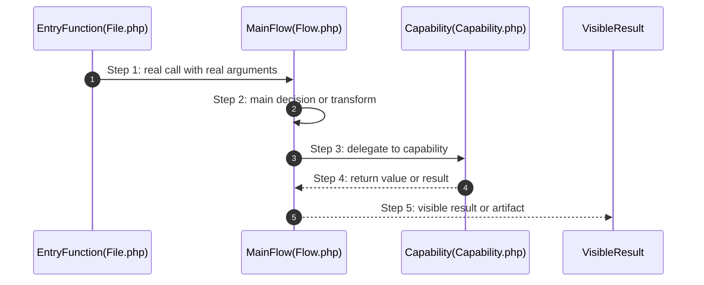

# How To Write Self-Explaining Architecture

## Status

**MANDATORY** - This document defines the self-explaining architecture standard for the project.

## Normative Language

The words **MUST**, **MUST NOT**, **REQUIRED**, **MANDATORY**, **SHOULD**, **SHOULD NOT**, **MAY**, **FORBIDDEN**, **BLOCKER**, **HIGH**, **MEDIUM**, **LOW** are governance keywords.

- **MUST / REQUIRED / MANDATORY**: non-negotiable rule.
- **MUST NOT / FORBIDDEN**: prohibited pattern.
- **SHOULD**: expected default unless documented exception exists.
- **SHOULD NOT**: discouraged pattern requiring justification.
- **MAY**: optional behavior.
- **BLOCKER**: violation prevents GREEN status.
- **HIGH**: must be fixed before production-complete unless explicitly accepted.
- **MEDIUM**: must be tracked and fixed or explicitly deferred.
- **LOW**: cleanup or documentation issue.

---

## 1. The Self-Explaining Architecture Standard

### What It Is

Self-explaining architecture is the principle that every important ownership boundary in The framework must explain itself without requiring the reader to open the code.

A reader — human or AI — must be able to understand:

```text
what this boundary owns
why it exists here
what does NOT belong here
how it fails
how it is observed
how it is tested
which terms are easy to confuse
which decisions are locked
which flows are non-trivial
which mistakes are known
```

If documentation cannot explain the design without opening the code, the design has failed.

### Why It Matters

Code is read more than written. AI agents read code more than humans. An architecture that cannot explain itself at the boundary level creates:

```text
archaeological excavation instead of reading
accidental coupling because boundaries are unclear
duplicate logic because ownership is hidden
stale assumptions because decisions are not recorded
misleading confidence because docs exist but are shallow
```

Self-explaining architecture is not documentation theater. It is the difference between a system that explains itself and a system that must be reverse-engineered.

### Where It Applies

Self-explaining documentation is required at every **important ownership boundary**:

```text
component roots (components/<Area>/<Component>/)
System/ folders
PublicSurface/ folders
Flows/ folders with non-trivial behavior
Capabilities/ folders with complex logic
Configuration/ folders with assembly decisions
security-sensitive boundaries
persistence boundaries
external I/O boundaries
runtime state boundaries
```

### Where It Does NOT Apply

The following boundaries are **exempt** from mandatory self-explaining documentation:

```text
small utilities under 3 PHP files with no subdirectories
Foundation/ folders (tiny neutral primitives)
InternalSystem/ concept folders
ExportedCapabilities/ concept folders
single-file adapters or shims
test fixtures and test helpers
generated or compiled artifacts
```

Exemption does not mean chaos. Exempt boundaries must still follow naming rules and responsibility clarity.

---

## 2. Documentation Artifacts

Self-explaining architecture uses five documentation artifacts:

| Artifact | Purpose | Required When |
|----------|---------|---------------|
| `README.md` | Ownership summary and boundary explanation | Always for important boundaries |
| `dictionary/` | Term definitions with negative grounding | When 5+ domain-specific terms exist |
| `docs/adr/` | Locked architectural decisions | When architectural decisions are made |
| Mermaid diagrams | Non-trivial flow visualization | When flows have 3+ handoffs or 5+ steps |
| `mistakes.md` | Known mistakes and prevention | When area is risky (security, persistence, I/O, runtime state) |

### 2.1 Complexity Thresholds

A boundary is **important** when ANY of the following are true:

```text
- boundary has 10+ PHP files
- boundary has System/ folder (canonical component shape)
- boundary has PublicSurface/ folder
- boundary has Flows/ or Capabilities/ folder
- boundary exposes public API
- boundary owns security-sensitive behavior
- boundary owns persistence or external I/O
- boundary owns runtime state or worker lifecycle
```

A boundary is **complex** when ANY of the following are true:

```text
- boundary has 25+ PHP files
- boundary has 3+ sub-boundaries
- boundary has 5+ domain-specific terms
- boundary has 3+ external dependencies
- boundary has non-trivial flow (3+ handoffs or 5+ steps)
- boundary has locked architectural decisions
```

**Important** boundaries require at minimum README.md.

**Complex** boundaries require the full documentation suite.

---

## 3. Local README Requirements

Every important boundary MUST have a `README.md` that answers:

### 3.1 Required Content

```text
1. What this boundary owns (positive space)
2. What does NOT belong here (negative space — mandatory for AI grounding)
3. Which platform plane it belongs to
4. What public API it exposes
5. What flows it owns or participates in
6. What capabilities it provides
7. How it is configured
8. How it fails
9. How it is observed
10. How it is tested
11. What is not owned here
```

### 3.2 README Template

```markdown
# <Boundary Name>

## What This Boundary Owns

One or two plain sentences about what this boundary is responsible for.

## What Does NOT Belong Here

- <thing that does not belong> — belongs in <correct location>
- <thing that does not belong> — belongs in <correct location>

## Platform Plane

This boundary belongs to the <runtime | control plane | contract plane | integration plane | reliability plane | observability plane | delivery plane | system-design validation plane>.

## Public API

- <public class or method> — <what it does>
- <public class or method> — <what it does>

## Flows

- <Flow name> — <what happens>
- <Flow name> — <what happens>

## Capabilities

- <Capability name> — <what ability it provides>

## Configuration

How this boundary is configured and assembled.

## Failure Modes

- <failure scenario> — <what it looks like>
- <failure scenario> — <what it looks like>

## Observation

How this boundary is monitored and diagnosed.

## Testing

How this boundary is tested and what behavior is proven.

## Not Owned Here

- <responsibility> — owned by <other boundary>
- <responsibility> — owned by <other boundary>
```

### 3.3 README Quality Rules

A README that merely restates the folder name fails this standard.

A README that does not explain negative space fails this standard.

A README that does not document failure modes fails this standard.

---

## Gate Adoption and Baseline Policy

**Status:** MANDATORY
**Severity:** BLOCKER for new or changed ownership boundaries.

The self-explaining architecture checker supports phased adoption:

```bash
php tooling/governance/check-self-explaining-architecture.php --mode=baseline
php tooling/governance/check-self-explaining-architecture.php --mode=changed
```

Rules:

- New complex boundaries must include local documentation before the slice is review-ready.
- Changed complex boundaries must not add missing README, dictionary, ADR, diagram, or stale-marker findings.
- Legacy documentation gaps may remain only when recorded in `.agents/management/baselines/self-explaining-architecture-baseline.json` with owner, reason, remediation category, and review date.
- Baseline mode is not GREEN production readiness. It is controlled YELLOW debt.
- Changed mode is a HARD BLOCKER for Identity rewrite slices.
- FULL_GREEN requires full mode to be clean or the remaining debt to be explicitly accepted through governance evidence.

---

## 4. Dictionary Entry Format

### 4.1 Why Dictionary

A dictionary grounds terms in real behavior so that humans and AI agents share the same understanding.

Without a dictionary, the same term can mean different things to different readers. This creates subtle bugs, miscommunication, and incorrect AI-generated code.

### 4.2 Entry Format

Every dictionary entry MUST follow this exact format:

```markdown
<a id="term-slug"></a>

### `TermName`

**What It Is:**
Plain explanation of the concept. One to three sentences. Grounded in real behavior.
Not abstract. Not academic. Practical and honest.

**What It Is NOT:**
Clear boundaries on what this term does not mean.
What would be a wrong interpretation.
Why someone might misunderstand this term.
What term to use instead if this is not what they mean.

**Common Confusion:**
What other terms this is easily confused with.
Why they are different.
How to tell them apart in practice.
Code-level distinction if relevant.
```

### 4.3 Mandatory Sections

**"What It Is NOT"** is mandatory. A dictionary entry without negative definition is incomplete for AI grounding.

**"Common Confusion"** is mandatory. A dictionary entry without confusion guidance is incomplete for new developer onboarding.

### 4.4 Dictionary Entry Example

```markdown
<a id="flow"></a>

### `Flow`

**What It Is:**
A Flow owns one complete user, system, runtime, or platform action from start to finish.
It coordinates capabilities to achieve a specific outcome.
Example: `RegisterUser` coordinates email validation, password hashing, user creation, and welcome email sending.

**What It Is NOT:**
A Flow is not a reusable capability. It is not a utility function. It is not a configuration builder.
If multiple flows need the same behavior, that behavior should be extracted to a Capability, not duplicated.
A Flow with 500 lines is not a Flow — it is an unsplit responsibility.

**Common Confusion:**
- Flow vs Capability: A Flow owns one complete action. A Capability powers reusable behavior used by multiple flows.
- Flow vs UseCase: In the project, a use case IS a Flow. There is no separate UseCase folder.
- Flow vs Service: A Service is a generic term. A Flow has a specific name describing the action it owns.
```

### 4.5 Dictionary Location

Dictionaries live at:

```text
components/<Area>/<Component>/dictionary/
components/<Area>/<Component>/docs/dictionary/
```

Each dictionary entry is a separate `.md` file named after the term.

---

## 5. ADR Format and Trade-off Analysis

### 5.1 Why ADRs

Architecture Decision Records capture why a decision was made so that future readers understand the reasoning and do not reverse it without understanding the trade-offs.

Without ADRs, decisions are reversed based on incomplete information. The new decision-maker does not know why the old decision was made.

### 5.2 ADR Format

Every ADR MUST include:

```markdown
# ADR-NNN: Short Decision Title

**Status:** proposed | accepted | deprecated | superseded
**Date:** YYYY-MM-DD
**Context:** <boundary or subsystem>

## Context
Why this decision needed to be made. What problem existed before.
What triggered the need for a decision.

## Decision
What was decided. Clear and unambiguous.
If someone reads only this section, they should know the answer.

## Consequences
What this means for the codebase. What changes. What becomes easier. What becomes harder.
Future work that is affected by this decision.

## Trade-off Analysis
| Option | Pros | Cons | Why Rejected |
|--------|------|------|--------------|
| Option A | ... | ... | ... |
| Option B (chosen) | ... | ... | — |
| Option C | ... | ... | ... |

## Assumptions
- What was assumed when making this decision.
- What evidence supported the decision.

## Risks
- What could go wrong because of this decision.
- How to detect if the decision was wrong.
```

### 5.3 Required Sections

```text
Status: MANDATORY — without status, the ADR is unactionable
Context: MANDATORY — without context, the reader does not know why the decision exists
Decision: MANDATORY — without decision, there is no record
Consequences: MANDATORY — without consequences, the reader does not understand impact
Trade-off Analysis: HIGH — without trade-offs, the decision looks arbitrary
Assumptions: LOW — helpful for future readers
Risks: LOW — helpful for future monitoring
```

### 5.4 ADR Location

ADRs live at:

```text
components/<Area>/<Component>/docs/adr/
components/<Area>/<Component>/adr/
docs/adr/
```

ADRs are numbered sequentially: `ADR-001`, `ADR-002`, etc.

---

## 6. Mermaid Diagram Standards

### 6.1 When Diagrams Are Required

Non-trivial flows MUST have Mermaid diagrams:

```text
- flows with 3+ handoffs require sequenceDiagram
- flows with 5+ steps require step-by-step annotation
- flows crossing component boundaries require explicit participant labels
```

### 6.2 Diagram Rules

```text
1. Participants are real files or functions, not abstract names.
2. Steps are numbered (autonumber) unless unnumbered is clearer.
3. Arrows show real data flow, not conceptual flow.
4. Return values and file writes are shown where relevant.
5. Diagram matches actual code behavior, not aspirational design.
6. Use sequenceDiagram by default for the first important path.
7. Use flowchart only when topology teaches better than call order.
8. Colors carry meaning, not decoration.
```

### 6.3 Diagram Template



### 6.4 Bad Diagrams

A diagram that does not match code behavior is misleading and worse than no diagram.

A diagram with abstract participants (`Upstream`, `Downstream`, `Service`) teaches nothing.

A diagram that merely restates the folder structure is noise.

---

## 7. Mistakes File Format for Risky Areas

### 7.1 Why Mistakes Files

Risky areas have known failure modes. Documenting them prevents repeated mistakes and speeds up debugging.

Without mistakes documentation, developers re-discover the same failures. AI agents generate code that repeats the same mistakes.

### 7.2 When Mistakes Files Are Required

Mistakes files are required for:

```text
- security-sensitive areas (auth, tokens, sessions, authorization)
- persistence areas (database, cache, filesystem with user data)
- external I/O areas (HTTP APIs, message brokers, object storage)
- runtime state areas (worker state, request scope, singleton state)
- configuration areas (DI container, service providers, boot sequence)
```

### 7.3 Mistakes File Format

```markdown
# Known Mistakes in <Boundary>

## Mistake: <What Goes Wrong>

**Symptom:** What you see when this happens.

**Root Cause:** Why it happens.

**Prevention:** How this boundary prevents it.

**Recovery:** What to do when it happens anyway.

---

## Mistake: <Next What Goes Wrong>

**Symptom:** ...

**Root Cause:** ...

**Prevention:** ...

**Recovery:** ...
```

### 7.4 Mistakes File Example

```markdown
# Known Mistakes in AuthenticationGateway

## Mistake: Token stored with wrong tenant context

**Symptom:** User can access resources belonging to wrong tenant.

**Root Cause:** Token was issued before tenant context was validated.
The token creation flow did not check tenant boundary.

**Prevention:** TokenAuthority validates tenant context before issuance.
CredentialAuthority validates tenant context before authentication.
Tests prove cross-tenant token rejection.

**Recovery:** Revoke the token. Audit affected resources.
Fix the token creation flow to validate tenant context.
```

### 7.5 Mistakes File Location

Mistakes files live at:

```text
components/<Area>/<Component>/mistakes.md
components/<Area>/<Component>/docs/mistakes.md
components/<Area>/<Component>/System/<Boundary>/mistakes.md
```

---

## 8. Examples Directory Structure

### 8.1 When Examples Are Required

Examples are required when:

```text
- a component exposes public API
- a flow has non-obvious usage patterns
- configuration has non-trivial setup
- failure modes are not obvious
```

### 8.2 Examples Directory Structure

```text
components/<Area>/<Component>/
  docs/
    examples/
      basic-usage.md
      advanced-usage.md (if applicable)
      failure-scenarios.md (if applicable)
      configuration-examples.md (if applicable)
```

### 8.3 Example Quality Rules

Examples are architecture artifacts. They MUST show canonical style.

Examples MUST NOT show:

```text
- manual runtime service assembly
- hidden fallback dependencies
- direct new of runtime services
- service locator in runtime code
- fake providers as primary examples
- deprecated APIs as primary examples
- old names after canonical rename
- shortcuts that violate governance
- weak test patterns
- fake GREEN evidence
- security-sensitive shortcuts without warning
```

If examples must show low-level or manual usage, they MUST be clearly labeled as advanced, internal, or testing-only.

---

## 9. Complexity Thresholds Summary

### 9.1 Documentation Requirements by Complexity

| Level | Files | Sub-boundaries | Terms | Required Docs |
|-------|-------|----------------|-------|---------------|
| Trivial | < 3 | 0 | 0-1 | None (exempt) |
| Simple | 3-9 | 0-1 | 2-4 | README.md |
| Important | 10-24 | 1-2 | 5+ | README.md + dictionary |
| Complex | 25+ | 3+ | 5+ | README.md + dictionary + ADR + Mermaid + mistakes.md |

### 9.2 Quick Decision Guide

```text
Is this boundary exempt (under 3 files, Foundation, etc.)?
  YES → no mandatory docs (but still follow naming rules)
  NO → continue

Does this boundary have System/, PublicSurface/, Flows/, or Capabilities/?
  YES → important boundary → README.md required
  NO → continue

Does this boundary have 5+ domain-specific terms?
  YES → complex boundary → dictionary required

Does this boundary have locked architectural decisions?
  YES → ADR required

Does this boundary have non-trivial flows (3+ handoffs or 5+ steps)?
  YES → Mermaid diagram required

Does this boundary own security, persistence, external I/O, or runtime state?
  YES → mistakes.md required
```

---

## 10. Ownership Rules

### 10.1 Who Writes Docs

```text
The agent or developer who creates or modifies the boundary writes the docs.
```

### 10.2 When Docs Are Reviewed

```text
Docs are reviewed as part of every code review touching the boundary.
```

### 10.3 When Docs Are Updated

```text
Docs MUST be updated in the same commit as the code change.
Code change without doc update is incomplete.
```

### 10.4 Who Approves Docs

```text
The reviewer who approves the code change must also approve the docs.
```

### 10.5 Stale Doc Detection

```text
If docs reference files/functions that no longer exist, docs are stale.
Stale docs are a HIGH finding if they mislead about behavior.
Stale docs are a MEDIUM finding if they reference non-existent files.
```

---

## 11. Gate Integration

The self-explaining architecture gate validates:

```text
- important boundaries have README.md
- README.md explains ownership
- README.md explains negative space
- complex boundaries have dictionary/
- dictionary entries have required sections ("What It Is", "What It Is NOT", "Common Confusion")
- locked decisions have adr/
- ADRs have required sections (Status, Context, Decision, Consequences)
```

The gate location is configured by the project:

```text
configured self-explaining architecture checker
```

The gate is an automated check. Human review must still verify quality, not just presence.

No automated gate replaces human judgment. But no human judgment bypasses automated gates.

---

## 12. GREEN Status Requirement

A component without self-explaining documentation at every important boundary MUST NOT be marked GREEN.

Severity classification:

```text
BLOCKER: missing README.md on important boundary
BLOCKER: missing mistakes.md on risky security/persistence boundary
HIGH: missing README.md negative space explanation
HIGH: missing dictionary on complex boundary
MEDIUM: missing dictionary entry "What It Is NOT" section
MEDIUM: missing dictionary entry "Common Confusion" section
MEDIUM: missing Mermaid diagram on non-trivial flow
MEDIUM: missing ADR on locked architectural decision
LOW: ADR missing trade-off analysis table
LOW: dictionary entry could be clearer
```

---

## 13. Cross-References

This document is supported by:

```text
.agents/how-to/documentation/how-to-document.md — Documentation Quality Gate
.agents/how-to/components/how-to-design-components.md — Self-Explaining Documentation Gate
configured self-explaining architecture checker — Automated gate
AGENTS.md §12 — Evidence Contract
AGENTS.md §8 — SDLC Rule Map
```
