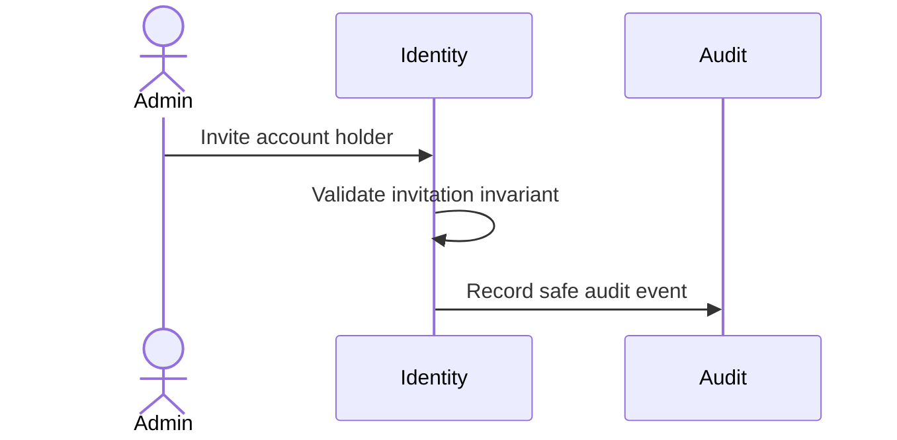

# How To Do Domain Discovery

## Purpose

Do not model by folder habit.
Domain discovery identifies business capability, language, invariants, and context before shaping flows and capabilities.

## When Required

Required for new components, new bounded contexts, domain terminology changes, or major flow/capability modeling.

## Evidence Path

`.agents/management/evidence/generated/<task-name>/domain-discovery.md`

## Template Sections

- Business Capability
- Business Problem
- Core Terms
- Actors
- Work Objects
- Activities
- Domain Story
- Subdomain Classification
- Bounded Context
- Ubiquitous Language Rules
- Invariants
- External Concepts / Translation
- Context Map Notes
- Out of Scope
- Open Questions

## Rules

- Dictionary terms must include local meaning and owner.
- Bounded contexts own meaning and translation boundaries.
- Subdomain classification must explain why the capability is core, supporting, or generic.
- Invariants must be testable.
- External models must be translated at explicit boundaries.

## Prohibited Domain Theater

Do not create these folders by habit unless project-specific governance explicitly allows them:

- `Entities/`
- `ValueObjects/`
- `Services/`
- `Repositories/`
- `Managers/`
- `Helpers/`
- `Utils/`

## Severity

Modeling by folder habit in new production areas is HIGH.
Missing domain discovery for a new bounded context is HIGH.

## Final Report Requirement

Final reports must state domain discovery required/written/skipped and link evidence when present.

## Bounded Context Decision Matrix

| Signal | One Context | Separate Context |
|---|---|---|
| Same terms mean the same thing | YES | NO |
| Different actors own the rules | NO | YES |
| Different lifecycle or release pressure | NO | YES |
| Translation is needed at boundary | NO | YES |
| Invariants must be enforced together | YES | NO |

## Term Conflict Examples

`User` may mean account holder, admin operator, authenticated principal, billing customer, or external identity. Do not reuse the same term across contexts unless the meaning is intentionally shared.

## Dictionary Entry Format

```text
term:
context:
meaning:
not_meaning:
owner:
invariants:
examples:
translation_boundary:
review_date:
```

## Context Map Relationship Types

Use only when the relationship is real:

- upstream/downstream: one context depends on the published model of another;
- customer/supplier: downstream needs influence upstream changes;
- conformist: downstream accepts upstream model as-is;
- anticorruption: downstream translates external meaning into local language;
- shared kernel: small explicitly shared model with joint ownership;
- open-host service: upstream publishes a stable integration surface.

## Invariant Placement Rules

An invariant belongs where it can be enforced atomically and tested. If enforcement crosses boundaries, name the consistency model, retry behavior, and reconciliation path.

## External Model Translation Example

External `subject` may translate to local `PrincipalId`; external `role` may translate to local `CapabilityGrant`. The external name must not leak into core language unless adopted deliberately.

## Mermaid Domain Story Example



## Modeling Investment Rubric

| Scope | Required Modeling |
|---|---|
| Small local behavior | terms, invariant, owner |
| New flow | actor, work object, activity, invariant |
| New bounded context | dictionary, context map, translation, local docs |
| Cross-context data mutation | consistency model, failure paths, reconciliation |

## Anti-Examples

- Creating `Entities/` because DDD was mentioned.
- Naming a folder `Domain/` without a bounded context decision.
- Using external API words as local domain terms without translation.
- Modeling every noun as a class before the scenario is understood.
