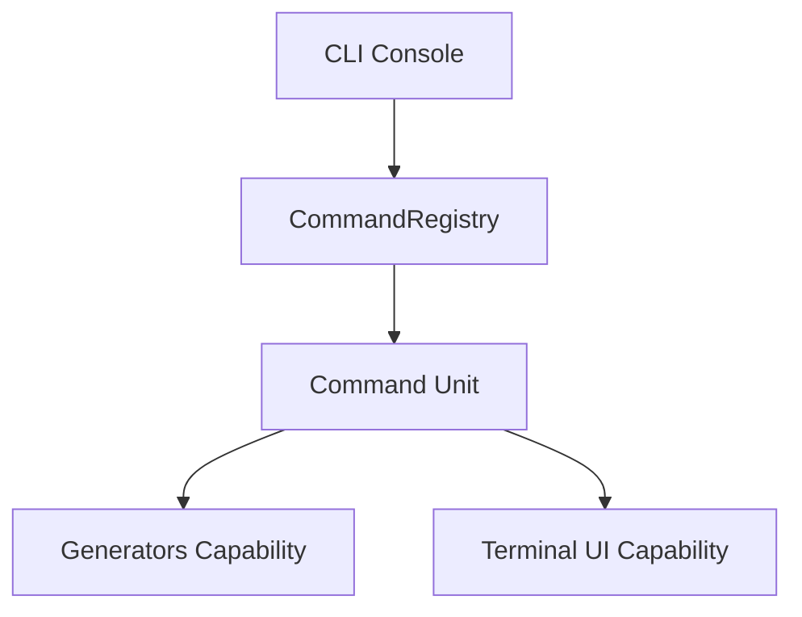

# How This Works: CLI Commands Component

This component provides the core scaffolding and terminal-based tools for the Avax framework.

## Architecture Topology

## Key Capabilities

### 1. Code Generators

Specialized units for creating controllers, entities, repositories, and services with predefined templates.

## Where to Debug First

1. **Command Not Found**: `Avax\Components\CLI\Commands\System\Configuration\CommandRegistry`.
2. **Template Failures**: `Avax\Components\CLI\Commands\System\Capabilities\Generators`.

## Evidence

- `components/CLI/Commands/`
- `components/CLI/UI/`
