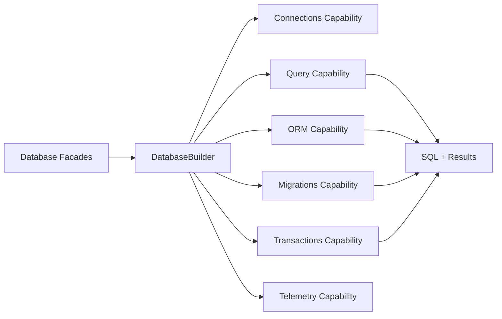

# ARCHITECTURE NOTES

## Phase 0

- System Type: shared library / internal framework component
- Primary Consumers: internal teams, app layer, console tooling
- Runtime Context: mixed (HTTP, CLI, worker)
- Lifecycle: stable core under active refactor hardening
- Intended Use-Cases:
    - query building and execution across multiple SQL dialects
    - migrations and schema operations
    - transaction boundaries and retry policies
    - ORM-style metadata, hydration, identity map, and repositories
    - telemetry and diagnostics around database activity
- Anti-Use-Cases:
    - vendor-specific SDK replacement
    - distributed workflow orchestration
    - arbitrary business logic in capability folders
- Non-Goals:
    - full ORM rewrite
    - cross-process cache or queue implementation
    - external observability vendor integration
- Public API Stability Requirement: moderate
- Backwards Compatibility: required for root facades, optional for internal capability layout
- Performance Budget: optimized for normal application workloads, with explicit batch and pool tooling for
  higher-throughput paths

## Phase 1

Primary axis:

> This system is fundamentally organized around **capabilities**.

Secondary axis:

> Secondary axis: **vertical flow slices** inside capabilities (used where lifecycle orchestration is clearer than one
> service class).

This is how the system actually works.

1. Public facades in `Foundation/Database/*.php` expose the stable entry points.
2. `System/Configuration/DatabaseBuilder.php` wires connections, query, ORM, migrations, transactions, and telemetry
   capabilities.
3. Each capability owns its own execution path:
4. Query: builder/state -> grammar/execution -> result/projection.
5. ORM: metadata -> unit of work/persister/hydrator -> identity map/repository.
6. Migrations: loader/repository -> runner -> transaction wrapper -> schema/query effects.
7. Transactions: connection resolution -> transaction manager -> savepoints/retry helpers.
8. Telemetry: events/spans/metrics capture around connection and query actions.

System invariants:

1. Root facades are thin and delegate ownership into `System/Capabilities`.
2. Query grammar selection is isolated from query state construction.
3. Migration execution is wrapped by the transactions capability, not by ad-hoc builder transactions.
4. Typed projection concerns stay separate from ORM hydration concerns.
5. Telemetry artifacts are append-only diagnostics, not control flow.
6. Each new ownership folder must document its boundary with `how-this-works.md`.

# FINDINGS

### Finding: Database autoload surface was not PSR-4 safe before completion

- Symptom: multiple Database classes and enums were colocated in files whose names no longer matched class ownership.
- Root Cause: refactor expansion added enterprise helpers quickly without finishing physical file normalization.
- Impact: Composer autoload skipped classes, which made parts of the new architecture effectively unavailable at
  runtime.
- Evidence: completed by splitting former `Connections/Pools/{AbstractPools,AdvancedPools,DatabasePoolFactory}.php`,
  `Query/IR/Nodes/*`, `ORM/DataLoader/BatchLoader.php`, and `Query/Advanced/WindowFunctions/WindowBuilder.php`.
- Risk Level: High

### Finding: Query IR existed, but execution quality gates were incomplete

- Symptom: IR nodes existed, but `FromNode` was broken, `WHERE`/`WITH` rendering was incomplete, and no
  validator/normalizer/cache existed.
- Root Cause: phase-2 structure was started before the supporting tooling around it was introduced.
- Impact: static analysis, deterministic fingerprints, and safe IR-based extension were not reliable.
- Evidence: completed by `Query/IR/{IRBuilder,IRValidator,IRNormalizer,IRCache}.php` plus normalized `Nodes/*` and
  `IRTransformer.php`.
- Risk Level: Medium

### Finding: Enterprise expansion slices needed explicit ownership docs

- Symptom: new folders for IR, advanced queries, projections, DataLoader, and OpenTelemetry had no local ownership
  explanation.
- Root Cause: source refactor moved faster than documentation mirroring.
- Impact: reviewability drops quickly; future changes risk reintroducing generic buckets and mixed responsibilities.
- Evidence: added `how-this-works.md` to each missing ownership folder under Database.
- Risk Level: Medium

### Finding: Transactions and telemetry had capability primitives but lacked plan-complete support objects

- Symptom: the main capability existed, but refactor plan items like savepoint manager, deadlock detector, lock manager,
  transaction profiler, fingerprinting, timeline, slow query tracking, and OTel exporters were absent.
- Root Cause: initial refactor prioritized the primary path over supporting enterprise tooling.
- Impact: the component shape looked complete, but the promised extension points were missing.
- Evidence: added `Transactions/{IsolationLevels,SavepointManager,DeadlockDetector,LockManager,TransactionProfiler}.php`
  and `Telemetry/{QueryFingerprint,SlowQueryDetector,QueryTimeline,DbMetricsCollector,OpenTelemetry/*}.php`.
- Risk Level: Medium

# DECISION

Keep and Improve. The component is fundamentally sound after the refactor completion because the primary axis is now
capability-first, the public root remains stable, and the enterprise expansion is attached without collapsing ownership
boundaries. The previous risk was not a wrong axis, but incomplete structural follow-through. That gap is now closed
with PSR-4-safe files, explicit boundaries, and plan-complete helper slices. Future work should remain incremental and
test-driven rather than architectural.

# DECISIONS-LOG

- 2026-04-23: kept the capability-first structure and avoided introducing generic shared service buckets.
- 2026-04-23: normalized every new Database enterprise helper into one-class-per-file ownership where autoload required
  it.
- 2026-04-23: retained root facade compatibility and pushed new behavior into internal capability slices.
- 2026-04-23: made documentation a mandatory ownership artifact for every newly introduced folder.

# NEXT STEPS

- Run the full Database test suite and fix any behavioral regressions surfaced by the expanded helpers.
- Wire selected new helpers into higher-level APIs only where the public contract genuinely benefits.
- Apply the same review discipline to `Foundation/DataModeling`.

