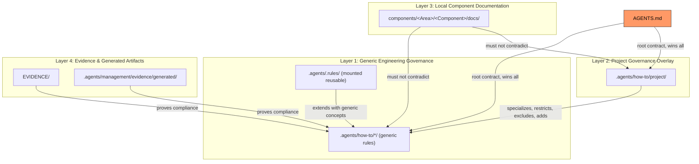
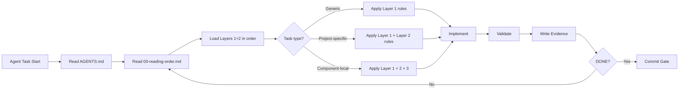

# Governance Layering Model



---

## Governance Reading Flow



## Purpose

This document defines how governance rules are layered, how they relate to each other, and how to determine where a rule belongs.

## The Four Governance Layers

The project governance system has four distinct layers:

```text
┌─────────────────────────────────────────────────────────────┐
│  LAYER 1 — GENERIC ENGINEERING GOVERNANCE                    │
│  Reusable, project-agnostic rules.                            │
│  Location: .agents/.rules/ (mounted), or .agents/how-to/*/    │
│                                                               │
│  Examples:                                                     │
│  - Screaming architecture                                     │
│  - Anti-pattern avoidance                                     │
│  - Risk-based testing                                         │
│  - Self-explaining architecture                               │
│  - Semantic naming                                            │
│  - Clean code philosophy                                      │
│  - ADR philosophy                                             │
│  - Deterministic AI loading                                   │
│  - Governance review process                                  │
│  - Validation philosophy                                      │
└─────────────────────────────────────────────────────────────┘
                               │
                               │ extends with project-specific rules
                               ▼
┌─────────────────────────────────────────────────────────────┐
│  LAYER 2 — PROJECT GOVERNANCE OVERLAYS                       │
│  Project-specific rules that extend Layer 1.                  │
│  Location: .agents/how-to/project/                            │
│                                                               │
│  Examples:                                                     │
│  - Project runtime lifecycle                                  │
│  - Project component taxonomy                                 │
│  - Project PublicSurface rules                                │
│  - Project Flows/Capabilities structure                       │
│  - Project-specific naming conventions                        │
│  - Project-specific runtime adapters                          │
│  - Project-specific anti-patterns                             │
│  - Project governance maturity goals                          │
└─────────────────────────────────────────────────────────────┘
                               │
                               │ informs documentation at boundaries
                               ▼
┌─────────────────────────────────────────────────────────────┐
│  LAYER 3 — LOCAL COMPONENT DOCUMENTATION                      │
│  Component-specific README, ADR, dictionary.                  │
│  Location: components/<Area>/<Component>/docs/                 │
│                                                               │
│  Examples:                                                     │
│  - component-local README.md                                  │
│  - component-local ADRs                                       │
│  - component-local dictionary                                 │
│  - component-local how-this-works.md                          │
│  - component-local Mermaid diagrams                           │
└─────────────────────────────────────────────────────────────┘
                               │
                               │ proves status
                               ▼
┌─────────────────────────────────────────────────────────────┐
│  LAYER 4 — EVIDENCE & GENERATED ARTIFACTS                     │
│  Validation output, reports, audit logs.                      │
│  Location: EVIDENCE/, .agents/management/evidence/             │
│                                                               │
│  Examples:                                                     │
│  - Validation reports                                         │
│  - Audit findings                                             │
│  - Review packs                                               │
│  - Governance classification audits                           │
│  - Generated diagrams and models                              │
└─────────────────────────────────────────────────────────────┘
```

## Layer Ownership

| Layer | Who Owns | Can Be Modified By | Review Required |
|-------|----------|-------------------|-----------------|
| Layer 1 (Generic) | Engineering community | Anyone (with governance review) | Governance review |
| Layer 2 (Project overlay) | Project maintainers | Project contributors | Project review |
| Layer 3 (Local docs) | Component owner | Component contributors | Component review |
| Layer 4 (Evidence) | Task executor | Same task executor | Task review |

## Precedence Rules

When two layers disagree about the same rule:

```text
1. Layer 2 (project overlay) WINS over Layer 1 (generic) for project-specific matters
2. Layer 1 (generic) WINS for universal engineering principles
3. Layer 3 (local docs) MUST NOT contradict Layer 1 or Layer 2
4. Layer 4 (evidence) proves Layer 1-3 compliance, does not define rules
```

### Resolution Algorithm

```text
Does Layer 2 define a project-specific override for this rule?
  → YES → Use Layer 2's version
  → NO → Does Layer 1 define a universal rule?
     → YES → Use Layer 1's version
     → NO → Is this a component-specific concern?
        → YES → Layer 3 applies
        → NO → No governance exists — create at correct layer
```

## Extension Model

Layer 2 extends Layer 1 by:

1. **Specializing** — Making a generic rule concrete for the project
   ```text
   Generic: "Components must have local documentation."
   Project:  "Project components use docs/, dictionary/, adr/, how-this-works.md"
   ```

2. **Restricting** — Making a generic rule stricter
   ```text
   Generic: "Public API should be stable."
   Project:  "PublicSurface must not own runtime machinery."
   ```

3. **Excluding** — Declaring a generic rule does not apply
   ```text
   Generic: "Use UseCases/ folder."
   Project:  "Project does not use UseCases/. Uses Flows/ instead."
   ```

4. **Adding** — Introducing project-specific rules
   ```text
   New: "Project components follow canonical System/PublicSurface/Flows/Capabilities/Configuration shape."
   ```

## How to Classify a Rule

When writing or reviewing governance, classify each rule:

```text
GENERIC:
  - Could apply to any project using this architecture.
  - Does not reference project name, project folders, or project-specific components.
  - Example: "Every public boundary must document its failure modes."

PROJECT_SPECIFIC:
  - Applies only to this project.
  - References project name, project components, project runtime.
  - Example: "Project Flows must not assemble missing object graphs in runtime."

MIXED:
  - Generic concept with project-specific examples.
  - Solution: Separate the generic rule from the project example.
  - Move the generic rule to Layer 1, the example to Layer 2.
```

## What the Layering Model Prevents

```text
1. Duplicate governance truth — every rule lives at exactly one layer
2. Hidden project assumptions in generic rules — project specifics go in Layer 2
3. AI confusion — deterministic loading order tells AI which layer to read first
4. Coupling — generic rules are reusable, project rules are isolated
5. Stale project references — project-specific examples don't pollute generic docs
```
