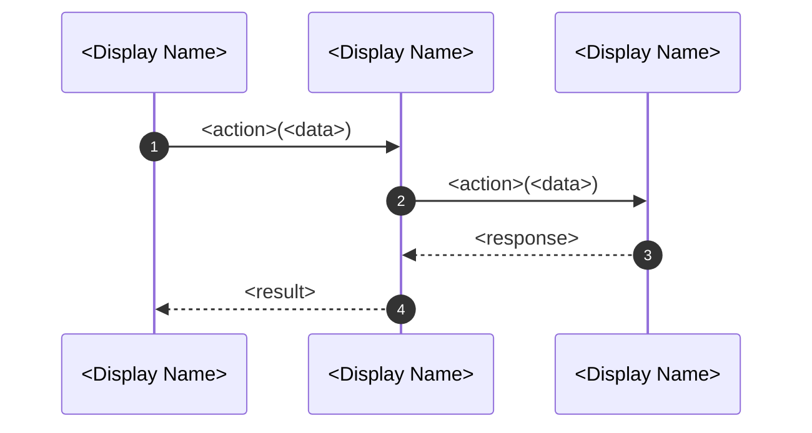

# <Flow Name>

> Purpose: <one sentence describing what flow this diagram shows>

## Diagram

## Step-by-Step

1. **<Step 1>:** <what happens, who does it, why>
2. **<Step 2>:** <what happens, who does it, why>
3. **<Step 3>:** <what happens, who does it, why>

## Participants

| Participant | Role | Key Files |
|-------------|------|-----------|
| <Participant> | <what it does in this flow> | `<file-path>` |
| <Participant> | <what it does in this flow> | `<file-path>` |

## Failure Modes

| Step | Failure | Behavior |
|------|---------|----------|
| <Step> | <what can go wrong> | <how the system responds> |
| <Step> | <what can go wrong> | <how the system responds> |

## Related

- ADRs:
- Dictionary:
- Tests:
