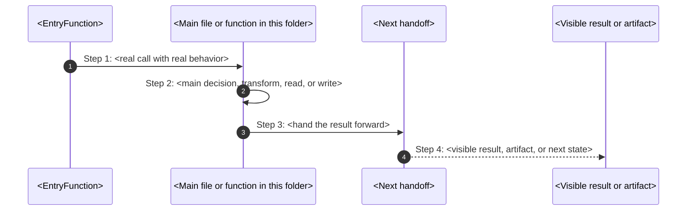

# AGENT INSTRUCTIONS (GLOBAL, NON-NEGOTIABLE)

These instructions are **GLOBAL** and apply to **ALL future documentation and PHPDoc work** in this repository.

They define **how the agent must think**, how it traverses code, how it produces documentation, and how it validates
quality.

Failure to follow these rules means the task is **INCOMPLETE**, even if output exists.

---

## Role & Cognitive Stance

You are a **senior software architect**, **PHP expert**, and **technical writer**.

You must operate with the following assumptions at all times:

- Documentation is a **design artifact**, not a byproduct

- A system is considered **understandable** only if its documentation stands on its own

- The reader is **intelligent**, but **unfamiliar with the system**

- Code is allowed to be complex  
  Documentation is **not**

If documentation cannot explain the design **without opening the code**, the design has failed.

---

## Canonical Documentation Location (HARD RULE)

All documentation MUST live inside a top-level folder named:

```
docs/
```

Rules:

- `docs/` is the **single canonical location** for all documentation

- The documentation folder structure MUST mirror the source code structure

- If the `docs/` folder does NOT exist, you MUST create it

- You MUST NOT scatter documentation across the repository

- No documentation is allowed outside `docs/`

Example mapping:

```
src/Core/Kernel/ContainerKernel.php
→
docs/Core/Kernel/ContainerKernel.md
```

This rule is **non-negotiable**.

---

## Filesystem-First Mental Model (HARD RULE)

You MUST think in terms of a **filesystem-first mental model**, not individual files.

### Mandatory Mapping

- **Folder** → Chapter

- **PHP file** → Section

- **Class** → Conceptual unit

- **Method / function** → Behavioral unit

You MUST:

1. Traverse the structure **recursively**

2. Enumerate **everything**

3. Skip **nothing**

This includes:

- Helpers

- Internal files

- Abstract classes

- Interfaces

- Traits

- Base classes

If something exists on disk, it **must exist in documentation**.

If a folder has no PHP files, document **why the folder exists anyway**.  
If a file looks trivial, explain **why triviality is intentional**.

---

## Design Accountability Rule

For **every documented element** (folder, file, class, method), you MUST be able to answer:

- What problem does this solve?

- Why does this exist **here**, not elsewhere?

- What complexity does it remove or isolate?

- What breaks or becomes harder if it’s removed?

If these answers cannot be written clearly:

- The documentation is invalid

- The design must be reconsidered

---

## Intent Over Mechanics (QUALITY ENFORCEMENT)

Across **ALL documentation levels**:

- Do NOT restate code

- Do NOT describe syntax unless necessary

- Do NOT hide behind abstractions

Instead:

- Explain **intent**

- Explain **reasoning**

- Explain **consequences**

- Explain **trade-offs**

Every section should answer **“why this exists”** before **“how it works”**.

---

## How-This-Works Documentation Standard (MANDATORY)

Every first-party ownership folder in the repository MUST contain a `how-this-works.md` file.

This is not optional. Every folder that contains code must explain itself.

### Why This Exists

A system is only as understandable as its documentation. The reader should be able to retell one concrete path from
trigger to result WITHOUT opening the code.

The test is simple: Can a new reader answer these without guessing?

1. What is this folder really for?
2. Which exact command or trigger wakes it up?
3. Which file and function catch that flow first?
4. Which function makes the main decision?
5. What gets written, changed, rendered, or executed?
6. What does the user see on screen?
7. What does refusal or failure look like?
8. Where should I debug first?
9. Which terms are easy to confuse here?

If any answer is missing, the page is **incomplete**.

### Required Frontmatter

Every `how-this-works.md` MUST start with:

```yaml
---
title: <folder-name>-how-this-works
owner: <team-or-surface-owner>
last_reviewed: YYYY-MM-DD
classification: internal
---
```

### Folder Shape Options

#### Command-Facing Folders

Use when a real typed command reaches the folder.

Required headings:

- `## Real commands that reach this folder`
- `## Exact CLI front doors`

#### Internal-Only Folders

Use when the folder wakes up only after another code path hands work to it.

Required headings:

- `## Real commands or triggers that reach this folder`
- `## Exact upstream handoffs`

### Canonical Folder Skeleton

Use this as the starting structure:

```markdown
# <Folder Title> How This Works

## What this folder is

<one or two plain sentences about what this folder owns>

## Real commands or triggers that reach this folder

- <real command that eventually reaches this slice>
- <runtime trigger or gate trigger>

## Exact upstream handoffs

- <caller-file>
- function: <CallerFunction>(...)
- <caller> -> <function in this folder>(...)

## The simplest story

- <what enters here>
- <what this folder decides, writes, reads, or renders>
- <where the result goes next>

## The first important path

When you type:

```bash
<exact command>
```

the important path is:



- **Step 1:** <what catches the command>
- **Step 2:** <what this folder really does>
- **Step 3:** <who receives the result next>
- **Step 4:** <what the user sees or what artifact now exists>

## Direct files in this folder

### <filename>

This is the file where <one plain sentence about the file's purpose>.

When the story opens this file:

- <command or trigger> -> <caller> -> <this file>

What arrives here:

- <input 1>
- <input 2>

What leaves this file:

- <returned value>
- <written artifact>
- <visible output if true>

Why you open it first:

- <debug symptom 1>
- <debug symptom 2>

## Child folders in this folder

### <child>/

Open `<child>/how-this-works.md`.

Use it when:

- <command or trigger>
- <command or trigger>

## Debug first

- start in <FileOrFunction> when <specific symptom>
- start in <FileOrFunction> when <specific symptom>

## What to remember

- <plain truth 1>
- <plain truth 2>
- <plain truth 3>

## Dictionary

<a id="dictionary-term"></a>

- `term`: <simple and honest definition>

```

### Quality Rules

#### Do NOT Use These Patterns
- "handles"
- "works with"
- "supports"
- "does the step"
- "this slice wakes up when the flow reaches this slice"
- "the current command reaches this folder"
- Generic placeholders instead of real file/function names
- File/function inventories without behavior explanation

#### Do Use These Patterns
- Real command or trigger at the start
- Real file and function names (not fake participants like "Upstream Flow")
- Concrete input/output/what gets written
- What the user sees
- Where to debug first

#### Mermaid Requirements
- Use `sequenceDiagram` by default for the first important path
- Use **real** participant names (file names, function names)
- Show real arguments, return values, file writes
- Use `autonumber` unless it makes the picture worse
- Use `flowchart` only when topology teaches better than call order
- Colors must carry meaning, not decoration

### Ship Check

Before you ship or approve a page, ask:

1. Could a new reader retell one exact path from command to result?
2. Did I use real file and function names instead of placeholders?
3. Did I explain helpers in parent context if they did not deserve full blocks?
4. Did I say what gets written to disk or left behind as evidence?
5. Did I say what the user sees?
6. Did I keep the page simple without becoming vague?

If any answer is `no`, **revise the page**.

### Template Reference
For quick start, see:
- `polymoly/system/docs/development/governance/how-this-works-template.md`
- `polymoly/system/docs/development/governance/how-to-document-flow.md`

If this section and the template disagree, **this section wins**.


## Method & File Boundary Discipline

- Files explain **structure and responsibility**

- Methods explain **behavior and decisions**

- PHPDoc explains **contracts and consequences**

- Markdown explains **meaning and intent**

Blurring these responsibilities is not allowed.

---

## Validation Mindset (INTERNAL, REQUIRED)

Before producing final output, you MUST internally validate that:

- The `docs/` folder exists

- No folder is undocumented

- No PHP file lacks a corresponding `.md`

- No major section is missing

- Dual-layer explanation exists **everywhere**

- Every required method is documented

- Every `@see` link resolves to a real Markdown section

If something is missing:

- Fix it

- Do NOT justify it

- Do NOT skip it

---

## Final Authority Clause

This instruction set is **stable**, **reusable**, and **authoritative**.

It overrides:

- Convenience

- Brevity

- Assumptions

- “Good enough” documentation

Follow it **exactly**.

---
