# AvaX Architecture

**Status:** Normative — Root Architecture North Star
**Version:** 1.0.0
**Date:** 2026-05-26
**Scope:** `./**`

This is the canonical high-level architecture truth for AvaX.

It explains what AvaX is, why it exists, how it works, and what it refuses to become.

Every agent, engineer, reviewer, and future maintainer must read this before touching code.

---

## Table of Contents

1. [What AvaX Is](#1-what-avax-is)
2. [What AvaX Is NOT](#2-what-avax-is-not)
3. [Runtime-Agnostic Philosophy](#3-runtime-agnostic-philosophy)
4. [Screaming Architecture](#4-screaming-architecture)
5. [Flow and Capability Philosophy](#5-flow-and-capability-philosophy)
6. [Public/Internal Boundary](#6-publicinternal-boundary)
7. [DI and Container Philosophy](#7-di-and-container-philosophy)
8. [Runtime Lifecycle Philosophy](#8-runtime-lifecycle-philosophy)
9. [Request-Scope Philosophy](#9-request-scope-philosophy)
10. [Governance Philosophy](#10-governance-philosophy)
11. [Self-Explaining Architecture](#11-self-explaining-architecture)
12. [Testing Philosophy](#12-testing-philosophy)
13. [AI-Native Engineering](#13-ai-native-engineering)
14. [Component Ownership](#14-component-ownership)
15. [Extension Philosophy](#15-extension-philosophy)
16. [Adapter Boundary](#16-adapter-boundary)
17. [Long-Lived Runtime](#17-long-lived-runtime)
18. [Diagrams and Flows](#18-diagrams-and-flows)
19. [Anti-Patterns](#19-anti-patterns)
20. [Forbidden Structures](#20-forbidden-structures)

---

## 1. What AvaX Is

AvaX is a **runtime-agnostic modern PHP application platform and engineering system**.

It is not a framework in the traditional sense. It is a **platform** — a set of reusable, composable, governed capabilities that power applications across multiple runtime environments.

### Core Properties

| Property | Meaning |
|----------|---------|
| **Runtime-agnostic** | Runs on PHP-FPM, FrankenPHP, RoadRunner, Swoole, Workerman, ReactPHP, CLI, Fibers, and future concurrent runtimes. No runtime owns the core. |
| **Flow-oriented** | User, system, and platform actions are expressed as **Flows** — complete stories from input to result. |
| **Capability-oriented** | Reusable behavior lives in **Capabilities** — tested, composable, dependency-injected units. |
| **Component-based** | The system is built from **components** — bounded contexts with stable public APIs, clear ownership, and canonical structure. |
| **Governance-driven** | Rules are codified, enforced by tooling, and validated by evidence. No governance by convention. |
| **Evidence-first** | Claims require proof. GREEN status requires validation. No optimism, no "should work". |
| **AI-native** | Designed for human-AI collaboration. Self-explaining architecture, deterministic rules, evidence trails. |
| **Production-ready** | Built for real systems. Security, observability, failure boundaries, warm worker safety, performance discipline. |

### The AvaX Promise

> **Folder says flow or capability. Unit says responsibility. Function says exact action.**

The repository must read like a story of ownership and behavior, not a warehouse of technical categories.

---

## 2. What AvaX Is NOT

| It Is NOT | Why |
|-----------|-----|
| **Another MVC framework** | MVC is a presentation-layer pattern. AvaX owns the entire application lifecycle. |
| **A Symfony clone** | Symfony provides decoupled components. AvaX provides governed, assembled capabilities with explicit flow execution. |
| **A Laravel clone** | Laravel provides expressive DX. AvaX borrows the DX spirit but enforces enterprise composition discipline. |
| **A microservices platform** | AvaX components are in-process bounded contexts, not network-distributed services. |
| **A CQRS/ES framework** | CQRS and event sourcing are patterns AvaX can express, not the architecture itself. |
| **A boilerplate generator** | No code generation. No skeleton theater. Real classes, real behavior, real tests. |
| **A dependency injection container wrapper** | DI is a means of composition. AvaX is a platform of capabilities. |
| **A collection of Services/Helpers/Utils** | Forbidden folder names are forbidden for a reason. Responsibility owns folders, not technical categories. |
| **A framework that hides complexity** | AvaX makes complexity explicit. Hidden state is a blocker. Magic is minimized. |
| **Optimized for coverage percentage** | Tests prove behavior. Coverage percentage is a side effect, not a goal. |

---

## 3. Runtime-Agnostic Philosophy

AvaX separates **what the system does** from **how the system runs**.

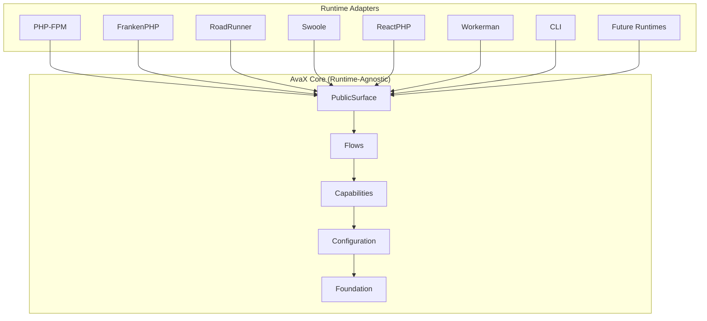

**The rule:** Core code must not import runtime-specific classes. Runtime adapters translate between the runtime world and the AvaX world. The core does not know which runtime executes it.

### Why This Matters

- **Worker safety:** Long-lived processes (RoadRunner, Swoole, FrankenPHP) need state reset, memory guards, and request isolation. AvaX provides this at the capability level, not the runtime level.
- **Testability:** CLI and test runtimes can exercise the same flows as HTTP runtimes.
- **Future-proofing:** New runtimes adopt an interface. Core code does not change.
- **Performance discipline:** Hot paths stay hot. Runtime-specific optimization happens at the adapter boundary.

---

## 4. Screaming Architecture

AvaX uses **screaming architecture** — the folder and file names scream what the system does, not how it is implemented.

### Correct

```
components/Identity/Auth/System/
  Flows/
    AuthenticateUser/
      AuthenticateUser.php
    ValidateToken/
      ValidateToken.php
  Capabilities/
    TokenVerification/
      VerifyTokenSignature.php
    CredentialValidation/
      ValidatePassword.php
```

### Wrong

```
components/Identity/Auth/System/
  Services/
    AuthService.php
  Helpers/
    TokenHelper.php
  Handlers/
    LoginHandler.php
```

The wrong version screams **technical categories**. The correct version screams **business behavior**.

### The Law

| Level | Screams |
|-------|---------|
| **Folder** | Flow or Capability — what action completes or what behavior powers |
| **Class** | Responsibility — what unit owns |
| **Method** | Exact action — what happens here |

---

## 5. Flow and Capability Philosophy

### Flow

A **Flow** owns one complete user, system, runtime, or platform action.

```
Input → Flow → Result
```

- One Flow = one story.
- Flows orchestrate capabilities.
- Flows do not own reusable behavior.
- Flows must stay under 150 lines.
- Flows execute, they do not assemble.

### Capability

A **Capability** owns reusable behavior that multiple flows may compose with.

```
Flow A → Capability → Result
Flow B → Capability → Result
```

- Capabilities are the reusable muscles.
- Capabilities are tested independently.
- Capabilities have clear dependencies.
- Capabilities fail closed when security-sensitive.

### The Decision Rule

**Default to Flow first.** Extract to Capability only after reuse is honest.

If only one Flow uses it, it stays in the Flow. If two Flows need it, extract to Capability. If three Flows need it, it is definitely a Capability.

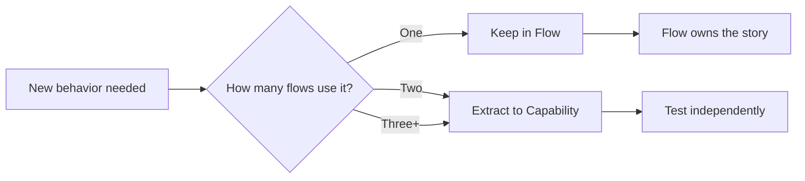

---

## 6. Public/Internal Boundary

### PublicSurface

The PublicSurface is a **boundary**, not a place for machinery.

**Allowed:**
- Stable public API entry point
- DSL entrypoint
- Facade method
- Input normalization for ergonomics
- Delegation to internal Flow/Capability

**Forbidden:**
- Runtime machinery
- Object graph assembly
- Fallback construction of dependencies
- Service locator logic
- Business logic
- Security decisions
- Cache ownership
- Filesystem scanning
- Reflection/class discovery
- Hidden mutable state

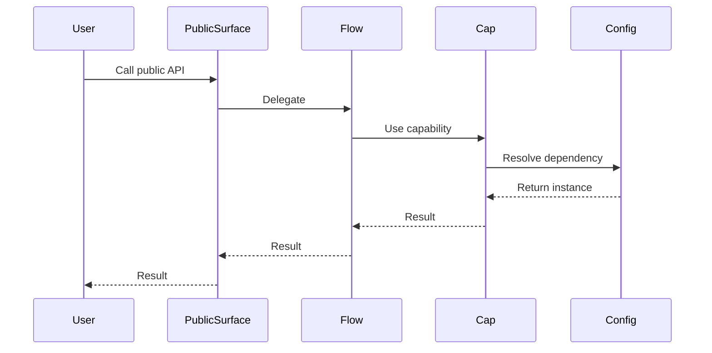

### Internal

Internal code is behind the boundary. It is not hidden — it is **protected**. Internal code:

- Can be refactored without public API changes.
- Must still follow governance.
- Must still have tests.
- Must still document intent.

The boundary is about **stability contract**, not access control.

---

## 7. DI and Container Philosophy

AvaX treats dependency injection as **assembly**, not magic.

### The Rule: Configuration Assembles, Flows Execute

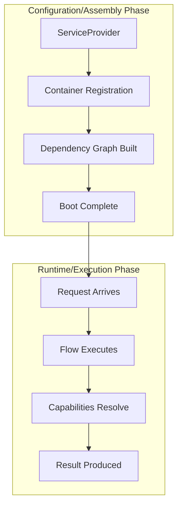

### Constructor Injection

- 0-4 dependencies: normal
- 5-7 dependencies: check design
- 8+ dependencies: warning — likely violates single responsibility

### Required Dependencies

Required dependencies must fail during **configuration, provider registration, compile, verify, or boot**. They must not fail deep inside runtime business code.

### Forbidden in Runtime

- `new MissingDependency()` as fallback
- Hidden service locator usage
- Global `app()` shortcuts inside component internals
- Runtime object graph construction in PublicSurface
- Runtime class discovery for dependency resolution

---

## 8. Runtime Lifecycle Philosophy

Every AvaX runtime follows the same lifecycle:

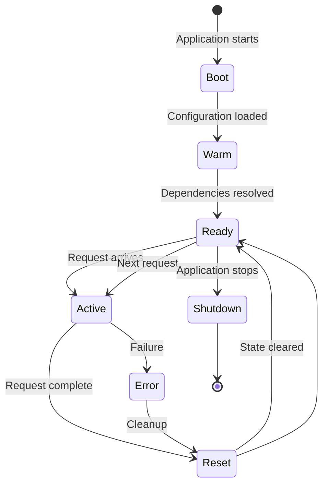

### The Phases

| Phase | What Happens | Who Owns It |
|-------|-------------|-------------|
| **Boot** | Configuration loaded, providers registered | Configuration/ |
| **Warm** | Compiled metadata cached, routes compiled | Capabilities/ |
| **Ready** | All dependencies resolved, health checks pass | PublicSurface/ |
| **Active** | Request flows execute, capabilities compose | Flows/ |
| **Reset** | State cleared, memory checked, worker safe | Runtime/Capabilities |
| **Shutdown** | Resources released, final flush | Runtime/ |

### Why Lifecycle Matters

- **Long-lived runtimes** need reset. Without it, state leaks between requests.
- **Tests** need to exercise the full lifecycle, not just the happy path.
- **Observability** needs to know which phase the system is in.
- **Security** needs to know that reset actually clears sensitive state.

---

## 9. Request-Scope Philosophy

Every request gets its own isolated scope. Request scope:

- Owns per-request state (request data, correlation IDs, tenant context).
- Is reset between requests in long-lived runtimes.
- Cannot leak into the next request.
- Cannot be accessed by sibling requests.

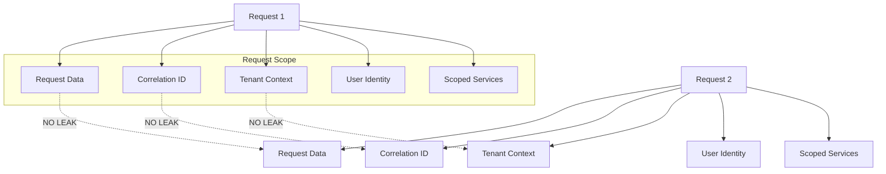

### The Rule

No request-scoped data may live in static state, singleton state, or global state without an explicit reset lifecycle.

---

## 10. Governance Philosophy

AvaX governance is **evidence-based, not opinion-based**.

### The Core Principles

1. **No evidence = NOT_PROVEN** — "Looks good" is not a status.
2. **GREEN must be justified** — Every GREEN claim includes validation results, gate results, and deviation audit.
3. **Suppression is a violation** — Disabling tests, broadening ignore patterns, or weakening assertions to achieve GREEN is itself a BLOCKER.
4. **Severity is canonical** — BLOCKER, HIGH, MEDIUM, LOW, INFO. No document-local severity systems.
5. **Rules are enforceable** — Governance without tooling is decoration.
6. **Self-explaining** — Architecture documents itself locally. AI and humans can understand ownership from the filesystem.

### The Governance Stack

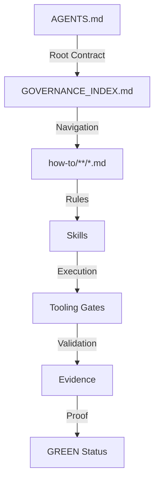

### Why This Matters

- **Scale:** Large teams need deterministic rules, not tribal knowledge.
- **AI safety:** Agents need explicit boundaries, not "figure it out".
- **Maintainability:** Future maintainers can understand why rules exist.
- **Reviewability:** Every claim can be verified independently.

---

## 11. Self-Explaining Architecture

AvaX architecture explains itself **locally**.

### The Model

Every important boundary ships with:

| Document | Purpose |
|----------|---------|
| **README.md** | What this boundary owns, what it does NOT own, how to use it, how it fails |
| **Dictionary** | Terms defined with "What It Is", "What It Is NOT", "Common Confusion" |
| **ADR/** | Decisions with Status, Context, Decision, Consequences |
| **Flows diagrams** | Mermaid diagrams for non-trivial flows |
| **Mistakes** | Known failure modes and anti-patterns in risky areas |

### Why Self-Explaining

- **AI agents** can understand ownership without reading every file.
- **Junior engineers** can navigate without a mentor.
- **Reviewers** can verify completeness quickly.
- **Future maintainers** can understand decisions without archaeology.

### The Threshold

Documentation is required when:
- The boundary has 10+ PHP files, OR
- The boundary has System/ (canonical component shape), OR
- The boundary owns security, identity, or authorization behavior.

Small utilities (3 or fewer files) are exempt.

---

## 12. Testing Philosophy

AvaX testing is **risk-based and behavior-first**.

### What Tests Prove

| Test Type | What It Proves |
|-----------|---------------|
| **Happy path** | Valid input produces expected result |
| **Failed-when** | Invalid input, unauthorized access, expired tokens, missing dependencies fail correctly |
| **Validation-path** | DTO validation, value object validation, boundary normalization work |
| **Security-path** | Fail-closed behavior, authorization denial, token misuse rejection |
| **Runtime/lifecycle** | Reset behavior, worker safety, state cleanup, long-running process safety |

### Forbidden Tests

- `assertTrue(true)` — proves nothing
- Constructor-only tests without behavior — coverage farming
- Getter/setter-only tests — no real logic tested
- Tests changed to fit broken behavior — fake GREEN
- Tests that only prove execution — no behavior assertion

### The Rule

**A security boundary without a negative test is NOT proven.**

Coverage percentage is NOT truth. Behavioral proof is truth.

### Test Pyramid

```
        /\
       /  \       Contract Tests
      /----\      (few, slow, integration-heavy)
     /      \
    /--------\    Integration/Feature Tests
   /          \   (moderate count, realistic setup)
  /------------\
 /              \  Unit Tests (many, fast, isolated)
/________________\
```

---

## 13. AI-Native Engineering

AvaX is designed for **human-AI collaboration**, not AI replacement.

### What This Means

| Aspect | Design Decision |
|--------|----------------|
| **Self-explaining architecture** | AI agents can understand ownership from filesystem + local docs |
| **Deterministic governance** | Rules are explicit, not heuristic. AI can verify compliance. |
| **Evidence trails** | Every claim links to files, outputs, and validation results. |
| **Canonical severity** | AI and humans use the same severity scale. |
| **Skill system** | Reusable agent playbooks with explicit preconditions. |
| **Review packs** | Focused, timestamped ZIP packages for AI upload with context. |

### AI Agent Safety

AI agents must:
1. Load context before acting (AGENTS.md, relevant how-tos, skills, evidence).
2. Distinguish between current state and historical state.
3. Never suppress findings to achieve GREEN.
4. Always validate before claiming success.
5. Write evidence for every important claim.

### The Promise

> AvaX governance makes it **difficult to fake GREEN, difficult to drift, and difficult to misuse**.

---

## 14. Component Ownership

Every component is a **bounded context** with a single owner.

### The Canonical Shape

```
components/
  <Area>/
    <Component>/
      System/
        PublicSurface/     # Stable public API (conditional)
        Flows/             # Complete action stories (conditional)
        Capabilities/      # Reusable behavior (required)
        Configuration/     # Assembly, registration, providers (conditional)
        Foundation/        # Tiny neutral primitives (optional, must stay small)
```

### Component Dogfooding

Components must reuse existing AvaX capabilities where appropriate:
- Filesystem (not raw `file_get_contents`)
- Logger (not raw `echo`/`error_log`)
- Cache (not raw static arrays)
- Configuration (not raw `$_ENV`)
- Security (not raw `md5()`)

### Forbidden Between Components

- Reaching into another component's private internals.
- Circular component dependencies.
- Hidden service locator calls.
- Global `app()` shortcuts inside internals.

---

## 15. Extension Philosophy

AvaX extends through **stable boundaries**, not through invasive hooks.

### Extension Points

| Extension Mechanism | Use Case |
|-------------------|----------|
| **ServiceProvider** | Register new capabilities, override bindings |
| **Events/Listeners** | React to system events without modifying core flows |
| **Middleware** | Intercept HTTP request/response pipeline |
| **Capabilities** | Replace or extend behavior through DI |
| **Adapters** | Provide runtime-specific implementations |

### The Rule

Extensions must not modify core AvaX code. They compose with it through stable interfaces.

---

## 16. Adapter Boundary

Adapters translate between **the AvaX world** and **the external world**.

### What Adapters Do

- Translate runtime-specific APIs into AvaX abstractions.
- Own runtime-specific state management.
- Provide availability detection.
- Never leak runtime details into core code.

### Adapter Lifecycle

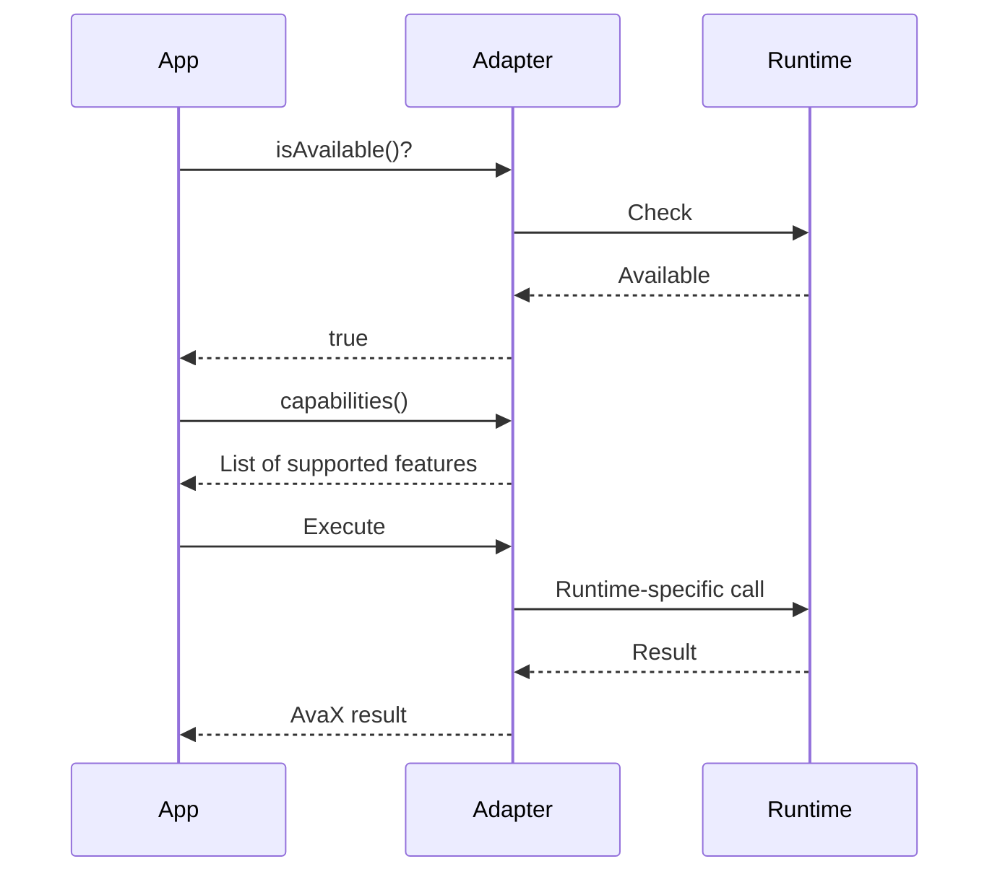

---

## 17. Long-Lived Runtime

AvaX must survive in **long-lived processes** where state persists between requests.

### The Challenges

| Challenge | AvaX Solution |
|-----------|--------------|
| **State leaks** | `MustResetState` contract, `HandleWarmRequest` lifecycle |
| **Memory growth** | `MonitorWorkerMemory` with thresholds, growth rate tracking |
| **Stale connections** | Connection pooling with idle timeout, reset/close lifecycle |
| **Static mutable state** | `reset()` lifecycle on all owners with static state |
| **Singleton pollution** | Request-scoped instances, reset between requests |

### The Warm Worker Lifecycle

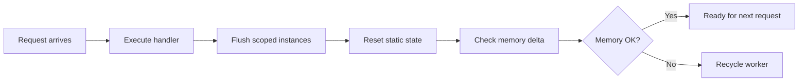

### Why This Matters

- **FrankenPHP, RoadRunner, Swoole** are production runtimes. AvaX must work on them.
- **Tests prove worker safety** with two-request leak tests.
- **Memory guards prevent slow growth** that only appears after hours of operation.

---

## 18. Diagrams and Flows

### Complete Request Flow

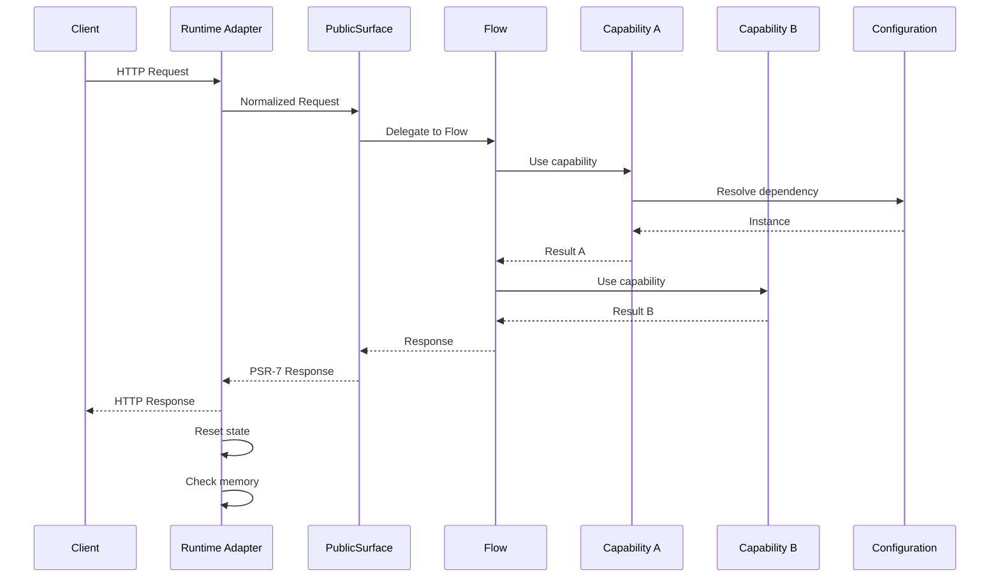

### Component Dependency Direction

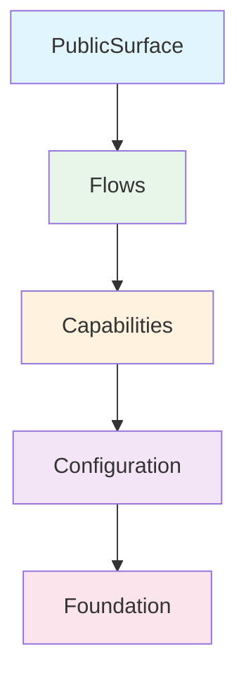

Dependencies flow **down**. Foundation depends on nothing. PublicSurface depends on everything below it.

### Governance Enforcement Flow

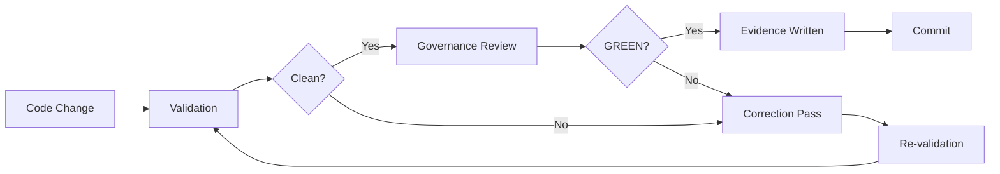

---

## 19. Anti-Patterns

### Anti-Pattern: The God Class

**What it looks like:** A single class with 1000+ lines, 40+ methods, and dependencies on everything.

**Why it's bad:** No single responsibility, impossible to test, impossible to review.

**AvaX fix:** Split into Flow (orchestration) + Capabilities (reusable behavior). Extract to Configuration (assembly).

### Anti-Pattern: The Hidden Singleton

**What it looks like:** Static mutable state that leaks between requests in long-lived runtimes.

**Why it's bad:** Request A's data appears in Request B. Worker safety is broken.

**AvaX fix:** `MustResetState` contract, `reset()` lifecycle, request-scoped instances.

### Anti-Pattern: The Runtime Assembly in Flow

**What it looks like:** A Flow that constructs its own dependencies with `new` or container lookups.

**Why it's bad:** Flows should execute, not assemble. Testing becomes impossible. DI contract is broken.

**AvaX fix:** Configuration/Assembly owns construction. Flows receive fully constructed dependencies.

### Anti-Pattern: The Test That Proves Nothing

**What it looks like:** `assertTrue(true)`, constructor-only tests, getter/setter tests without behavior.

**Why it's bad:** Coverage percentage goes up. Actual confidence stays at zero.

**AvaX fix:** Tests must prove behavior. Negative tests for security boundaries. Fail-closed tests.

### Anti-Pattern: The Fake GREEN

**What it looks like:** Disabling tests, broadening ignore patterns, weakening assertions to pass gates.

**Why it's bad:** The system is broken. The gate says it's fine. Production will fail.

**AvaX fix:** Suppression is itself a BLOCKER violation. Real correction or explicit exception register entry required.

### Anti-Pattern: The Folder Dump

**What it looks like:** `Services/`, `Helpers/`, `Utils/`, `Common/` — technical categories, not responsibilities.

**Why it's bad:** The filesystem says nothing about what the system does. New engineers cannot navigate.

**AvaX fix:** Folder says flow or capability. Unit says responsibility. Function says exact action.

---

## 20. Forbidden Structures

The following are **forbidden** as default directories, namespaces, or broad buckets:

```
Services        Helpers         Utils           Common
Shared          Managers        Core            Support
Adapters        Contracts       Handlers        Processors
Commands        Queries         Domain          Entities
ValueObjects    Aggregates      Repositories    Events
CQRS            EventSourcing   Sagas           Policies
Specifications  Diagnostics     Tests           Docs
InternalSystem  ExportedCapabilities
```

### Why These Are Forbidden

These words describe **technical categories**, not **responsibilities**. They tell you nothing about what the system does.

### Exception Process

If a forbidden term is truly domain language, document:

| Field | Purpose |
|-------|---------|
| rule | Which governance rule is being bent |
| path | Where the exception lives |
| reason | Why the exception is needed |
| risk | What could go wrong |
| owner | Who is responsible |
| expiry | When this exception must be revisited |
| cleanup | How to remove the exception |
| validation | How to verify the exception is still needed |

---

## Appendix: Quick Reference for Beginners

### I'm New. Where Do I Start?

1. Read this file (you're here).
2. Read `AGENTS.md` for the execution contract.
3. Read `.agents/GOVERNANCE_INDEX.md` for navigation.
4. Look at any component's `System/` folder — the structure is canonical.
5. Read the component's `README.md` for ownership.
6. Read the component's dictionary for terms.
7. Read a Flow file — it tells the story of one complete action.

### I Want to Add a Feature. What Do I Do?

1. Which component owns this behavior?
2. Is there already a Capability for this?
3. Create a Flow in the owning component.
4. Write tests that prove behavior (happy + failure paths).
5. Run validation gates.
6. Write evidence.

### I Want to Fix a Bug. What Do I Do?

1. Write a failing test that reproduces the bug.
2. Fix the code.
3. Verify the test passes.
4. Run validation gates.
5. Write evidence.

### I'm Reviewing Code. What Do I Check?

1. Does the folder scream flow or capability?
2. Does the class scream responsibility?
3. Does the method scream exact action?
4. Are dependencies injected (not assembled at runtime)?
5. Are there negative tests for security behavior?
6. Is there a README for new boundaries?
7. Does GREEN have evidence?

---

**This document is the north star. It evolves with the platform. Every change to architecture philosophy must update this file.**
