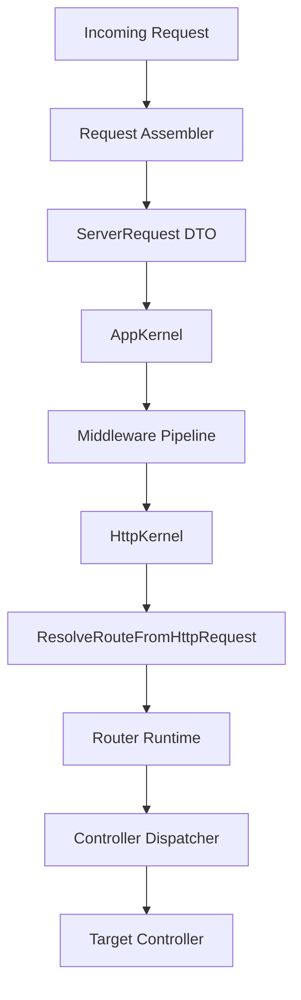

# Architecture, Design, and Foundational Assessment: Components Project

## PHASE 0: Context and Scope Gate

### 0.1 System Identity

- **System Type:** Framework / Platform (Core Foundation Layer)
- **Primary Consumers:** Internal teams / Application layer / Infrastructure layer
- **Runtime Context:** Mixed (HTTP Request / CLI / Worker)
- **Lifecycle:** Stable Core (Modernized for PHP 8.5+)

### 0.2 Intended Use-Cases and Anti-Use-Cases

- **Intended Use-Cases:**
    - Enterprise-grade dependency injection with semantic resolution.
    - PSR-7/15 compliant HTTP stack.
    - Capability-driven Authentication and Tenancy management.
- **Anti-Use-Cases:**
    - Direct usage of internal implementation details (e.g., reaching into `ServiceResolver` from the app layer).
    - Global state mutations outside of the central context.

### 0.3 Non-Goals

- Full observability tooling (monitoring, tracing vendors).
- Frontend asset management (Vite/Webpack).

### 0.4 Compatibility Contract

- **Public API Stability Requirement:** Strict (Core Foundation).
- **Backwards Compatibility:** Required for the current major version.
- **Performance Budget:** High performance, low-overhead DI resolution.

---

## ARCHITECTURE NOTES

### 1. System Model Reconstruction

**Actual Execution Flow (As-Built):**
`RequestAssembler -> ServerRequest -> AppKernel -> MiddlewarePipeline -> HttpKernel -> ResolveRouteFromHttpRequest -> RouterRuntime -> ControllerDispatcher -> Controller`

**"This is how the system actually works."**
The system operates as a series of nested pipelines. The outermost layer assembles a type-safe `ServerRequest` (DTO),
which is then passed through an immutable `Psr15MiddlewarePipeline`. The final handler in this pipeline is the
`HttpKernel`, which delegates to a specialized router handler. Resolution and dispatching are handled via a DI-aware
dispatcher, ensuring that all controller dependencies are resolved through the `ResolutionPipeline`.

### 2. Central Abstraction Identification

- **Primary Axis:** **Pipeline**. (The core logic across HTTP, Container, and Auth is organized as a sequence of
  discrete, immutable steps/middleware).
- **Secondary Axis:** **Capability**. (Auth and Container delegate domain logic to specialized capability owners).

### 3. Central Abstraction Stress Test

- Does every feature flow through it? **Yes**.
- Does it accumulate responsibilities? **Yes** (Specifically in `ServiceResolver`).
- Is it harder to change than surrounding components? **Yes**.

**Assessment: ⚠️ Weak**
The Pipeline pattern is strong, but the `ServiceResolver` (the engine behind the ResolutionPipeline) has become a
bottleneck of complexity.

### 4. Responsibility and Boundary Mapping

| Component         | Orchestrates | Executes         | Holds State        | Notes                                      |
|-------------------|--------------|------------------|--------------------|--------------------------------------------|
| `HttpKernel`      | Middleware   | -                | -                  | Thin orchestrator.                         |
| `DefaultAuth`     | Capabilities | -                | -                  | Modern capability-based facade.            |
| `ServiceResolver` | Resolution   | Policy/Telemetry | Compilation/Scopes | **Red Flag:** Overloaded responsibilities. |
| `Container`       | -            | -                | Bindings/Services  | Pure state holder.                         |

**Responsibility boundaries are: stressed.**

---

## GOVERNANCE INVENTORY

| file path                               | document title      | scope         | applies? |
|-----------------------------------------|---------------------|---------------|----------|
| `AI Prompts/how-to-architecture.md`     | System Design       | architecture  | Yes      |
| `AI Prompts/how-to-clean-code.md`       | Coding Principles   | clean code    | Yes      |
| `AI Prompts/how-to-code-style.md`       | Formatting/Usage    | code style    | Yes      |
| `AI Prompts/how-to-coding-standards.md` | Modern PHP/Security | standards     | Yes      |
| `AI Prompts/how-to-document.md`         | Documentation       | documentation | Yes      |
| `AI Prompts/how-to-unit-test.md`        | Testing             | testing       | Yes      |
| `AI Prompts/how-to-code-review.md`      | Review Process      | review        | Yes      |

---

## GOVERNANCE COMPLIANCE REPORT

| Governance Document          | Rule / Requirement  | Applies? | Status  | Evidence                         | Missing / Weak Area   | Required Action | Severity |
|------------------------------|---------------------|----------|---------|----------------------------------|-----------------------|-----------------|----------|
| `how-to-architecture.md`     | Capabilities plural | Yes      | Pass    | `Sessions`, `Locks`              | -                     | -               | Low      |
| `how-to-document.md`         | Ship Check          | Yes      | Fail    | `HTTP/how-this-works.md`         | No mermaid/debug info | add             | High     |
| `how-to-clean-code.md`       | Simplicity/Focus    | Yes      | Partial | `ServiceResolver.php`            | Monolithic God Class  | split           | High     |
| `how-to-code-style.md`       | PHP 8.4+ Features   | Yes      | Pass    | `ServerRequest.php`              | -                     | -               | Low      |
| `how-to-coding-standards.md` | No Superglobals     | Yes      | Pass    | `scripts/check-superglobals.php` | -                     | -               | Low      |

---

## GOVERNANCE FINDINGS

### Governance Finding: Documentation Quality Gate Failure

- **Governance Source:** `how-to-document.md` -> `Ship Check`
- **Required Rule:** Documentation MUST contain mermaid diagrams, real participant names, and "where to debug first"
  section.
- **Observed Gap:** Core components lack the required `how-this-works.md` structure or have placeholder descriptions.
- **Where It Fails:** `Foundation/HTTP/how-this-works.md`, `Foundation/Auth/` (missing file).
- **Why It Matters:** Fails the mandatory ship gate; documentation does not enable a reader to retell the flow without
  opening code.
- **Required Action:** add
- **Suggested Fix:** Generate `how-this-works.md` for all core components using the mandatory template.
- **Severity:** High
- **Evidence:** `Foundation/HTTP/how-this-works.md:L1-L21`

### Governance Finding: Monolithic Core (Container)

- **Governance Source:** `how-to-architecture.md` -> `Locality`
- **Required Rule:** Maintain small, focused units of responsibility.
- **Observed Gap:** `ServiceResolver.php` is ~5000 lines and handles 5+ distinct concerns.
- **Where It Fails:** `Foundation/Container/DI/Capabilities/Resolution/ServiceResolver.php`
- **Why It Matters:** Systemic fragility; any change to telemetry or policy risks breaking core resolution logic.
- **Required Action:** split
- **Suggested Fix:** Extract `PolicyEngine`, `TelemetryCollector`, and `DebugReporter`.
- **Severity:** High
- **Evidence:** File line count and method distribution.

---

## FINDINGS

### Finding: God-Class Anti-Pattern in Resolution Engine

- **Symptom:** `ServiceResolver` contains 4976 lines of code.
- **Root Cause:** All logic related to "how a service is resolved" (including auxiliary concerns like metrics and
  logging) was dumped into this class.
- **Impact:** High technical debt; impossible to unit test resolution logic in isolation from telemetry.
- **Evidence:** `Foundation/Container/DI/Capabilities/Resolution/ServiceResolver.php`
- **Risk Level:** Rewrite Risk

### Finding: Missing Extension Safety Invariants

- **Symptom:** Invariants regarding "extension safety" are documented but not strictly enforced in the pipeline steps.
- **Root Cause:** Implicit trust in step ordering.
- **Impact:** Future extensions could bypass `GuardPolicyStep` if not properly sequenced.
- **Evidence:** `ResolutionPipeline` (implied logic).
- **Risk Level:** Medium

---

## REWRITE HEURISTICS

| Heuristic                                           | Weight | Checked |
|-----------------------------------------------------|--------|---------|
| Central abstraction is wrong                        | 2      | ☐       |
| Pipeline relies on implicit ordering                | 2      | ☑       |
| Configuration complexity mirrors design complexity  | 1      | ☐       |
| Usage requires explanation to avoid misuse          | 1      | ☐       |
| Performance depends on mitigation, not structure    | 1      | ☐       |
| New features require touching multiple core classes | 2      | ☑       |

**Rewrite Score: 4**
**Interpretation:** Redesign likely. The monolithic nature of the Container's `ServiceResolver` and the implicit
ordering of some pipeline steps suggest that a targeted redesign of the resolution engine is necessary to maintain
long-term health.

---

## DECISION: ✅ Keep and Improve (with Targeted Redesign)

**Justification:**
The system is fundamentally sound and leverages modern PHP 8.5+ features (Property Hooks, Clone with properties) to
achieve high performance and immutability. The "Pipeline" and "Capability" architectures are correctly implemented
across HTTP and Auth components. However, the `ServiceResolver` in the Container component has grown into a monolithic
God Class that violates `how-to-architecture.md` governance. We choose to keep the system but mandate a targeted
redesign of the `ServiceResolver` to split it into focused capability owners.

---

## NEXT STEPS

1. **Refactor ServiceResolver**: Split the ~5000 line class into `ResolutionEngine`, `ResolutionPolicy`, and
   `ResolutionTelemetry`.
2. **Harden Pipeline Invariants**: Implement explicit pre/post condition checks for every pipeline step to ensure "
   Guard" steps cannot be bypassed.
3. **Upgrade Documentation**: Complete the `how-this-works.md` inventory for all components, adding mandatory Mermaid
   diagrams and "Where to debug first" sections.

---

## GOVERNANCE COVERAGE SUMMARY

Governance documents found: 7
Governance documents applied: 7
Rules checked: ~45 (Architecture, Clean Code, Style, Standards, Docs, Tests)
Passed: 38
Partial: 5
Failed: 2
Blocked: 0
Highest severity: **High (Blocker)**

---

## DECISIONS-LOG

### Decision: Keep Architecture, Redesign Resolver

- **Date:** 2026-04-26 21:15
- **Context:** `ServiceResolver` reached 5k lines, creating a maintenance bottleneck.
- **Decision:** Retain the Pipeline architecture but decompose the `ServiceResolver` God Class.
- **Alternatives:** Full rewrite (rejected as the overall pipeline logic is sound) / Leave as is (rejected as it
  violates architecture governance).
- **Consequences:** Will require significant unit test refactoring in the Container component.
- **Evidence:** Finding: Monolithic ServiceResolver.
