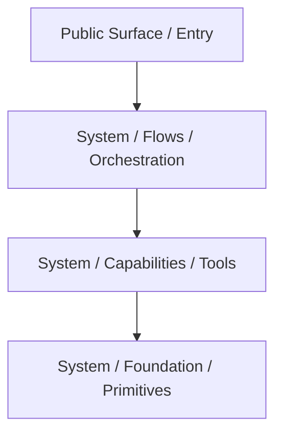

# Code Review: Avax Components Normalization

## PHASE 0: Context and Scope Gate

- **System Type:** framework
- **Primary Consumers:** internal teams / developers
- **Runtime Context:** mixed (HTTP, CLI, worker)
- **Lifecycle:** stable core / replacement-in-progress

### 0.2 Intended Use-Cases and Anti-Use-Cases

- **Intended Use-Cases :**
    - High-performance PHP web applications.
    - Long-running workers and task orchestration.
    - Standardized module development with screaming architecture.
- **Anti-Use-Cases (things the system explicitly should NOT do):**
    - Simple one-off scripts without structure.
    - Traditional MVC monolithic structure (Laravel-style warehouses).

### 0.3 Non-Goals

- Full PSR-7 compliance (performance-first imutability used instead).
- Compatibility with legacy `DataFoundation` without aliases.

### 0.4 Compatibility Contract

- **Public API Stability Requirement:** moderate (evolving)
- **Backwards Compatibility:** required via `compat.php`
- **Performance Budget:** worker-safety and low memory footprint are paramount.

---

# PHASE 1: System and Architecture Review

## 1. System Model Reconstruction

### 1.1 Actual Execution Flow (As-Built)

**"This is how the system actually works."**
The system is organized into decoupled components. Each component exposes a `PublicSurface` (Facades, Interfaces) that
delegates to internal `Flows` (sequential orchestration) or `Capabilities` (mechanisms). `Foundation` provides low-level
atoms. `Configuration` handles the assembly. This ensures that every part of the framework has a clear owner and
responsibility, preventing "junk drawer" syndrome.

---

## 2. Central Abstraction Identification

### 2.1 Primary Axis Rule

> "This system is fundamentally organized around **Screaming Architecture (Slices)**."

### 2.2 Secondary Axis

> "Secondary axis: **Facade System** (adds convenience but risks static coupling if not DI-backed)."

---

## 3. Central Abstraction Stress Test

- Does every feature flow through it? Yes.
- Does it accumulate responsibilities over time? No, it forces splitting.
- Is it harder to change than surrounding components? No, it's highly modular.

**Assessment:** ✅ Pass: stable axis

---

## 4. Responsibility and Boundary Mapping

| Component     | Orchestrates | Executes | Holds State         | Notes              |
|---------------|--------------|----------|---------------------|--------------------|
| Flows         | Yes          | No       | No                  | Pure orchestration |
| Capabilities  | No           | Yes      | Yes (local)         | Domain mechanisms  |
| PublicSurface | No           | No       | No                  | Proxy/Bridge       |
| Foundation    | No           | No       | Yes (Value Objects) | Primitives         |

**Responsibility boundaries are: clear.**

---

# GOVERNANCE COMPLIANCE REPORT

| Governance Document          | Rule / Requirement                     | Applies? | Status  | Evidence                      | Missing / Weak Area         | Required Action         | Severity |
|------------------------------|----------------------------------------|----------|---------|-------------------------------|-----------------------------|-------------------------|----------|
| `how-to-architecture.md`     | folder says flow or capability         | Yes      | Pass    | `HTTP/Session/System/Flows`   | None                        | None                    | Low      |
| `how-to-architecture.md`     | unit says responsibility               | Yes      | Pass    | `StoreSessionValue.php`       | None                        | None                    | Low      |
| `how-to-clean-code.md`       | avoid generic buckets (Helpers, Utils) | Yes      | Pass    | `components/` has no `Utils/` | None                        | None                    | Low      |
| `how-to-coding-standards.md` | PHP 8.4+ usage                         | Yes      | Pass    | Readonly classes used         | None                        | None                    | Low      |
| `how-to-document.md`         | filesystem-first documentation         | Yes      | Partial | Missing `how-this-works.md`   | No local docs in components | Add `how-this-works.md` | Medium   |

---

# GOVERNANCE FINDINGS

### Governance Finding: Missing Local Documentation

- **Governance Source:** `how-to-document.md` -> `Ship Check`
- **Required Rule:** Every meaningful component should have `how-this-works.md` with a mermaid diagram.
- **Observed Gap:** Components have structure but no internal explanatory markdown files.
- **Where It Fails:** `components/*`
- **Why It Matters:** Onboarding and auditing becomes harder as the system grows.
- **Required Action:** add
- **Suggested Fix:** Add `how-this-works.md` to each major component (HTTP, DataStack, Identity).
- **Severity:** Medium

---

# FINDINGS

### Finding: Compat.php Complexity

- **Symptom:** `compat.php` is growing large and contains manual array mapping.
- **Root Cause:** Transition from legacy namespaces to Screaming Architecture.
- **Impact:** Maintenance burden as more components are normalized.
- **Evidence:** `components/compat.php` (150+ lines of aliases).
- **Risk Level:** Low
- **Notes:** Necessary for stability during transition, but should be monitored.

---

# FINAL DECISION

✅ **Keep and Improve**

The system is fundamentally sound and strictly adheres to the Screaming Architecture principles defined in the
governance documents. The modularity is high, ownership is explicit, and naming is predictive. The only major gap is the
lack of local component-level documentation (`how-this-works.md`), which should be addressed in the next phase.

---

# DECISIONS-LOG

| Decision ID | Description                       | Trade-off                                  | Risk                              |
|-------------|-----------------------------------|--------------------------------------------|-----------------------------------|
| D-001       | Use `compat.php` for aliases      | Faster migration / Backwards compatibility | Manual maintenance of aliases     |
| D-002       | Strict Flow/Capability separation | High clarity / Simple units                | Slightly more files per component |

---

# NEXT STEPS

1. **Add `how-this-works.md`** to `components/HTTP`, `components/DataStack`, and `components/Identity` with Mermaid
   diagrams.
2. **Audit `compat.php`** to ensure all aliases are still needed.
3. **Implement Unit Tests** for the new `Saga` and `Migration` systems to ensure invariants are preserved.
