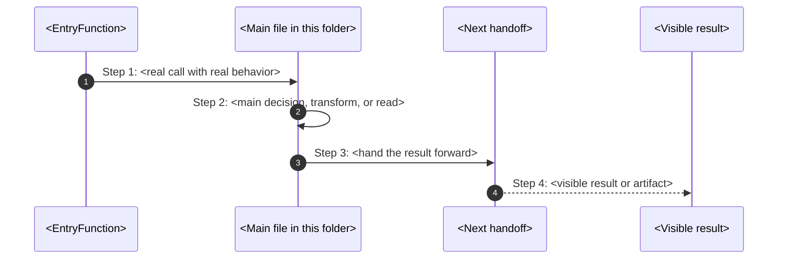

# How-This-Works Template

This file is a thin execution scaffold for programming-facing flow documents.

The real law lives in:

- `../governance/standards/documentation/how-to-document-flow.md`
- `../governance/standards/documentation/how-to-document.md`

If the template and the flow law disagree, the flow law wins.

## Before You Write

Collect these facts first:

1. one real trigger
2. the first file and first function
3. the main decision owner
4. the next handoff
5. the visible result
6. the failure path
7. what gets written, changed, observed, or returned
8. the terms a new reader may confuse

If you do not know those answers yet, keep reading code before writing prose.

## Required Frontmatter (MANDATORY)

```yaml
---
title: <folder-name>-how-this-works
owner: <team-or-surface-owner>
last_reviewed: YYYY-MM-DD
classification: internal
---
```

**This frontmatter is mandatory. Without it, the file fails CI lint.**

## Canonical Skeleton

````md
# <Folder Title> How This Works

## What this folder is

<one or two plain sentences>

## Real commands that reach this folder

- `<real trigger>`

## Exact CLI front doors

- `<entry-file>`
- function: `<EntryFunction>(...)`
- `<trigger>` -> `<next function>(...)`

## The simplest story

- <what enters here>
- <what this folder decides, writes, reads, or renders>
- <where the result goes next>

## The first important path

When this trigger happens:

```text
<exact trigger>
```

the important path is:



- **Step 1:** <what catches the command>
- **Step 2:** <what this folder really does>
- **Step 3:** <who receives the result next>
- **Step 4:** <what the user sees or what artifact exists>

<add one or two plain sentences for failure or refusal>

## Direct files in this folder

### `<file-name>`

This is the file where <one plain sentence>.

Why this name is honest:

- <responsibility statement>

When the story opens this file:

- `<trigger>` -> `<caller>` -> `<this file>`

What arrives here:

- <input 1>
- <input 2>

What leaves this file:

- <returned value>
- <written artifact>
- <visible output>

Why you open it first:

- <debug symptom 1>
- <debug symptom 2>

Important functions:

- `<FunctionA>(...)`
- `<FunctionB>(...)`

## Child folders in this folder

### `<child>/`

Open `<child>/how-this-works.md`.

Use it when the story includes:

- `<trigger>`
- `<trigger>`

## Debug first

- start in `<FileOrFunction>` when <specific symptom>

## What to remember

- <plain truth 1>
- <plain truth 2>
- <plain truth 3>

## Dictionary

- `<term>`: <plain meaning>

## Quality Gates (MANDATORY - CI will fail if not met)

This template MUST produce files that pass these checks:

### Required Elements:

- [ ] **Mermaid diagram** in "The first important path" section
- [ ] **Real participant names** (file names, function names - NOT placeholders)
- [ ] **Real command or trigger** at the start
- [ ] **What gets written to disk** explained
- [ ] **What user sees** explained
- [ ] **Where to debug first** section

### Explicitly Forbidden Patterns:

- "handles", "works with", "supports" without concrete behavior
- Generic placeholders: "Upstream Flow", "Main Handler", "Data Handler"
- Generic participants: "Some Function", "Another File"
- Missing mermaid when flow is sequential
- Missing flowchart when topology is more important

If you cannot fill a placeholder with a real name, you don't understand the code yet. Keep reading.
````
