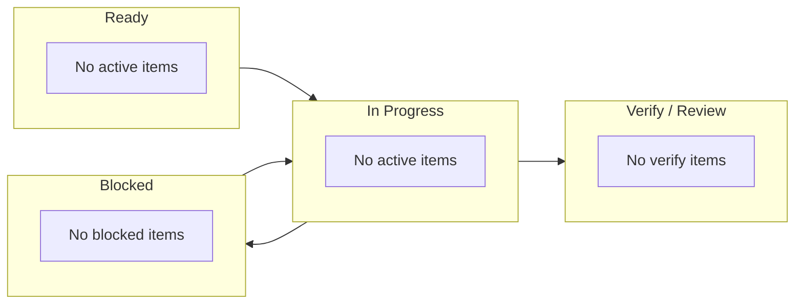

# ACTIVE Board

No active items remain.

## Board

```mermaid
flowchart LR
    subgraph Ready["Ready"]
        R0["No active items"]
    end

    subgraph InProgress["In Progress"]
        P0["No active items"]
    end

    subgraph Blocked["Blocked"]
        B0["No blocked items"]
    end

    subgraph Verify["Verify / Review"]
        V0["No verify items"]
    end

    Ready --> InProgress
    InProgress --> Verify
    InProgress --> Blocked
    Blocked --> InProgress
```
