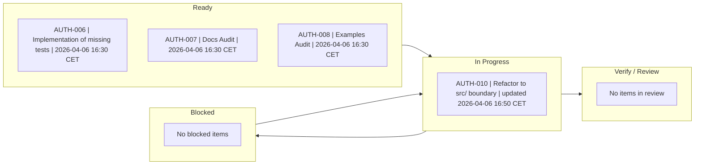

# ACTIVE Board

Visual live board for currently active work across `TODO.md` and `BUGS.md`.

## Board

```mermaid
flowchart LR
    subgraph Ready["Ready"]
        R1["AUTH-006 | Implementation of missing tests | 2026-04-06 16:30 CET"]
        R2["AUTH-007 | Docs Audit | 2026-04-06 16:30 CET"]
        R3["AUTH-008 | Examples Audit | 2026-04-06 16:30 CET"]
    end

    subgraph InProgress["In Progress"]
        P1["AUTH-010 | Refactor to src/ boundary | updated 2026-04-06 16:50 CET"]
    end

    subgraph Blocked["Blocked"]
        B0["No blocked items"]
    end

    subgraph Verify["Verify / Review"]
        V0["No items in review"]
    end

    Ready --> InProgress
    InProgress --> Verify
    InProgress --> Blocked
    Blocked --> InProgress
```
