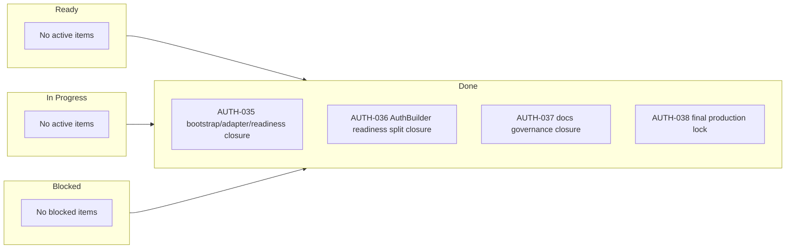

# ACTIVE Board

Current board mirrors the canonical re-check queue in `TODO.md`.

## Board

```mermaid
flowchart LR
    subgraph Ready["Ready"]
        R0["No active items"]
    end

    subgraph InProgress["In Progress"]
        P0["No active items"]
    end

    subgraph Blocked["Blocked"]
        B0["No blocked items"]
    end

    subgraph Done["Done"]
        D1["AUTH-035 bootstrap/adapter/readiness closure"]
        D2["AUTH-036 AuthBuilder readiness split closure"]
        D3["AUTH-037 docs governance closure"]
        D4["AUTH-038 final production lock"]
    end

    Ready --> Done
    InProgress --> Done
    Blocked --> Done
```
