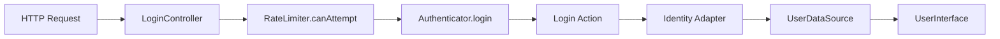

# Code Review: Avax Auth Framework

**Captured:** 2026-04-06 14:00 CET
**Reviewer:** Agent
**Scope:** Foundation/Auth/**
**Status:** Complete

---

## PHASE 0: Context Gate

### System Identity

| Property | Value |
|----------|-------|
| **System Type** | Authentication/Authorization Framework (Pure PHP 8.3+) |
| **Primary Consumers** | PHP application developers |
| **Runtime Context** | HTTP requests, CLI, worker processes |
| **Lifecycle** | Initial development / Prototype |
| **Delivery Kind** | Framework (pure PHP library) |

### Intended Use-Cases

- User authentication via credentials (email/password)
- JWT-based stateless authentication
- Session-based authentication
- Role-based access control (RBAC)
- Rate limiting for brute-force prevention

### Anti-Use-Cases

- OAuth2/OpenID Connect (not implemented)
- Multi-factor authentication (not implemented)
- Password reset flow (not implemented)

### Non-Goals

- Laravel-specific adapters (framework-agnostic required)
- Database-specific implementations (abstracted via UserSourceInterface)

### Compatibility Contract

- **Public API Stability:** Moderate (interfaces stable, implementations may vary)
- **Backwards Compatibility:** Required for core interfaces
- **PHP Version:** 8.3 minimum

---

## PHASE 1: As-Built Reconstruction

### 1.1 Execution Flow (Authentication)

**This is how the system actually works:**

1. Request arrives at `LoginController`
2. `RateLimiter` checks if identifier can attempt login (prevents brute-force)
3. `Authenticator.login()` delegates to `LoginAction`
4. `LoginAction` calls `Identity->attempt()` with credentials
5. `Identity` (abstract) uses `UserDataSource` to retrieve user by credentials
6. `Identity->authenticate()` verifies password using `password_verify()`
7. On success, returns `UserInterface`

### 1.2 Primary Axis

> This system is fundamentally organized around **Identity abstraction** (authentication mechanism) that delegates user retrieval to pluggable `UserSourceInterface`.

### 1.3 Secondary Axis

> Secondary axis: **JWT vs Session** (adds complexity and must be justified)

Two implementations exist: `JwtIdentity` and `SessionIdentity`. This dual-axis requires justification — stateless vs stateful is a fundamental architectural choice.

---

## PHASE 2: Foundational Stress Test

### 2.1 Central Abstraction Stress Test

| Question | Answer | Evidence |
|----------|--------|----------|
| Does every feature flow through Identity? | Yes | All auth flows use Identity->attempt() |
| Does it accumulate responsibilities over time? | No | Clear separation: Actions (logic) vs Adapters (implementation) |
| Is it harder to change than surrounding components? | No | Identity is abstract, implementations are swappable |

**Assessment:** ✅ Pass — stable axis

### 2.2 Responsibility Mapping

| Component | Orchestrates | Executes | Holds State | Notes |
|-----------|--------------|----------|-------------|-------|
| Authenticator | Yes | No | No | Facade, delegates to actions |
| LoginAction | No | Yes | No | Use case, delegates to Identity |
| Identity | No | Yes | No | Abstract adapter, uses UserDataSource |
| UserDataSource | No | Yes | No | Interface, implementation-dependent |
| RateLimiter | No | Yes | Yes | Session-based attempt tracking |

**Summary:** Responsibilities are **clear**

### 2.3 Mutability Audit

| Object | Scope | Lifetime | Why Mutable | Classification |
|--------|-------|----------|--------------|----------------|
| UserInterface | Application | Request | Roles can change | Necessary |
| RateLimiter | Request | Session | Tracks attempts | Necessary |
| Credentials | Request | Request | DTO, input data | Convenience |

**Summary:** Mutability is **justified**

### 2.4 System Invariants

| Invariant | Enforced Where | Evidence | Status |
|-----------|----------------|----------|--------|
| Passwords hashed | Identity::authenticate | password_verify() | ✅ Enforced |
| Generic auth errors | LoginAction | AuthFailed message | ✅ Enforced |
| Sensitive data protected | Credentials, login() | #[SensitiveParameter] | ✅ Enforced |
| Rate limiting | RateLimiter | Session-based | ✅ Enforced |
| No user enumeration | LoginController | Generic "Invalid credentials" | ✅ Enforced |

---

## PHASE 3: Findings

### Finding: AuthMiddleware is Non-Functional

- **Symptom:** AuthMiddleware::handle() always returns `$next($request)` without any authentication check
- **Root Cause:** All authentication logic is commented out (lines 28-50)
- **Impact:** Middleware provides no protection; all routes are accessible without auth
- **Evidence:** Http/AuthMiddleware.php:26-50
- **Risk Level:** High

### Finding: RateLimiter Not Integrated in Login Flow

- **Symptom:** LoginAction doesn't use RateLimiter, only LoginController does
- **Root Cause:** Architecture inconsistency — rate limiting is controller-level, not action-level
- **Impact:** If controller is bypassed, rate limiting is bypassed
- **Evidence:** Actions/Login.php vs Http/Controllers/LoginController.php
- **Risk Level:** Medium

### Finding: JwtIdentity Depends on External Framework

- **Symptom:** JwtIdentity uses `Firebase\JWT\JWT`, `Carbon\Carbon`, `Avax\HTTP\Context\HttpContextInterface`
- **Root Cause:** JWT adapter has tight coupling to external dependencies
- **Impact:** Not truly framework-agnostic; creates dependency on Avax framework components
- **Evidence:** Adapters/JwtIdentity.php:12-19
- **Risk Level:** Medium

### Finding: UserInterface Has Mutable Methods

- **Symptom:** UserInterface includes `setPassword()`, `addRole()`, `removeRole()` 
- **Root Cause:** User entity should be immutable after creation
- **Impact:** Can lead to role escalation or password changes without proper validation
- **Evidence:** Contracts/UserInterface.php:49, 83, 92
- **Risk Level:** High

### Finding: Missing Logout in RateLimiter

- **Symptom:** Failed login attempts are tracked, but logout doesn't reset rate limiting
- **Root Cause:** RateLimiter::resetAttempts() not called on logout
- **Impact:** After logout, user still has same attempt count (minor issue)
- **Evidence:** Actions/Logout.php
- **Risk Level:** Low

### Finding: Architecture Not Feature-Sliced

- **Symptom:** Code is organized by technical type (Actions/, Adapters/, Contracts/) not by business flow
- **Root Cause:** Layered architecture instead of vertical-slice
- **Impact:** Violates declared architecture profile (vertical-slice in AGENTS.md)
- **Evidence:** Actions/, Adapters/, Contracts/ folders
- **Risk Level:** Medium

### Finding: Missing @throws in Docblocks

- **Symptom:** Some methods lack @throws documentation
- **Evidence:** Actions/Logout.php, Actions/Check.php
- **Risk Level:** Low

---

## PHASE 4: Rewrite Heuristics

| Heuristic | Weight | Checked |
|-----------|--------|---------|
| Central abstraction is wrong | 2 | ☐ |
| Pipeline relies on implicit ordering | 2 | ☐ |
| Configuration complexity mirrors design complexity | 1 | ☐ |
| Usage requires explanation to avoid misuse | 1 | ☐ |
| Performance depends on mitigation, not structure | 1 | ☐ |
| New features require touching multiple core classes | 2 | ☐ |

**Rewrite Score:** 0

---

## DECISION

### ✅ Keep and Improve

**Justification:**

The core authentication architecture is sound. The primary axis (Identity abstraction) is stable and well-designed. Security basics are in place:
- Password hashing via `password_verify()`
- `#[SensitiveParameter]` on sensitive data
- Generic error messages
- Rate limiting implemented

The findings are fixable without redesign:
- AuthMiddleware is a stub (High) — needs implementation
- UserInterface mutability (High) — needs design decision
- RateLimiter placement (Medium) — architectural improvement
- JWT dependencies (Medium) — refactor to interface
- Feature-sliced migration (Medium) — planned refactoring

---

## NEXT STEPS

### First 3 Actions

1. **Implement AuthMiddleware** — Uncomment and fix the authentication check logic, or remove if not needed
2. **Fix UserInterface** — Decide whether UserInterface should be mutable or immutable; if immutable, remove setters
3. **Create TODO items** — Move actionable items to `.agents/management/TODO.md`

### If Keep and Improve

- **Must not change:** Identity abstraction, AuthInterface contract
- **Can evolve:** Add feature-sliced structure incrementally, improve JWT adapter decoupling

---

## Evidence Files Reviewed

- Authenticator.php
- Actions/Login.php, Logout.php, Check.php, GetUser.php, Register.php, ChangePassword.php
- Contracts/AuthInterface.php, IdentityInterface.php, UserInterface.php, CredentialsInterface.php
- Adapters/Identity.php, JwtIdentity.php, RateLimiter.php, AccessControl.php
- Data/Credentials.php
- Http/Controllers/LoginController.php
- Http/AuthMiddleware.php
- Exceptions/AuthFailed.php