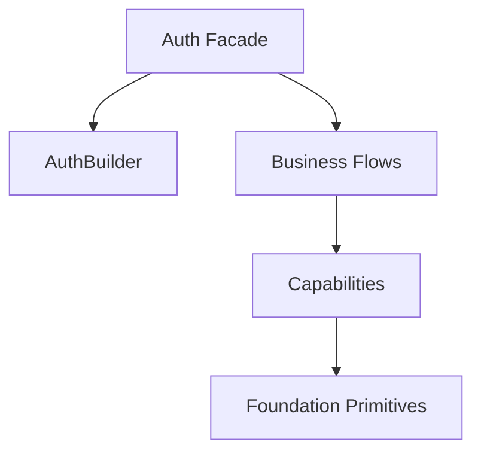

# Architecture Overview

This framework is built on **vertical-slice, feature-first** architectural laws. Every directory represents a business capability or flow, and every file represents a single responsibility.

## Repository Structure

The project repository is structured with a clean boundary between the core logic and operational assets:

1.  **`System/`**: The canonical source root (System Mašinerija) under the `Avax\Auth\System` namespace.
2.  **`tests/`**: Mirror of `System/` for unit and integration testing.
3.  **`docs/`**: Technical and architectural documentation.
4.  **`examples/`**: Reference implementations and user guides.
5.  **`tooling/`**: Local automation and developer infrastructure.

## System Anatomy (inside `System/`)

The core logic is divided into four primary lanes:

1.  **`Flows/`**: High-level business use-cases following the **Verb-Noun** naming pattern (e.g., `Login`, `Register`, `ChangePassword`). These are the primary entry points.
2.  **`Capabilities/`**: Domain enablers and internal subsystems that the flows orchestrate.
    -   `Access`: Authorization logic (Roles, Permissions).
    -   `Identity`: Unified authentication façade plus protocol-specific adapters (Session, JWT).
    -   `User`: The core User entity and its specific Value Objects (Email, Id, etc.).
    -   `UserSource`: The persistence bridge/gateway.
    -   `PasswordHashing`: Security primitives for credential management.
3.  **`Configuration/`**: The composition root and setup logic (e.g., `AuthBuilder`) for wiring the component.
4.  **`Foundation/`**: Low-level, domain-agnostic primitives (e.g., `Clock`, `IdGenerator`).

## Core Directory Roles

| Folder | Category | Role |
|:---|:---|:---|
| **[`System/Flows/`](./System/Flows/)** | **Features** | Core business processes and API entry points. |
| **[`System/Capabilities/Access/`](./System/Capabilities/Access/)** | Domain | Requirement boundaries for Role/Permission validation. |
| **[`System/Capabilities/Identity/`](./System/Capabilities/Identity/)** | Adapter | Unified identity façade with JWT and Session persistence adapters. |
| **[`System/Capabilities/User/`](./System/Capabilities/User/)** | Domain | Immutability-first User entity and its Value Objects. |
| **[`System/Capabilities/UserSource/`](./System/Capabilities/UserSource/)** | Gateway | Interface for accessing the external data store. |
| **[`System/Configuration/`](./System/Configuration/)** | Infra | Fluent DSL Builder for setting up Auth system instances. |
| **[`System/Foundation/`](./System/Foundation/)** | Tooling | Shared low-level utilities (Clock, IdGen). |

## Dependency Graph

## Evolution Log

### v5.0 (The System Era)
- Renamed `src/` to **`System/`** to better reflect the architectural purpose of the source root.
- Updated root namespace to **`Avax\Auth\System`**.
- Enforced strict repository discipline with a clear boundary between System logic and operational artifacts.
- Maintained the **vertical-slice, feature-first** architecture within the system lane.
