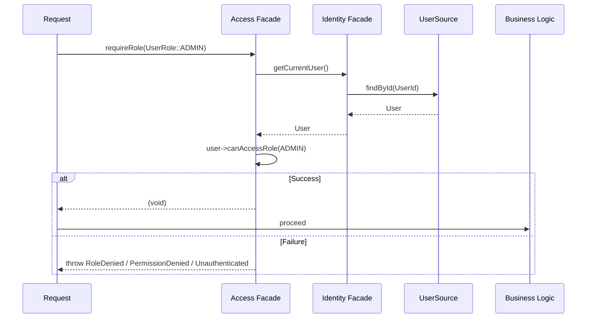

# Authorization Flow

This document describes the access control system in Avax Auth (v2.0+).

## Overview

Unlike older frameworks, authorization in Avax Auth is handled through the **`Access/`** layer, which provides a root façade plus specialized **require** actions.

## 1. Authentication vs Authorization

- **`RequireAuthentication`** (401 - Unauthenticated): Checks if the user is who they say they are.
- **`RequireRole`** (401 / 403): Checks if the current user exists and has the required business role.
- **`RequirePermission`** (401 / 403): Checks if the current user exists and has granular action-level permissions.

## 2. Sequence Diagram



## 3. Standard Roles

- **`ADMIN`**: Full system access.
- **`MODERATOR`**: Content management and moderation.
- **`USER`**: Standard registered user capability.
- **`GUEST`**: Public, unauthenticated access.

## 4. Usage

### Role Enforcement

```php
use Avax\Auth\System\Capability\User\UserRole;

$auth->access()->requireRole(UserRole::ADMIN);
```

### Permission Enforcement

```php
use Avax\Auth\System\Capability\User\UserPermission;

$auth->access()->requirePermission(new UserPermission('delete_user'));
```

## 5. Metadata Resolution

Authorization requirements can be discovered via PSR-7 request attributes, PHP 8 Attributes, or manual injection into the **`Access`** façade.

---
*Least privilege by design.*
