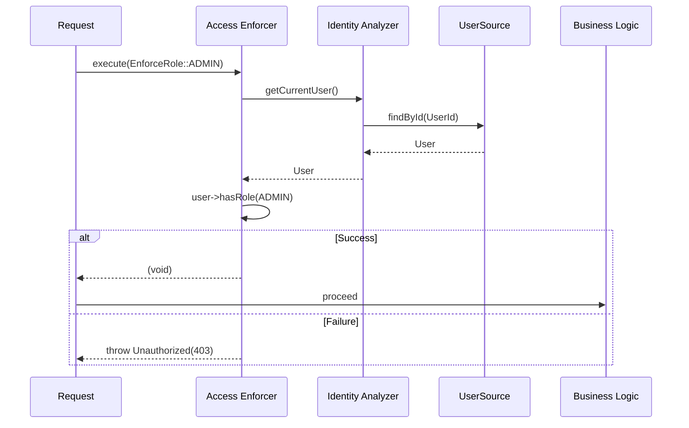

# Authorization Flow

This document describes the access control system in Avax Auth (v2.0+).

## Overview

Unlike older frameworks, authorization in Avax Auth is handled through the **`Access/`** layer, which provides specialized **Enforce** actions.

## 1. Authentication vs Authorization

- **`EnforceAuthentication`** (401 - Unauthenticated): Checks if the user is who they say they are.
- **`EnforceRole`** (403 - Unauthorized): Checks if the authenticated user has the required business role.
- **`EnforcePermission`** (403 - Unauthorized): Checks if the authenticated user has granular action-level permissions.

## 2. Sequence Diagram



## 3. Standard Roles

- **`ADMIN`**: Full system access.
- **`MODERATOR`**: Content management and moderation.
- **`USER`**: Standard registered user capability.
- **`GUEST`**: Public, unauthenticated access.

## 4. Usage

### Role Enforcement

```php
use Avax\Auth\Access\EnforceRole;
use Avax\Auth\User\UserRole;

$enforcer = new EnforceRole($auth->getReadFlow());
$enforcer->execute(UserRole::ADMIN);
```

### Permission Enforcement

```php
use Avax\Auth\Access\EnforcePermission;
use Avax\Auth\User\UserPermission;

$enforcer = new EnforcePermission($auth->getReadFlow());
$enforcer->execute(new UserPermission('delete_user'));
```

## 5. Metadata Resolution

Authorization requirements can be discovered via PSR-7 request attributes, PHP 8 Attributes, or manual injection into the **`Access`** enforcers.

---
*Least privilege by design.*
