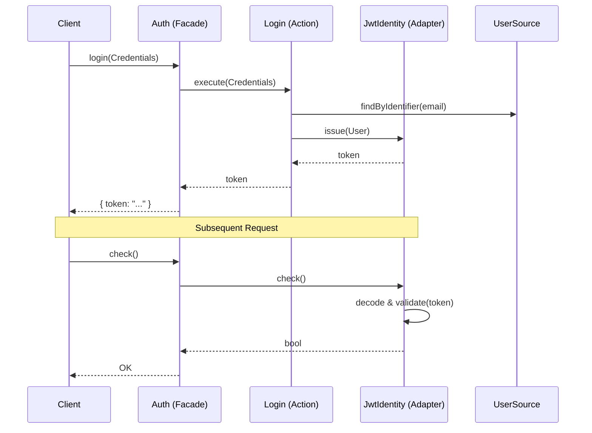

# JWT Authentication Flow

This document describes the stateless JWT-based authentication flow in the Avax Auth framework.

## Overview

Unlike session-based auth, JWT authentication is stateless. The client passes a token in the `Authorization: Bearer <token>` header with every request.



## Setup

To use JWT authentication, initialize the `Auth` instance using the `createJwt` factory method:

```php
use Avax\Auth\System\Auth;
use Avax\Auth\System\Capabilities\Identity\Jwt\JwtIdentity;

$auth = Auth::configuration()
    ->forUser($userSource)
    ->withJwt(new JwtIdentity(
        userSource: $userSource,
        secret: 'your-256-bit-secret'
    ))
    ->ready();
```

## Issuing Tokens

When a user logs in successfully, the `Identity` façade delegates to `JwtIdentity::issue(User)`.
The resulting token is usually returned as a string.

## Validating Tokens

The `JwtIdentity` adapter is responsible for:
1. Extracting the token from the request header.
2. Validating the signature.
3. Checking for expiration.
4. Returning a `User` entity if the token is valid.

## Implementation Details

- **Algorithm**: Default is HMAC with SHA-256 (HS256).
- **Stateless**: No server-side session lookup is required, improving scalability.
- **Portability**: Tokens are self-contained and carry user data (claims).

## Security Considerations

- Always use HTTPS to prevent token theft in transit.
- Use a strong, long secret for signing.
- Keep the expiry time short (e.g., 15-60 minutes).
- Consider implementing token blacklisting for revocation if necessary.
