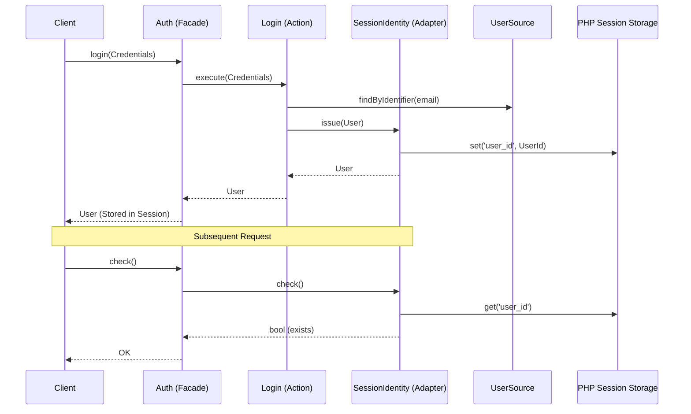

# Session Authentication Flow

This document describes the stateful session-based authentication flow in the Avax Auth framework.

## Overview

Session authentication is the traditional, server-side method for tracking user state.



## Setup

Initialize the `Auth` instance with a session-backed `Identity` façade:

```php
use Avax\Auth\System\Auth;
use Avax\Auth\System\Capability\Identity\Identity;
use Avax\Auth\System\Capability\Identity\Session\SessionIdentity;

$auth = Auth::configuration()
    ->forUser($userSource)
    ->withIdentity(new Identity(sessionIdentity: new SessionIdentity(
        sessionKey: 'user_id'
    )))
    ->ready();
```

## How It Works

1. **`SessionIdentity::issue(User)`**: Sets the user's ID into the PHP session storage.
2. **`SessionIdentity::check()`**: Verifies if the session key exists and is non-null.
3. **`SessionIdentity::getUserId()`**: Retrieves the user identifier from the session for lookups.
4. **`Logout`**: Clears the session key and destroys the session if necessary.

## Key Actions

- **`ClearAuthenticatedSession`**: Orchestrates removing the user identifier from the session storage.
- **`IdentityInterface`**: Coordinates the active auth backend used by the flow layer.
- **`SessionIdentityInterface`**: Defines the contract for session adapters, allowing custom session handlers.

## Security Features

- **Session Regeneration**: Default behavior on login to prevent session fixation attacks.
- **Expiry**: Managed via standard PHP `session.gc_maxlifetime` or custom adapter logic.
- **Encryption**: Values stored in the session can be encrypted if sensitive.

## Use Cases

- Standard web applications with browser-based clients.
- Scenarios where stateful management is easier to implement and monitor than JWT.
- Apps requiring immediate session invalidation without blacklisting.
