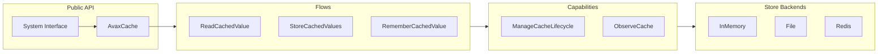

# AvaxCache

Enterprise-grade cache system for PHP 8.5+ with comprehensive value lifecycle management, storage abstraction,
and consistency guarantees across multiple store backends.

## Overview

AvaxCache is a **system-design grade caching framework** implementing the complete lifecycle of cached values:
creation, reading, aging, invalidation, refresh, eviction, distribution, and recovery.



## Implemented

- **Runtime Cache Facade**: `Cache::get()`, `Cache::put()`, `Cache::remember()`, `Cache::forget()`, `Cache::clear()`
- **CacheContract Interface**: PSR-16 compatible runtime cache contract
- **In-Memory Store**: Fast in-process cache store
- **File Store**: Persistent file-based cache store
- **Redis Store**: Redis-backed cache store
- **Unified Read Routing**: `Cache::read()` with explicit `RuntimeCacheTarget` / `CompiledCacheTarget`
- **Compiled Cache Subsystem**: Framework artifact compilation with atomic writes and manifest freshness
- **Cache Registry**: Named cache instances
- **Contract Tests**: Store implementations validated by contract
- **Clock Dependency**: Deterministic testing with injected clocks

## Experimental

- **Multi-tier Cache**: L1 + L2 promotion (planned)
- **Distributed Cache**: Routing model (skeleton, not production-ready)
- **Chain/Fallback Stores**: Composite store patterns (planned)

## Planned

- **Stampede Protection**: Lock-based prevention (in progress)
- **Stale-While-Revalidate**: Serve stale while refreshing (in progress)
- **Replacement Policies**: LRU, LFU, FIFO, Random eviction
- **Source Sync**: Write-through / write-around / write-behind
- **Observability**: Metrics, tracing, hit rate tracking
- **LRU/LFU Eviction**: Production-ready replacement policies
- **Distributed Partitioning**: Real distributed cache with node stores

## Compiled Cache

Separate subsystem for **framework-generated PHP artifacts**: routes, config, container, events, metadata.

```php
use Avax\Cache\CompiledCache;
use Avax\Cache\System\Capabilities\ManageCompiledCache\CompiledCacheSources;

// Configure once
CompiledCache::configure('var/cache/compiled');

// Read or compile artifact
$routes = CompiledCache::read('routes', function() {
    return ['GET /users' => ['controller' => UserController::class]];
}, CompiledCacheSources::fromPaths('routes/web.php'));

// Clear when needed
CompiledCache::clear('routes');
CompiledCache::clearAll();
```

### Intended CLI Commands

```bash
php avax cache:compile
php avax cache:clear

php avax route:cache
php avax config:cache
```

### Default Directory

```
var/cache/
├── compiled/
│   ├── routes.php
│   ├── config.php
│   └── manifest.php
│
└── runtime/
    └── file-cache/
```

### Runtime vs Compiled

| Runtime Cache    | Compiled Cache        |
|------------------|-----------------------|
| key → value      | artifact → PHP file   |
| expires by TTL   | stale by source mtime |
| PSR-16 interface | custom interface      |

## Quick Start

```php
use Avax\Cache\System\Cache;

// Setup (once at bootstrap)
$cache = BuildCache::inMemory();
Cache::use($cache);

// Basic operations (everywhere in app)
Cache::put('user:123', ['name' => 'John'], ttl: 3600);
$user = Cache::get('user:123');
Cache::forget('user:123');

// Remember pattern (get-or-load)
$user = Cache::remember(
    'user:123',
    ttl: 3600,
    loader: fn() => $userRepository->find(123)
);

// Testing
Cache::use($mockCache);
Cache::reset();
```

## Architecture

```
System/
├── Cache.php               # Public facade (Cache::get/put/remember)
├── CacheContract.php       # Runtime cache interface
├── CompiledCache.php       # Compiled artifacts facade
├── AvaxCache.php           # Default implementation
│
├── PublicSurface/          # Registry, facade, helpers
│   ├── CacheRegistry.php   # Named cache instances
│   └── CacheFacade.php     # Instance facade for DI
│
├── Flows/                  # End-to-end operations
│   ├── ReadCachedValue/
│   ├── CompileCache/
│   └── ...
│
├── Capabilities/           # Shared abilities
│   ├── ManageCacheLifecycle/
│   ├── ManageCompiledCache/
│   ├── StoreCachedValues/
│   └── ...
│
├── Foundation/             # Time, Serialization
│   └── ...
│
└── Configuration/          # BuildCache, BuildCompiledCache
```

## Key Design Decisions

### System Miss !== Stored Null

```php
$cache->set('key', null);
$cache->get('key'); // Returns null, NOT default

$cache->delete('key');
$cache->get('key'); // Returns default
```

### Expired !== Stale

- **Expired**: Past TTL, must be refreshed or removed
- **Stale**: Old but potentially servable while refreshing
- **Missing**: Key does not exist in cache

### Clock Dependency

All time operations use injected `Clock` for deterministic testing.

## Documentation

- [How This Works](./docs/Cache/how-this-works.md) - System overview
- [Public Surface](./docs/Cache/public-surface.md) - Facade usage
- [Public API](./docs/Cache/public-api.md) - Detailed usage guide
- [System Design](./docs/Cache/system-design.md) - Architecture details
- [Compiled Cache Model](./docs/Cache/compiled-cache-model.md) - Compiled artifacts
- [Failure Modes](./docs/Cache/failure-modes.md) - Error handling
- [Invalidation Model](./docs/Cache/invalidation-model.md) - Invalidation strategies
- [Replacement Policy](./docs/Cache/replacement-policy-model.md) - Eviction strategies

## Requirements

- PHP 8.5+
- PSR-16 Simple System

## Installation

```bash
composer require avax/cache
```

## Testing

```bash
./vendor/bin/phpunit
```

## License

MIT