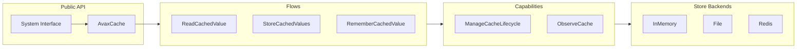

# AvaxCache

Enterprise-grade cache system for PHP 8.5+ with comprehensive value lifecycle management, storage abstraction,
and consistency guarantees across multiple store backends.

## Overview

AvaxCache is a **system-design grade caching framework** implementing the complete lifecycle of cached values:
creation, reading, aging, invalidation, refresh, eviction, distribution, and recovery.



## Features

- **Value Lifecycle Management**: Complete tracking from creation through eviction
- **Multiple Store Backends**: In-memory, File, Redis, Chain, Fallback
- **Multi-tier Caching**: L1 + L2 cache with automatic promotion
- **Smart Invalidation**: By key, tag, namespace, pattern, version
- **Stale-While-Revalidate**: Serve stale data while refreshing
- **Stampede Protection**: Lock-based cache stampede prevention
- **Replacement Policies**: LRU, LFU, FIFO, Random
- **Observability**: Metrics, tracing, hit rate tracking
- **Enterprise Quality**: Contract tests, deterministic testing

## Compiled Cache

Separate subsystem for **framework-generated PHP artifacts**: routes, config, container, events, metadata.

```php
use Avax\System\System\Configuration\ConfigureCompiledCache;

$compiled = ConfigureCompiledCache::inDirectory('var/cache/compiled');

// Read or compile artifact
$routes = $compiled->read('routes', function() {
    return ['GET /users' => ['controller' => UserController::class]];
}, CompiledCacheSources::fromPaths('routes/web.php'));
```

### Intended CLI Commands

```bash
php avax cache:compile
php avax cache:clear

php avax route:cache
php avax config:cache
```

### Default Directory

```
var/cache/
├── compiled/
│   ├── routes.php
│   ├── config.php
│   └── manifest.php
│
└── runtime/
    └── file-cache/
```

### Runtime vs Compiled

| Runtime Cache    | Compiled Cache        |
|------------------|-----------------------|
| key → value      | artifact → PHP file   |
| expires by TTL   | stale by source mtime |
| PSR-16 interface | custom interface      |

## Quick Start

```php
use Avax\System\System\Configuration\BuildCache;

// Create in-memory cache
$cache = BuildCache::inMemory();

// Basic operations
$cache->set('user:123', ['name' => 'John'], ttl: 3600);
$user = $cache->get('user:123');
$cache->delete('user:123');

// Remember pattern (get-or-load)
$user = $cache->remember(
    key: 'user:123',
    ttl: 3600,
    loader: fn() => $userRepository->find(123)
);
```

## Architecture

```
System/
├── System.php              # Public API
├── AvaxCache.php           # Main implementation
├── CacheResult.php        # Result types
│
├── Flows/                 # End-to-end operations
│   ├── ReadCachedValue/
│   ├── StoreCachedValue/
│   ├── RememberCachedValue/
│   ├── ForgetCachedValue/
│   ├── ClearCache/
│   └── ...
│
├── Capabilities/          # Shared abilities
│   ├── IdentifyCachedValues/
│   ├── ManageCacheLifecycle/
│   ├── StoreCachedValues/
│   ├── ObserveCache/
│   └── ...
│
├── Foundation/            # Primitive building blocks
│   ├── Time/
│   ├── Serialization/
│   └── ...
│
└── Configuration/         # Building and wiring
```

## Key Design Decisions

### System Miss !== Stored Null

```php
$cache->set('key', null);
$cache->get('key'); // Returns null, NOT default

$cache->delete('key');
$cache->get('key'); // Returns default
```

### Expired !== Stale

- **Expired**: Past TTL, must be refreshed or removed
- **Stale**: Old but potentially servable while refreshing
- **Missing**: Key does not exist in cache

### Clock Dependency

All time operations use injected `Clock` for deterministic testing.

## Documentation

- [How This Works](./docs/Cache/how-this-works.md) - System overview
- [Public API](./docs/Cache/public-api.md) - Usage guide
- [System Design](./docs/Cache/system-design.md) - Architecture details
- [Failure Modes](./docs/Cache/failure-modes.md) - Error handling
- [Invalidation Model](./docs/Cache/invalidation-model.md) - Invalidation strategies
- [Replacement Policy](./docs/Cache/replacement-policy-model.md) - Eviction strategies

## Requirements

- PHP 8.5+
- PSR-16 Simple System

## Installation

```bash
composer require avax/cache
```

## Testing

```bash
./vendor/bin/phpunit
```

## License

MIT