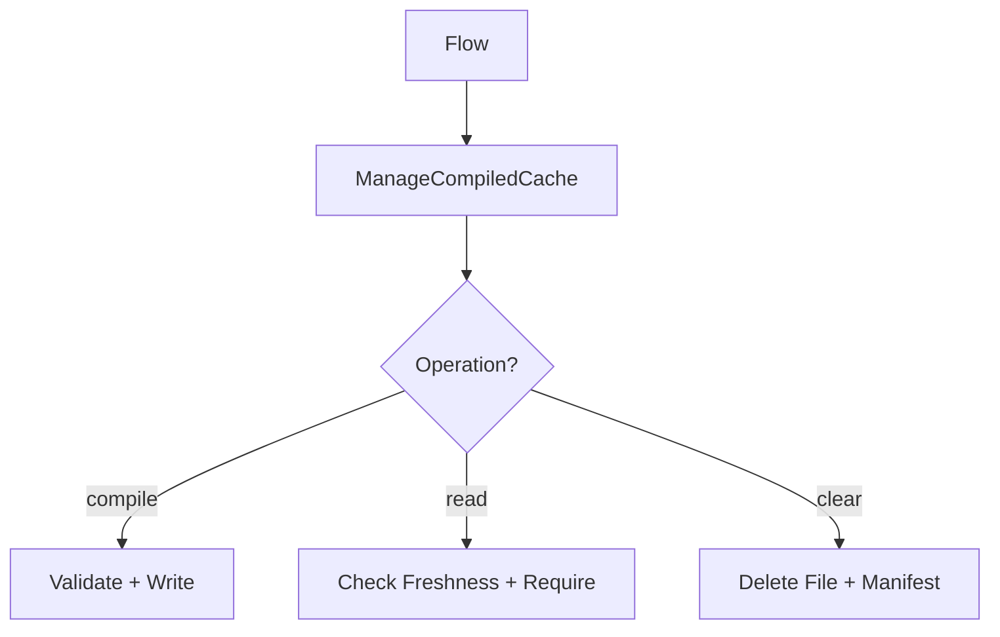

# ManageCompiledCache Capability

Manages compiled framework artifacts: routes, config, container, events, metadata.

## What This Owns

- CompiledCache - main interface
- CompiledCacheArtifact - artifact metadata
- CompiledCacheName - validated artifact names
- CompiledCacheDirectory - base directory
- CompiledCachePath - file paths
- CompiledCacheSource - source file tracking
- CompiledCacheSources - source collection
- CompiledCacheManifest - freshness manifest
- Path resolution, payload generation, atomic writes

## Triggers

- Compile, Read, Clear, Warm flows call this capability

## Main Flow

## Difference from StoreCachedValues

- StoreCachedValues: runtime key/value cache
- ManageCompiledCache: framework-generated PHP artifacts