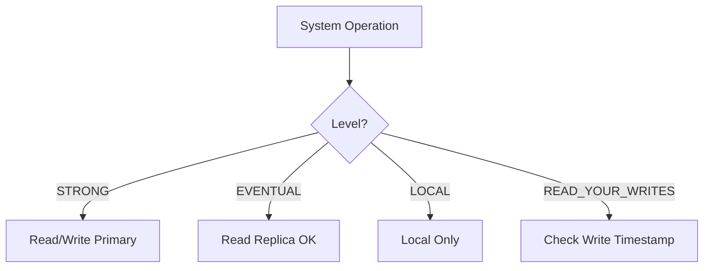

# ControlConsistency

Ensures cache reads/writes follow configured consistency guarantees.

## What This Owns

- EventualConsistency
- StrongLocalConsistency
- ReadYourWritesConsistency
- ConsistencyWindow
- DecideCacheReadConsistency
- DecideCacheWriteConsistency

## Triggers

System operation type + consistency level config

## Main Flow

## Debug

- Check ConsistencyWindow timing
- Verify read/write decision matches level