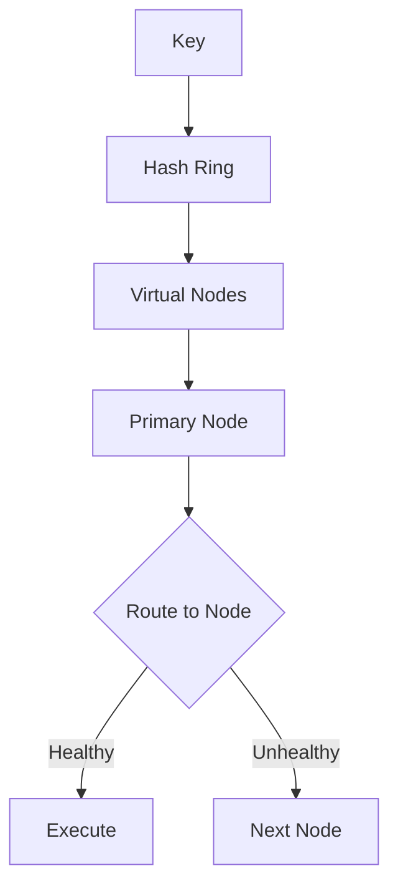

# DistributeCachedValues

Distributes cache across cluster nodes using consistent hashing.

## What This Owns

- ConsistentHashRing - virtual nodes for distribution
- CacheNodeId - node identity
- CacheNodeStatus - healthy/unhealthy
- DetectUnhealthyCacheNode - health checking

## Triggers

Multi-node cache cluster

## Main Flow

## Debug

- Check ring has >= 150 virtual nodes
- Verify node health tracking
- Check failover works