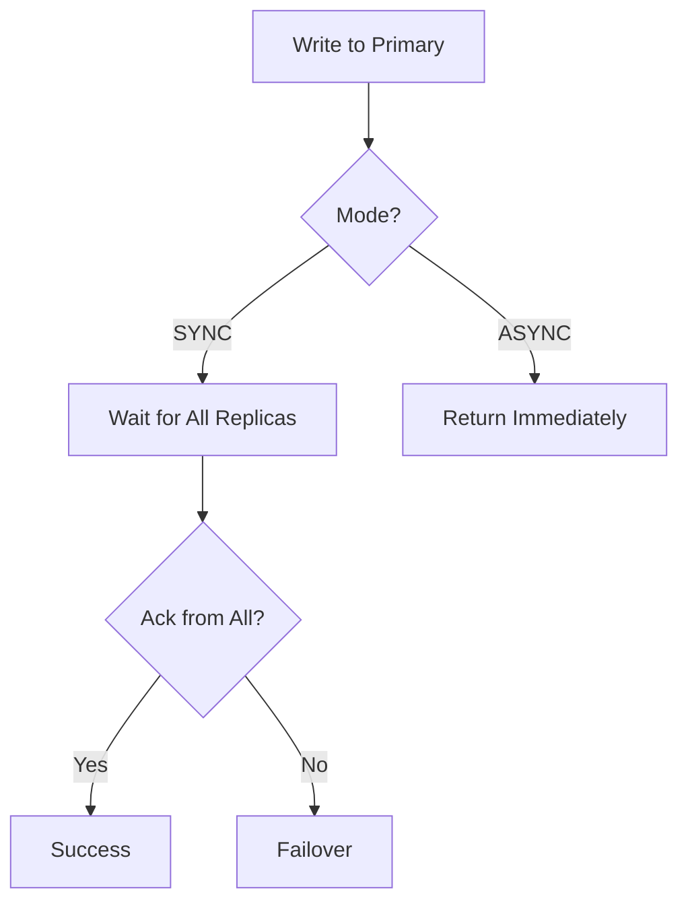

# ReplicateCachedValues

Replicates cache entries across multiple nodes for high availability.

## What This Owns

- CacheReplication - sync strategy (sync, async)
- ReplicaSet - primary + replicas
- ReplicationTopology - ring, chain, mesh

## Triggers

HA requirement + multiple nodes

## Main Flow

## Debug

- Check replication lag
- Verify quorum writes
- Check failover triggers