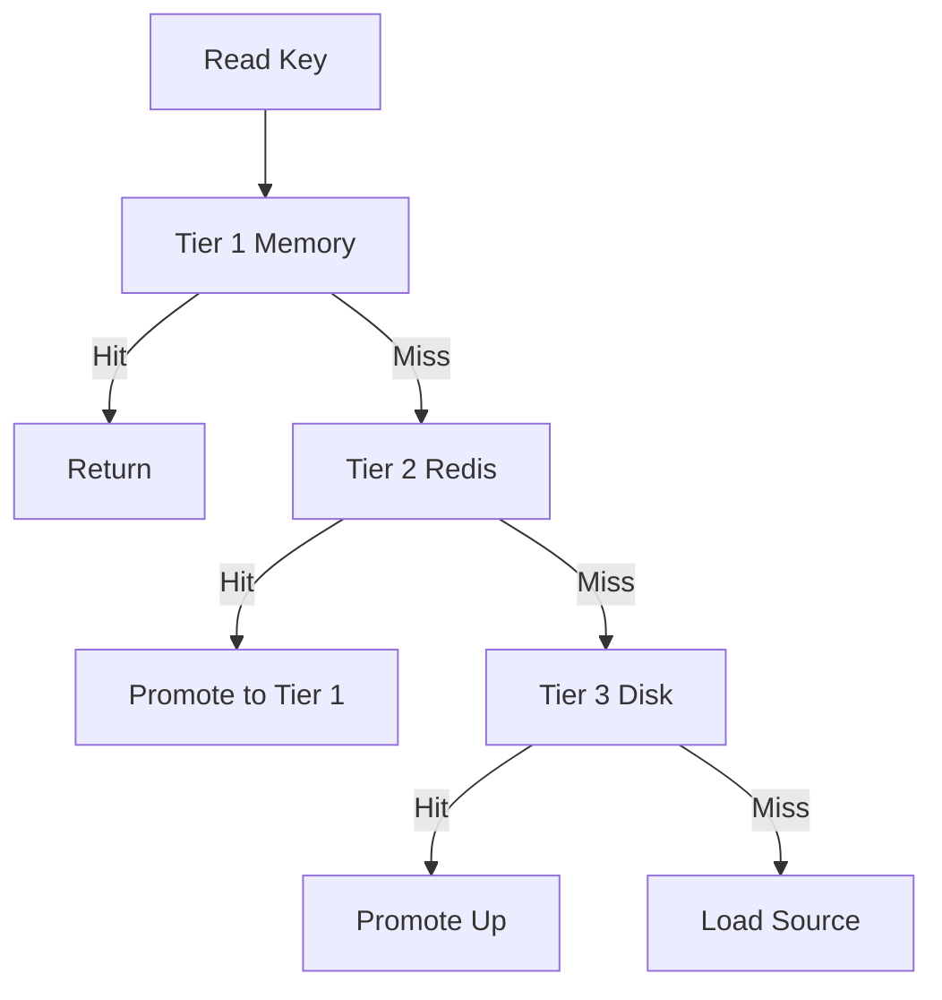

# UseCacheTiers

Multi-tier caching (L1 memory, L2 Redis, L3 disk).

## What This Owns

- CacheTier - tier configuration
- TieredCacheStore - multi-tier implementation
- TierLookup - search tiers in order
- TierWrite - write to appropriate tier

## Triggers

Multiple cache stores configured

## Main Flow

## Debug

- Check tier promotion works
- Verify eviction cascades
- Monitor hit rates per tier