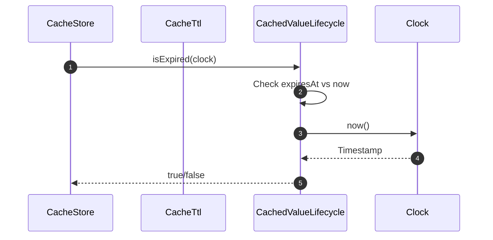

# ExpirationMethods How This Works

ExpirationMethods controls **when cached values become invalid** based on time.

## What This Folder Owns

- TTL calculation strategies
- Absolute vs relative expiration
- Sliding window expiration
- Expiration checking logic

## Expiration Strategies

### CacheTtl (Default)

Standard TTL from creation time:

```php
$ttl = new CacheTtl($clock);

// From seconds
$expiresAt = $ttl->calculateExpiresAt(3600, $clock);  // 1 hour from now

// From DateInterval
$expiresAt = $ttl->calculateExpiresAt(
    new \DateInterval('PT1H'),
    $clock
);

// From null (never expires)
$expiresAt = $ttl->calculateExpiresAt(null, $clock);  // null

// Check expiration
$isExpired = $ttl->isExpired($expiresAt, $clock);
```

### NeverExpires

Values that never expire:

```php
$strategy = new NeverExpires();
$expiresAt = $strategy->calculateExpiresAt($ttl, $clock);  // null
$isExpired = $strategy->isExpired($expiresAt, $clock);  // false
```

### ExpiresAt

Absolute expiration timestamp:

```php
$strategy = ExpiresAt::secondsFromNow(3600, $clock);
$strategy = ExpiresAt::atTimestamp(1700000000);

// Always returns the same expiresAt
$strategy->calculateExpiresAt($ttl, $clock);  // fixed timestamp
```

### ExpiresAfter

Relative expiration from now:

```php
$strategy = ExpiresAfter::seconds(3600);
$strategy = ExpiresAfter::milliseconds(500);

$expiresAt = $strategy->calculateExpiresAt($ttl, $clock);  // 1 hour from now
```

### SlidingExpiration

TTL resets on each access:

```php
$strategy = new SlidingExpiration(windowSeconds: 300);  // 5 min sliding window

// On access, slide the expiration
$newExpiresAt = $strategy->slide($currentExpiresAt, $clock);

// 5 more minutes from now
```

### ImmediateExpiration

Values are immediately expired:

```php
$strategy = new ImmediateExpiration();
$expiresAt = $strategy->calculateExpiresAt($ttl, $clock);  // now
$isExpired = $strategy->isExpired($expiresAt, $clock);  // true
```

## TTL Conversion

```php
// CacheTtl::toSeconds normalizes all TTL formats
CacheTtl::toSeconds(3600);              // 3600
CacheTtl::toSeconds(new \DateInterval('PT1H'));  // 3600
CacheTtl::toSeconds(null);               // null
```

## First Important Path: Check Expiration



## Debug First

1. **Check Clock** - wrong clock causes wrong expiration
2. **Check expiresAt** - if null, never expires
3. **Check TTL calculation** - ensure correct conversion

## Dictionary

- `CacheExpiration`: Interface for expiration strategies
- `CacheTtl`: Standard TTL calculation
- `NeverExpires`: Infinite TTL
- `ExpiresAt`: Fixed timestamp
- `ExpiresAfter`: Relative duration
- `SlidingExpiration`: TTL resets on access
- `ImmediateExpiration`: Immediately invalid