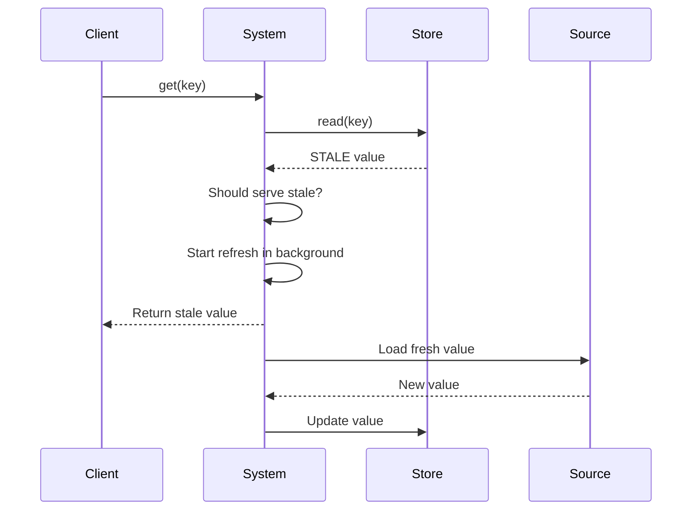

# StaleValuePolicies How This Works

StaleValuePolicies controls **whether stale values can be served while refreshing**.

## What This Folder Owns

- Stale serving decision logic
- Maximum stale age constraints

## StaleValuePolicy Enum

```php
enum StaleValuePolicy: string
{
    case DO_NOT_SERVE_STALE = 'do_not_serve_stale';
    case SERVE_STALE_WHILE_REFRESHING = 'serve_stale_while_refreshing';
    case SERVE_STALE_WHEN_SOURCE_FAILS = 'serve_stale_when_source_fails';
    case SERVE_STALE_ALWAYS = 'serve_stale_always';
}
```

## Decision Logic

```php
class DecideStaleValueCanBeServed
{
    public function canBeServed(
        CachedValueState $state,
        int $staleAgeSeconds = 0
    ): bool {
        if ($state !== CachedValueState::STALE) {
            return true;
        }

        if ($staleAgeSeconds > $this->maxStaleAgeSeconds) {
            return false;
        }

        return match ($this->policy) {
            StaleValuePolicy::DO_NOT_SERVE_STALE => false,
            StaleValuePolicy::SERVE_STALE_ALWAYS => true,
            StaleValuePolicy::SERVE_STALE_WHILE_REFRESHING => true,
            StaleValuePolicy::SERVE_STALE_WHEN_SOURCE_FAILS => false,
        };
    }
}
```

## Policy Behaviors

### DO_NOT_SERVE_STALE

Returns default on stale:

```php
$strategy = new DecideStaleValueCanBeServed(
    policy: StaleValuePolicy::DO_NOT_SERVE_STALE
);

$strategy->canBeServed(CachedValueState::STALE);  // false
```

### SERVE_STALE_WHILE_REFRESHING

Serves stale while refreshing in background:



### SERVE_STALE_WHEN_SOURCE_FAILS

Serves stale only when source fails:

```php
$strategy = new DecideStaleValueCanBeServed(
    policy: StaleValuePolicy::SERVE_STALE_WHEN_SOURCE_FAILS
);

$strategy->canBeServed(CachedValueState::STALE);  // false normally
```

### SERVE_STALE_ALWAYS

Always serves stale:

```php
$strategy = new DecideStaleValueCanBeServed(
    policy: StaleValuePolicy::SERVE_STALE_ALWAYS
);

$strategy->canBeServed(CachedValueState::STALE);  // true
```

## Usage

```php
$cache = new AvaxCache(
    store: $store,
    clock: $clock,
    stalePolicy: StaleValuePolicy::SERVE_STALE_WHILE_REFRESHING
);
```

## Maximum Stale Age

```php
$strategy = new DecideStaleValueCanBeServed(
    policy: StaleValuePolicy::SERVE_STALE_ALWAYS,
    maxStaleAgeSeconds: 3600  // 1 hour max
);

$strategy->canBeServed(STALE, staleAgeSeconds: 7200);  // false (> 1 hour)
```

## Debug First

1. **Check policy** - wrong policy = wrong stale serving
2. **Check maxStaleAgeSeconds** - stale too old won't be served
3. **Check state** - must be STALE state

## Dictionary

- `StaleValuePolicy`: When stale values can be served
- `DecideStaleValueCanBeServed`: Stale serving decision logic
- `StaleWhileRevalidate`: Serve stale while refreshing
- `StaleWhenSourceFails`: Fallback to stale on failure