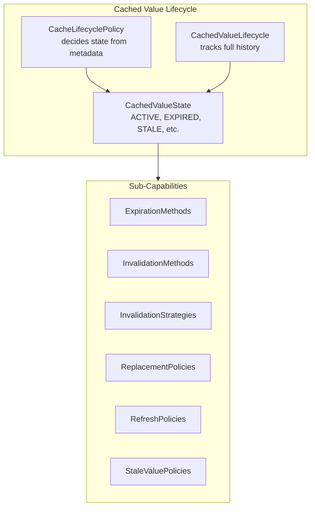
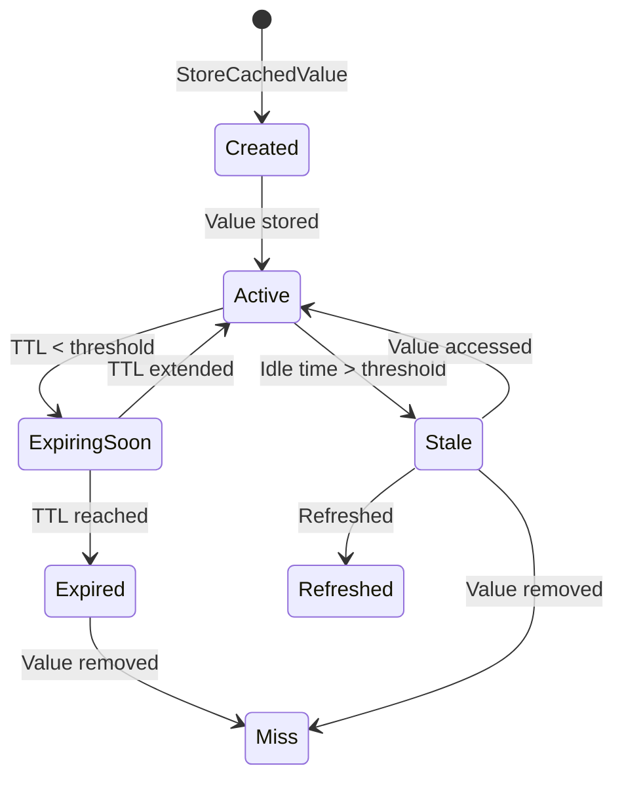

# ManageCacheLifecycle How This Works

ManageCacheLifecycle is the **large lifecycle capability** that manages how cached values are born, live, age, and die.

## What This Folder Owns

- Value state modeling
- Lifecycle metadata tracking
- Expiration methods
- Invalidation methods & strategies
- Replacement policies
- Refresh policies
- Stale value policies

## Architecture



## CachedValueState Enum

Represents all possible states a cached value can be in:

| State           | Meaning                    | Usable |
|-----------------|----------------------------|--------|
| `ACTIVE`        | Valid and fresh            | Yes    |
| `EXPIRING_SOON` | Near expiration            | Yes    |
| `EXPIRED`       | Past TTL                   | No     |
| `STALE`         | Old but potentially usable | Yes    |
| `INVALIDATED`   | Explicitly invalidated     | No     |
| `EVICTED`       | Removed due to capacity    | No     |
| `MISSING`       | Key does not exist         | No     |
| `STORE_FAILURE` | Store operation failed     | No     |

## CachedValueLifecycle

Tracks complete lifecycle metadata:

```php
CachedValueLifecycle {
    createdAt: Timestamp      // When value was stored
    lastAccessedAt: Timestamp // Last read
    expiresAt: Timestamp      // When value expires
    refreshedAt: Timestamp   // Last refresh
    hitCount: int            // Number of reads
    refreshCount: int       // Number of refreshes
}
```

## Sub-Capabilities

### ExpirationMethods

Controls when values become invalid:

- `CacheTtl` - Standard TTL calculation
- `NeverExpires` - Infinite TTL
- `ExpiresAt` - Absolute expiration time
- `ExpiresAfter` - Relative expiration
- `SlidingExpiration` - TTL resets on access
- `ImmediateExpiration` - Never usable
- `CheckCachedValueIsExpired` - Expiration checker

### InvalidationMethods

How values are invalidated:

- `InvalidateByKey` - Single key
- `InvalidateByKeys` - Batch keys
- `InvalidateByTag` - By tag
- `InvalidateByTags` - Batch tags
- `InvalidateByNamespace` - By namespace prefix
- `InvalidateByPattern` - Shell-style patterns
- `InvalidateByVersion` - Version bump
- `SoftInvalidateCachedValue` - Mark stale
- `HardInvalidateCachedValue` - Immediate removal

### ReplacementPolicies

Which entry to evict when capacity is reached:

- `LeastRecentlyUsedReplacement` - LRU
- `LeastFrequentlyUsedReplacement` - LFU
- `FirstInFirstOutReplacement` - FIFO
- `RandomReplacement` - Random
- `NoReplacement` - Never evict

### RefreshPolicies

When to refresh values:

- `DO_NOT_REFRESH` - Manual only
- `REFRESH_ON_READ` - When expired
- `REFRESH_AHEAD` - Before expiration
- `REFRESH_WHEN_STALE` - When idle too long

### StaleValuePolicies

Whether stale values can be served:

- `DO_NOT_SERVE_STALE` - Strict
- `SERVE_STALE_WHILE_REFRESHING` - Stale-while-revalidate
- `SERVE_STALE_WHEN_SOURCE_FAILS` - Fallback on source failure
- `SERVE_STALE_ALWAYS` - Always serve

## Lifecycle Flow



## State Decision Logic

```php
class CacheLifecyclePolicy implements DecideCachedValueState
{
    public function decide(
        ?CachedValueLifecycle $lifecycle,
        Clock $clock,
        bool $wasExplicitlyInvalidated = false,
        bool $wasEvicted = false
    ): CachedValueState {
        if ($wasEvicted) return EVICTED;
        if ($wasExplicitlyInvalidated) return INVALIDATED;
        if ($lifecycle === null) return MISSING;
        if ($lifecycle->isExpired($clock)) return EXPIRED;

        $ttl = $lifecycle->timeToLive($clock);
        if ($ttl <= $expiringSoonThreshold) return EXPIRING_SOON;

        if ($idleTime > $staleGracePeriod) return STALE;

        return ACTIVE;
    }
}
```

## Debug First

1. **Start in CacheLifecyclePolicy** when state seems wrong
2. **Check Clock** if time-based tests fail
3. **Check lifecycle metadata** if tracking is incorrect

## Dictionary

- `CachedValueState`: All possible states of a cached value
- `CachedValueLifecycle`: Complete history metadata
- `Expiration`: Time-based validity rules
- `Invalidation`: Explicit removal mechanisms
- `Replacement`: Eviction selection strategy
- `Stale`: Old but potentially usable data