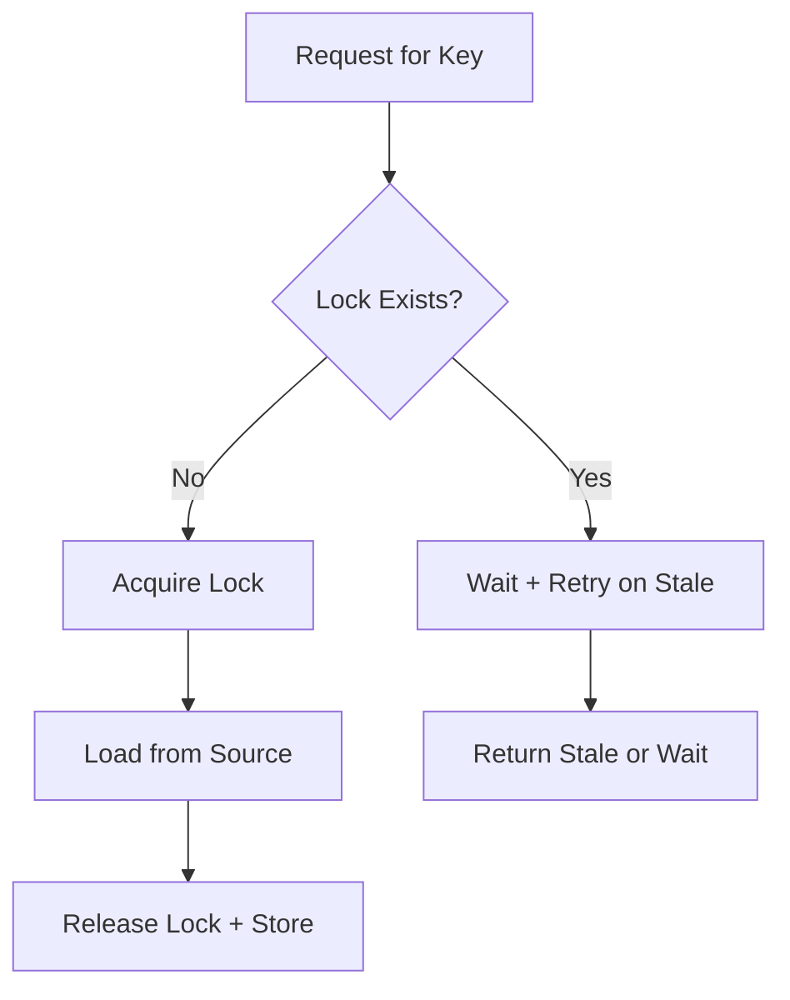

# ProtectCacheSource

Prevents cache stampede/thundering herd when cache is empty or expired.

## What This Owns

- CacheLock - distributed lock for key
- CacheLockOwner - lock holder identity
- CacheLockStore - lock storage (InMemory, Redis)
- CacheLockTimeout - lock TTL
- RequestCoalescing - deduplicate concurrent requests

## Triggers

System miss + concurrent requests to same key

## Main Flow

## Debug

- Check lock TTL not too short (causes stampede)
- Check lock TTL not too long (blocks other requests)