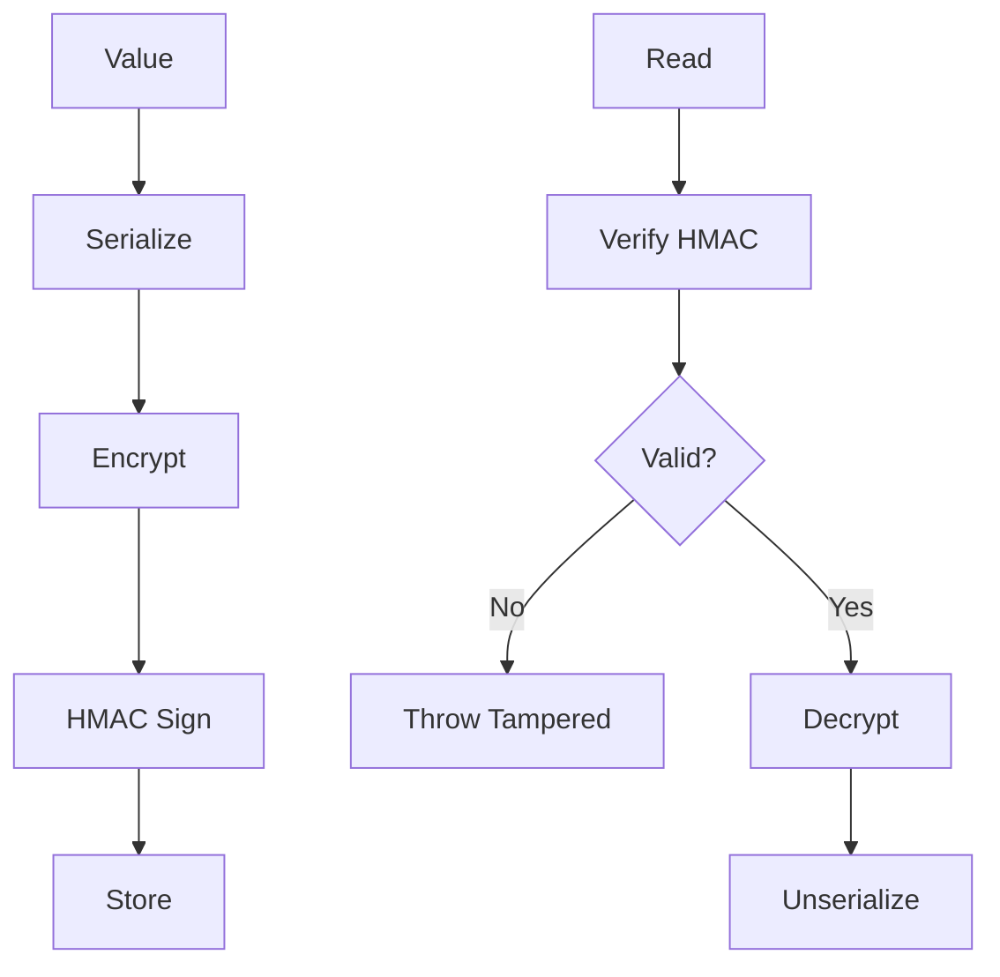

# ProtectCachedValues

Encrypts and signs cached payloads to prevent tampering.

## What This Owns

- EncryptedCache - AES-256-GCM encryption
- CacheEncryptionKey - key management
- EncryptCachedValue / DecryptCachedValue - serialize + encrypt
- SignCachedPayload - HMAC-SHA256 signing
- VerifyCachedPayloadSignature - signature verification
- CachePayloadWasTampered - exception

## Triggers

System write (encryption enabled)

## Main Flow

## Debug

- Check key length >= 32 bytes
- Verify encrypt/decrypt roundtrip
- Check signature verification