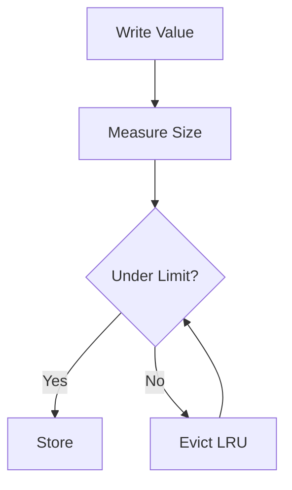

# SizeCachedValues

Tracks and limits cache storage size.

## What This Owns

- CacheSize - byte measurement
- SizeLimit - capacity enforcement
- EstimateSize - rough estimation

## Triggers

Storage quota configuration

## Main Flow

## Debug

- Check eviction policy
- Verify size tracking accuracy
- Monitor capacity warnings