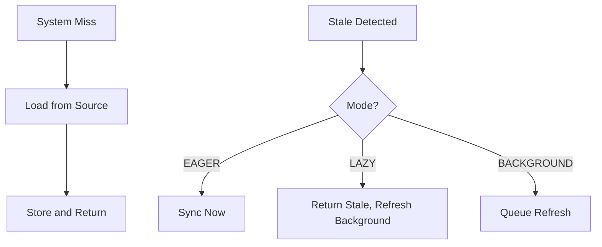

# SyncWithSource

Synchronizes cache with origin data source for freshness.

## What This Owns

- SourceSyncPolicy - when to sync (eager, lazy, background)
- CacheWarmer - pre-populate cache
- RefreshPolicy - when to refresh

## Triggers

System miss or staleness detection

## Main Flow

## Debug

- Check sync policy matches requirements
- Verify source availability
- Monitor refresh queue