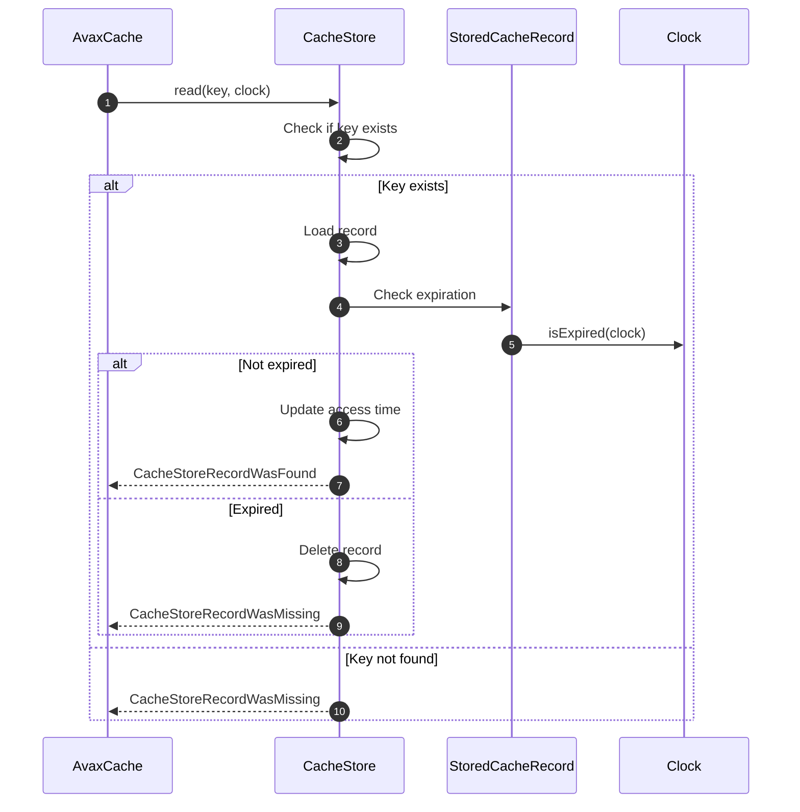

# StoreCachedValues How This Works

StoreCachedValues provides **store abstractions** and implementations for persisting cached values.

## What This Folder Owns

- Store interface contracts
- Value record types
- Store implementations (InMemory, File, Chain, Fallback)
- Error types

## Key Concepts

### CacheStore Interface

All stores implement this contract:

```php
interface CacheStore
{
    public function read(CacheKey $key, Clock $clock): CacheStoreRecordWasFound|CacheStoreRecordWasMissing;
    public function write(CacheKey $key, StoredCacheRecord $record): void;
    public function forget(CacheKey $key): void;
    public function clear(): void;
    public function exists(CacheKey $key): bool;
}
```

### Result Types

```php
// Found - value with lifecycle metadata
CacheStoreRecordWasFound {
    key: CacheKey
    record: StoredCacheRecord
    clock: Clock
}

// Missing - key does not exist
CacheStoreRecordWasMissing {
    key: CacheKey
}
```

### StoredCacheRecord

```php
StoredCacheRecord {
    value: mixed           // The cached value
    lifecycle: CachedValueLifecycle  // Metadata
    serializedData: string|null  // Pre-serialized payload
    format: string|null    // Serialization format
}
```

## Store Implementations

### InMemoryCacheStore

- **Storage**: PHP array
- **Use case**: Single-process, ephemeral caching
- **Persistence**: None (lost on process restart)
- **Performance**: Fastest (no I/O)

### FileCacheStore

- **Storage**: JSON files on filesystem
- **Use case**: Persistent local caching
- **Persistence**: Survives process restarts
- **Performance**: Disk I/O, mitigated by subdirectory sharding

### ChainCacheStore

- **Storage**: Multiple stores in chain
- **Use case**: Multi-tier caching (L1 + L2)
- **Behavior**: Read from first store, promote on miss

### FallbackCacheStore

- **Storage**: Primary + fallback store
- **Use case**: High availability
- **Behavior**: Primary, fall back to secondary on failure

### NullCacheStore

- **Storage**: None
- **Use case**: Testing, disabled cache
- **Behavior**: All reads return missing, all writes succeed

## First Important Path: Read



## Debug First

1. **Start in InMemoryCacheStore** for unit tests
2. **Start in FileCacheStore** for file-based cache issues
3. **Check Clock** if time-based tests fail
4. **Check lifecycle** if expiration seems wrong

## Dictionary

- `CacheStore`: Interface for cache storage backends
- `StoredCacheRecord`: Value with lifecycle metadata
- `CacheStoreRecordWasFound`: Discriminated union type for found records
- `CacheStoreRecordWasMissing`: Discriminated union type for missing records
- `ChainCacheStore`: Multi-tier cache that promotes hits
- `FallbackCacheStore`: Primary/fallback pattern for HA