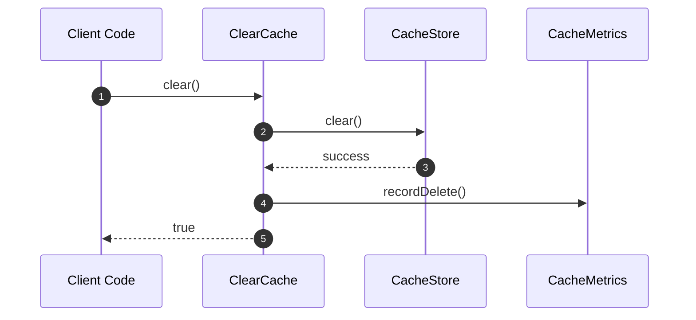

# ClearCache Flow

ClearCache handles **clearing all values from cache**.

## What This Flow Does

1. Clear all entries from store
2. Record metrics
3. Return success/failure

## First Important Path



## Direct Files

### ClearCache.php

```php
final readonly class ClearCache
{
    public function __construct(
        private CacheStore $store,
        private Clock $clock,
        private ?CacheMetrics $metrics = null
    ) {}

    public function clear(): bool
    {
        try {
            $this->store->clear();
            $this->metrics?->recordDelete();
            return true;
        } catch (\Throwable $e) {
            $this->metrics?->recordStoreFailure();
            return false;
        }
    }
}
```

## Namespace Clearing

```php
public function clearNamespace(CacheNamespace $namespace): int
{
    return $this->clear();
}
```

## Debug First

1. **Start here** when clear returns false
2. **Check store** - can store clear all entries?
3. **Check metrics** - is failure being recorded?

## Dictionary

- `ClearCache`: Clear all entries flow