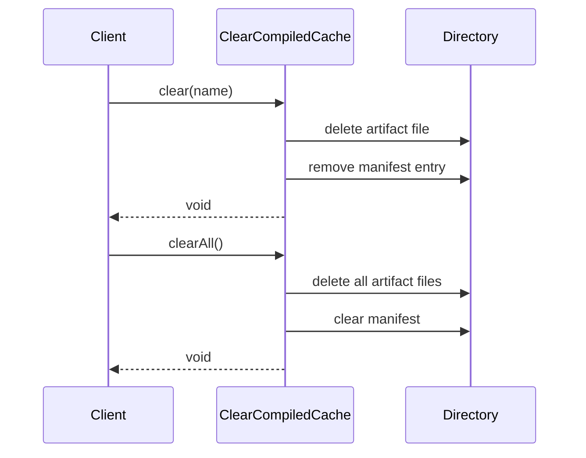

# ClearCompiledCache Flow

Clears compiled artifacts from the compiled cache directory.

## What This Owns

- ClearCompiledCache - main flow entry
- ClearCompiledCacheArtifact - deletes single artifact
- ClearAllCompiledCacheArtifacts - deletes all artifacts

## Triggers

- `$compiledCache->clear($name)` call
- `$compiledCache->clearAll()` call
- CLI: `php avax cache:clear`

## Main Flow

## Failure Modes

- file permission denied
- manifest write fails