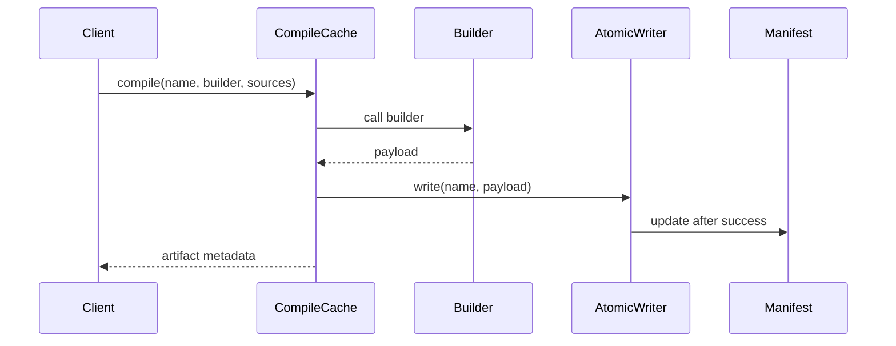

# CompileCache Flow

Compiles and writes a single compiled artifact to the compiled cache directory.

## What This Owns

- CompileCache - main flow entry
- BuildCompiledCacheArtifact - builds artifact metadata
- WriteCompiledCacheArtifact - writes PHP file atomically

## Triggers

- `$compiledCache->compile($name, $builder, $sources)` call
- CLI: `php avax cache:compile`

## Main Flow

## Failure Modes

- builder returns invalid payload
- directory not writable
- atomic rename fails
- manifest write fails