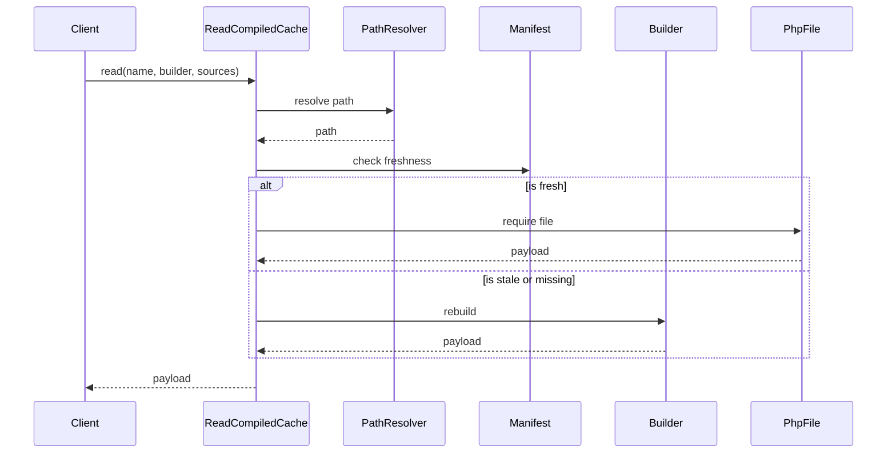

# ReadCompiledCache Flow

Reads a compiled artifact, rebuilding if missing or stale.

## What This Owns

- ReadCompiledCache - main flow entry
- ReadCompiledCacheArtifact - requires and returns PHP payload
- RebuildCompiledCacheWhenMissing - rebuilds on missing
- RebuildCompiledCacheWhenStale - rebuilds on stale

## Triggers

- `$compiledCache->read($name, $builder, $sources)` call

## Main Flow

## Failure Modes

- compiled file returns invalid payload
- manifest corrupted