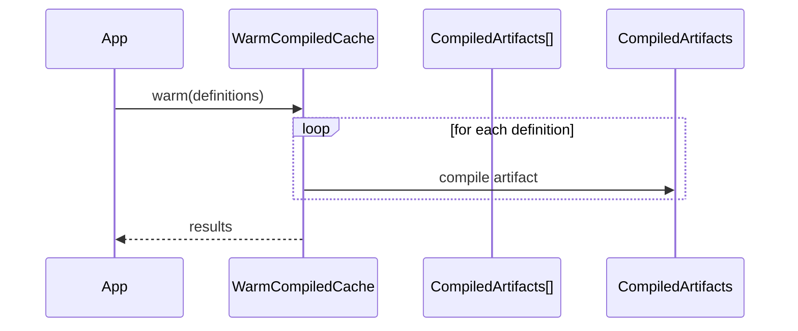

# WarmCompiledCache Flow

Warms multiple compiled artifacts at application startup.

## What This Owns

- WarmCompiledCache - main flow entry
- WarmCompiledCacheArtifacts - compiles multiple artifacts

## Triggers

- Application warmup
- CLI: `php avax cache:warm`

## Main Flow

## Failure Modes

- one artifact build fails
- partial failure reporting required