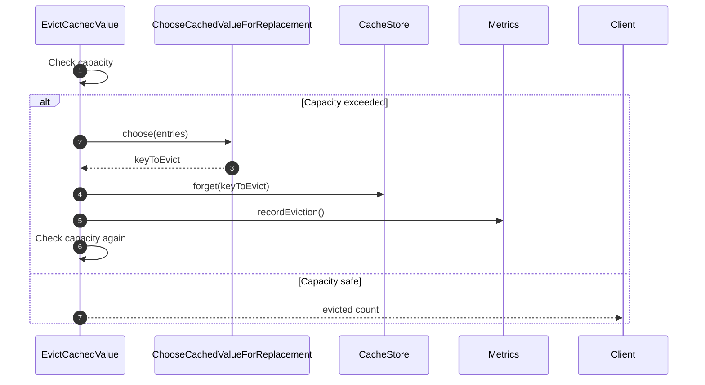

# EvictCachedValue Flow

EvictCachedValue handles **capacity-based eviction** using replacement policies.

## What This Flow Does

1. Check if capacity exceeded
2. Choose entry to evict using policy
3. Remove entry from store
4. Repeat until capacity is safe

## Replacement Policies

| Policy                           | Selection Criteria    |
|----------------------------------|-----------------------|
| `LeastRecentlyUsedReplacement`   | Oldest lastAccessedAt |
| `LeastFrequentlyUsedReplacement` | Lowest hitCount       |
| `FirstInFirstOutReplacement`     | Oldest createdAt      |
| `RandomReplacement`              | Random selection      |

## First Important Path



## Direct Files

### EvictCachedValue.php

```php
final readonly class EvictCachedValue
{
    public function __construct(
        private CacheStore $store,
        private Clock $clock,
        private ChooseCachedValueForReplacement $policy = new LeastRecentlyUsedReplacement(),
        private ?CacheMetrics $metrics = null
    ) {}

    public function evict(CacheKey $key): bool
    {
        try {
            $this->store->forget($key);
            $this->metrics?->recordEviction();
            return true;
        } catch (\Throwable) {
            return false;
        }
    }

    public function evictUntilCapacityIsSafe(
        array $entries,
        int $maxCapacity
    ): int {
        $evicted = 0;

        while (count($entries) > $maxCapacity) {
            $keyToEvict = $this->policy->choose($entries);

            if ($keyToEvict === null) {
                break;
            }

            $cacheKey = CacheKey::create($keyToEvict);
            $this->store->forget($cacheKey);
            $evicted++;
            unset($entries[$keyToEvict]);
        }

        $this->metrics?->recordEviction();
        return $evicted;
    }
}
```

## Debug First

1. **Check policy** - correct policy selected?
2. **Check entries** - are entries being tracked?
3. **Check maxCapacity** - what is the limit?

## Dictionary

- `EvictCachedValue`: Capacity eviction flow
- `ChooseCachedValueForReplacement`: Policy interface