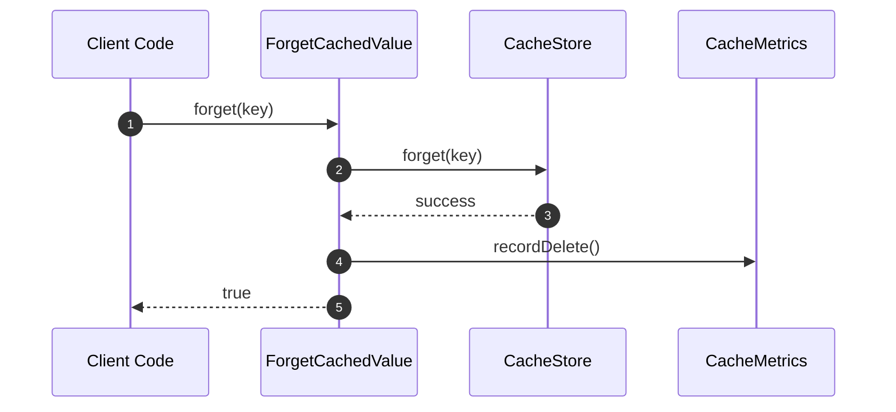

# ForgetCachedValue Flow

ForgetCachedValue handles **deleting values from cache**.

## What This Flow Does

1. Remove key from store
2. Record metrics
3. Return success/failure

## First Important Path



## Direct Files

### ForgetCachedValue.php

```php
final readonly class ForgetCachedValue
{
    public function __construct(
        private CacheStore $store,
        private Clock $clock,
        private ?CacheMetrics $metrics = null
    ) {}

    public function forget(CacheKey $key): bool
    {
        try {
            $this->store->forget($key);
            $this->metrics?->recordDelete();
            return true;
        } catch (\Throwable $e) {
            $this->metrics?->recordStoreFailure();
            return false;
        }
    }

    public function forgetMany(iterable $keys): int
    {
        $count = 0;
        foreach ($keys as $key) {
            if ($this->forget($key instanceof CacheKey ? $key : CacheKey::create($key))) {
                $count++;
            }
        }
        return $count;
    }
}
```

## Usage

```php
// Single key
$cache->delete('user:123');

// Multiple keys
$cache->deleteMultiple(['user:1', 'user:2', 'user:3']);
```

## Debug First

1. **Start here** when delete returns false
2. **Check store** - can store forget?
3. **Check metrics** - is failure being recorded?

## Dictionary

- `ForgetCachedValue`: Delete entry flow
- `forgetMany`: Batch delete operation