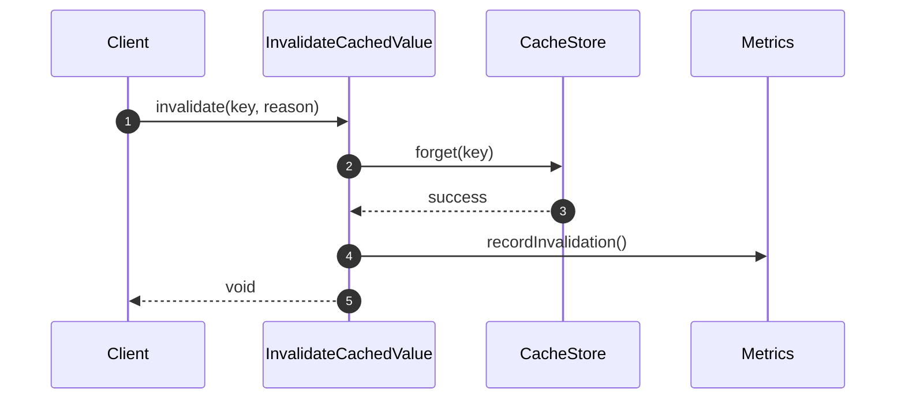

# InvalidateCachedValue Flow

InvalidateCachedValue handles **cache invalidation** by key, tag, namespace, or pattern.

## What This Flow Does

1. Identify keys to invalidate
2. Remove from store
3. Record metrics

## Invalidation Methods

| Method                  | Description           |
|-------------------------|-----------------------|
| `invalidateByKey`       | Single key            |
| `invalidateByKeys`      | Batch keys            |
| `invalidateByTag`       | All keys with tag     |
| `invalidateByNamespace` | All keys in namespace |
| `invalidateByPattern`   | Pattern matching      |

## First Important Path



## Direct Files

### InvalidateCachedValue.php

```php
final readonly class InvalidateCachedValue
{
    public function __construct(
        private CacheStore $store,
        private Clock $clock,
        private ?CacheMetrics $metrics = null
    ) {}

    public function invalidate(
        CacheKey $key,
        InvalidationReason $reason = InvalidationReason::EXPLICIT
    ): void {
        $this->store->forget($key);
        $this->metrics?->recordInvalidation();
    }

    public function invalidateByKeys(iterable $keys): int
    {
        $count = 0;
        foreach ($keys as $key) {
            $key = $key instanceof CacheKey ? $key : CacheKey::create($key);
            $this->store->forget($key);
            $count++;
        }
        $this->metrics?->recordInvalidation();
        return $count;
    }

    public function invalidateByTag(CacheTag $tag): int
    {
        // Tag tracking required
        $this->metrics?->recordInvalidation();
        return 0;
    }
}
```

## Usage

```php
$invalidate = new InvalidateCachedValue($store, $clock);

// Single key
$invalidate->invalidate(CacheKey::create('user:123'));

// Multiple keys
$invalidate->invalidateByKeys([
    CacheKey::create('user:1'),
    CacheKey::create('user:2'),
]);

// Pattern
$invalidate->invalidateByPattern('user:profile:*');
```

## Debug First

1. **Check store** - can keys be forgotten?
2. **Check tag tracking** - are tags being tracked?
3. **Check metrics** - is invalidation being recorded?

## Dictionary

- `InvalidateCachedValue`: Invalidation orchestration flow
- `InvalidationReason`: Why invalidation occurred