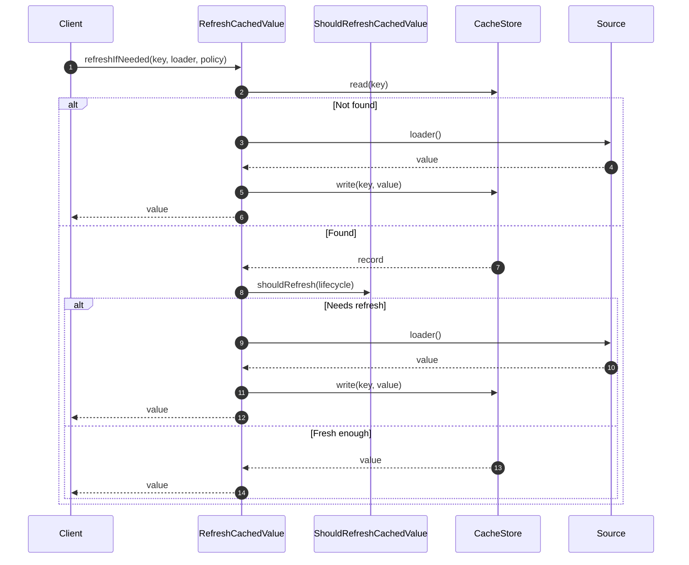

# RefreshCachedValue Flow

RefreshCachedValue handles **proactive value refresh** before or after expiration.

## What This Flow Does

1. Check if refresh is needed
2. Call loader to get fresh value
3. Store new value
4. Return value

## Refresh Policies

| Policy               | When to Refresh    |
|----------------------|--------------------|
| `DO_NOT_REFRESH`     | Never              |
| `REFRESH_ON_READ`    | On cache miss      |
| `REFRESH_AHEAD`      | Before TTL expires |
| `REFRESH_WHEN_STALE` | When idle too long |

## First Important Path



## Direct Files

### RefreshCachedValue.php

```php
final readonly class RefreshCachedValue
{
    public function __construct(
        private CacheStore $store,
        private Clock $clock,
        private ShouldRefreshCachedValue $shouldRefresh = new ShouldRefreshCachedValue(...),
        private CacheTtl $ttlCalculator = new CacheTtl()
    ) {}

    public function refresh(
        CacheKey $key,
        callable $loader,
        null|int|\DateInterval $ttl = null,
        RefreshPolicy $policy = RefreshPolicy::DO_NOT_REFRESH
    ): mixed {
        try {
            $value = $loader();

            $this->store->write($key, new StoredCacheRecord(
                value: $value,
                lifecycle: CachedValueLifecycle::create(...)
            ));

            return $value;
        } catch (\Throwable $e) {
            return null;
        }
    }

    public function refreshIfNeeded(
        CacheKey $key,
        callable $loader,
        null|int|\DateInterval $ttl = null,
        RefreshPolicy $policy = RefreshPolicy::DO_NOT_REFRESH
    ): mixed {
        $result = $this->store->read($key, $this->clock);

        if ($result instanceof CacheStoreRecordWasMissing) {
            return $this->refresh($key, $loader, $ttl, $policy);
        }

        if ($this->shouldRefresh->shouldRefresh($result->record->lifecycle)) {
            return $this->refresh($key, $loader, $ttl, $policy);
        }

        return $result->value();
    }
}
```

## Debug First

1. **Check policy** - is refresh enabled?
2. **Check thresholds** - when does refresh trigger?
3. **Check loader** - can source be loaded?

## Dictionary

- `RefreshCachedValue`: Proactive refresh flow
- `RefreshPolicy`: When to refresh