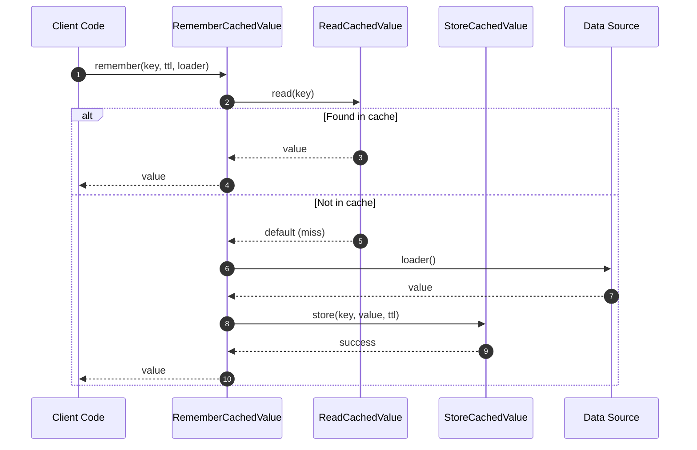

# RememberCachedValue Flow

RememberCachedValue implements the **get-or-load pattern** - read from cache, or load from source and cache.

## What This Flow Does

1. Try to read from cache
2. If found, return cached value
3. If missing, call loader
4. Store loaded value in cache
5. Return loaded value

## First Important Path



## Direct Files

### RememberCachedValue.php

```php
final readonly class RememberCachedValue
{
    public function __construct(
        private CacheStore $store,
        private Clock $clock,
        private ?ReadCachedValue $reader = null,
        private ?StoreCachedValue $writer = null
    ) {}

    public function remember(
        CacheKey $key,
        null|int|\DateInterval $ttl,
        callable $loader,
        mixed $default = null
    ): mixed {
        $this->reader ??= new ReadCachedValue($this->store, $this->clock);
        $this->writer ??= new StoreCachedValue($this->store, $this->clock);

        $value = $this->reader->read($key, default: null);

        if ($value !== null) {
            return $value;
        }

        try {
            $value = $loader();
        } catch (\Throwable $e) {
            return $default;
        }

        $this->writer->store($key, $value, $ttl);

        return $value;
    }
}
```

## Usage

```php
// Simple usage
$user = $cache->remember(
    key: 'user:123',
    ttl: 3600,
    loader: fn() => $userRepository->find(123)
);

// With default for loader failure
$user = $cache->remember(
    key: 'user:123',
    ttl: 3600,
    loader: fn() => $userRepository->find(123),
    default: null
);
```

## Debug First

1. **Start here** when remember returns unexpected value
2. **Check reader** - is read working correctly?
3. **Check loader** - is loader being called?
4. **Check writer** - is storage working?

## Dictionary

- `RememberCachedValue`: Get-or-load pattern flow
- `ReadCachedValue`: Sub-flow for reading
- `StoreCachedValue`: Sub-flow for storing