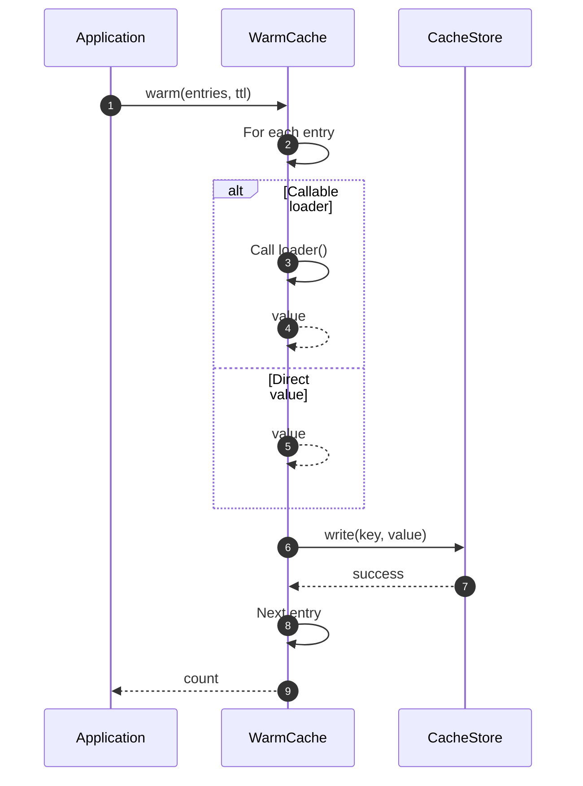

# WarmCache Flow

WarmCache handles **cache warming** - preloading frequently used values on startup.

## What This Flow Does

1. Accept list of entries to preload
2. For each entry, call loader or use provided value
3. Store in cache
4. Return count of warmed entries

## Use Cases

- Application startup
- After cache clear
- Scheduled warming job
- Event-driven warming

## First Important Path



## Direct Files

### WarmCache.php

```php
final readonly class WarmCache
{
    public function __construct(
        private CacheStore $store,
        private Clock $clock,
        private CacheTtl $ttlCalculator = new CacheTtl()
    ) {}

    public function warm(iterable $entries, null|int|\DateInterval $ttl = null): int
    {
        $count = 0;

        foreach ($entries as $key => $loader) {
            $cacheKey = $key instanceof CacheKey ? $key : CacheKey::create($key);
            $value = is_callable($loader) ? $loader() : $loader;

            $this->store->write($cacheKey, $this->createRecord($value, $ttl));
            $count++;
        }

        return $count;
    }
}
```

## Usage

```php
$warm = new WarmCache($store, $clock);

// Load from callables
$count = $warm->warm([
    'user:1' => fn() => $userRepo->find(1),
    'user:2' => fn() => $userRepo->find(2),
    'settings' => fn() => $settingsRepo->all(),
], ttl: 3600);

// Load from direct values
$warm->warm([
    'config:version' => '2.0.0',
    'config:region' => 'us-east-1',
], ttl: 86400);
```

## Debug First

1. **Check entries** - are loaders correct?
2. **Check store** - can values be written?
3. **Check TTL** - is default TTL appropriate?

## Dictionary

- `WarmCache`: System preloading flow