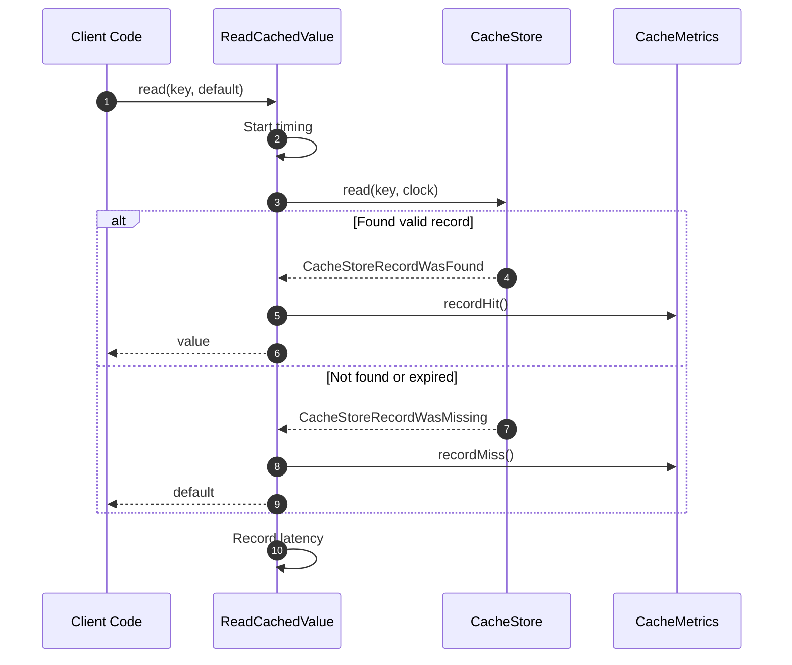

# ReadCachedValue Flow

ReadCachedValue is the flow for **reading values from cache**.

## What This Flow Does

1. Check store for key
2. Verify key exists
3. Check expiration
4. Return value or default

## First Important Path



## Direct Files

### ReadCachedValue.php

```php
final readonly class ReadCachedValue
{
    public function __construct(
        private CacheStore $store,
        private Clock $clock,
        private ?CacheMetrics $metrics = null
    ) {}

    public function read(CacheKey $key, mixed $default = null): mixed
    {
        $startTime = hrtime(as_integer: true);

        try {
            $result = $this->store->read($key, $this->clock);

            if ($result instanceof CacheStoreRecordWasMissing) {
                $this->recordLatency($startTime, 'miss');
                $this->metrics?->recordMiss();
                return $default;
            }

            if ($result->record->isExpired($this->clock)) {
                $this->recordLatency($startTime, 'miss');
                $this->metrics?->recordMiss();
                return $default;
            }

            $this->recordLatency($startTime, 'hit');
            $this->metrics?->recordHit();

            return $result->value();
        } catch (\Throwable $e) {
            $this->metrics?->recordStoreFailure();
            return $default;
        }
    }
}
```

## Debug First

1. **Start here** when cache returns unexpected value
2. **Check store** - is the value actually stored?
3. **Check expiration** - is it expired?
4. **Check metrics** - is it counting hits correctly?

## Dictionary

- `ReadCachedValue`: Flow for retrieving cached values
- `CacheStoreRecordWasFound`: Value exists and is valid
- `CacheStoreRecordWasMissing`: Key doesn't exist